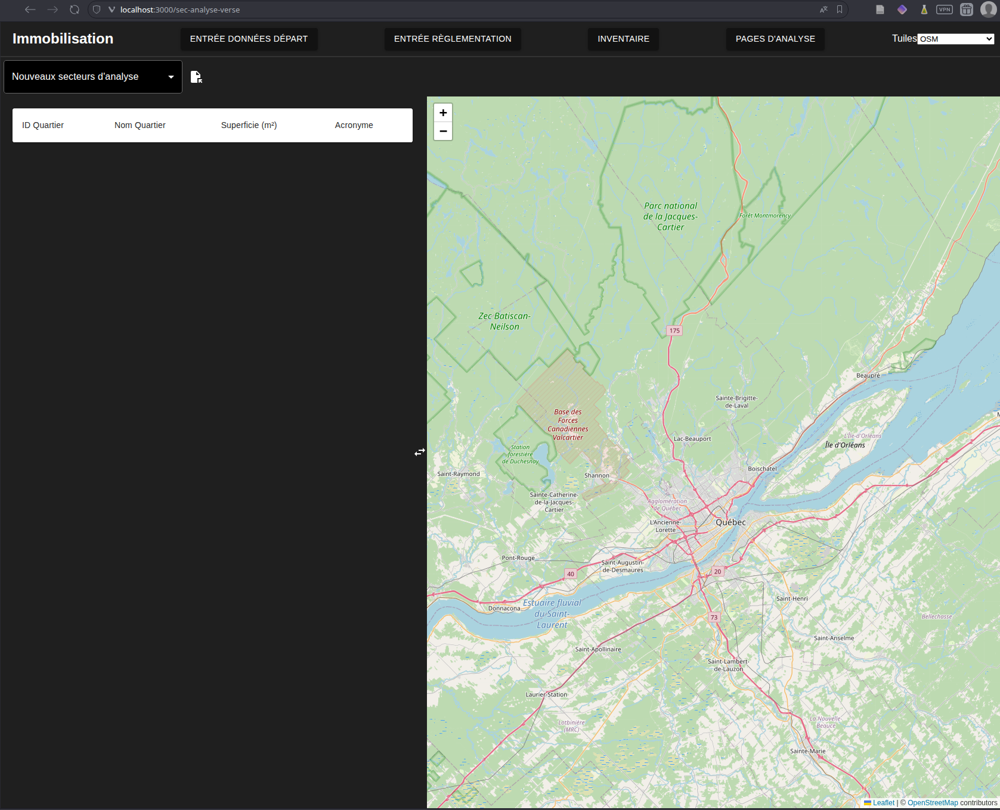
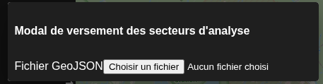
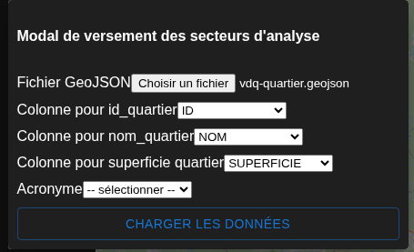
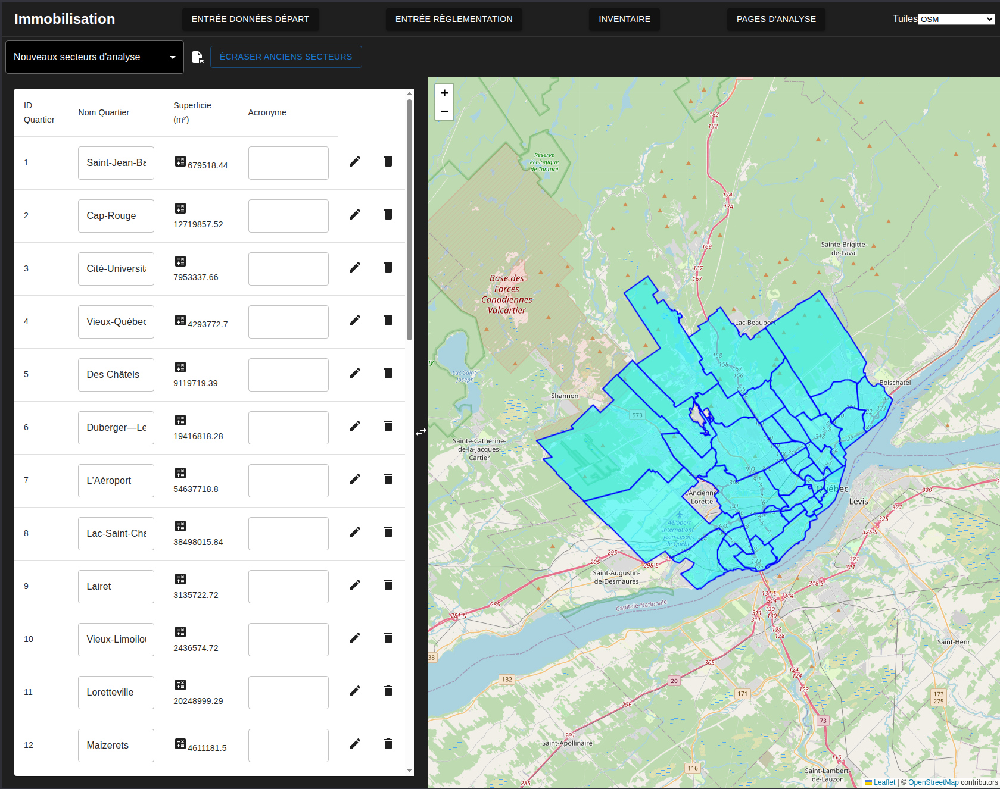
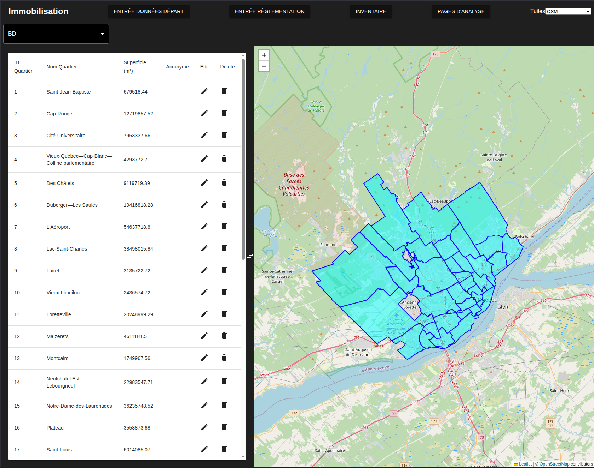

# Téléversement des secteurs d'analyse
---
[<Démarrage](020-UploadFormat.md)| 
[Entrée des facteurs de conversion d'unités>](023-EntreeConversions.md)
---

Les secteurs d'analyse sont les premiers à être versés. Pour ce faire, on choisi l'onglet [Entrée données départ](http://localhost:3000/sec-analyse-verse) ou l'on arrive à la page montrée à la figure suivante

On navique à l'onglet nouveaux secteurs d'analyse dans la barre déroulante à gauche. On clique ensuite sur l'icone de versement à côté de la liste déroulante qui ouvre le modal de versement 

Une fois le fichier choisi on peu sélectionner l'affectation des colonnes

En cliquant sur charger les données on charge les données dans le frontend (elles ne sont pas encore côté serveur). Notez que cette approche limite la complexité des secteurs choisis. une approche alternative pourrait être mise en place comme c'est le cas pour le cadastre et le rôle foncier. La page ressemble alors à ce qui est montrée ci dessous:

En cliquant sur écraser anciens secteurs on peut alors verser sur la base de données
On peut alors changer la valeur de la liste déroulante en haut à gauche pour voir ce qui est sur la bd et le modifier:

Les champs de textes des secteurs peuvent être modifiés dans l'outil mais pas leur géométrie. L'API ne fait pas de distinction mais les utilitaires de carte n'ont pas été mis en place pour le faire