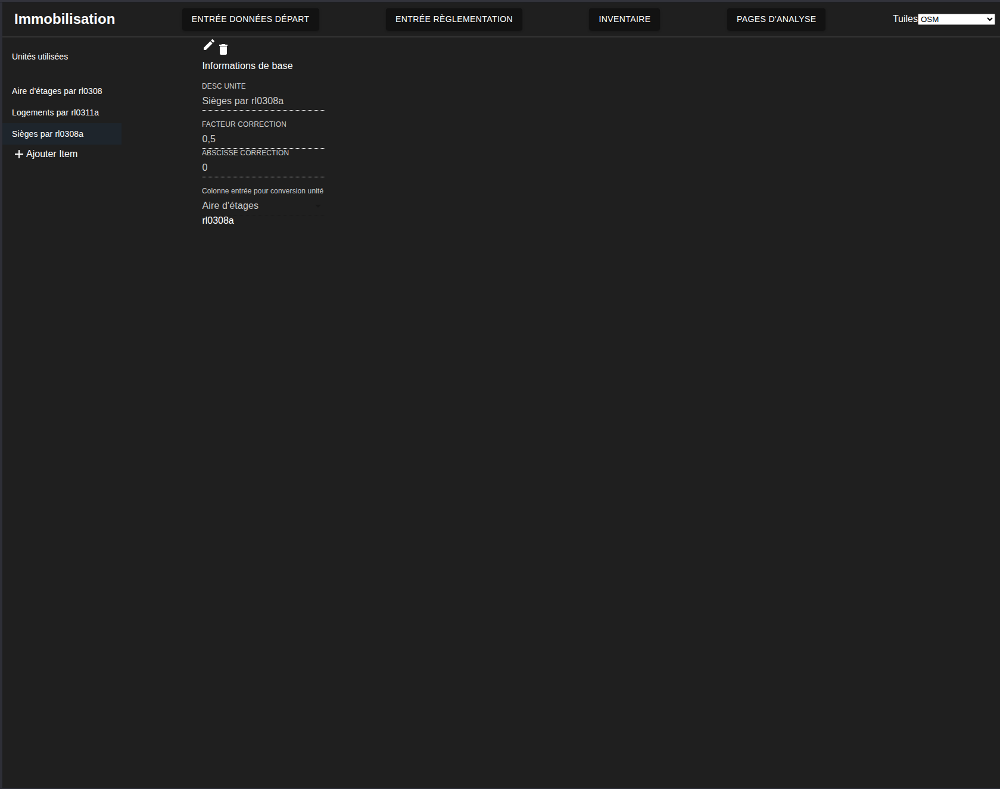

# Entrée des facteurs de conversions d'unités

---
[<Téléversement Secteurs](022-UploadSecteurs)| 
[Versement des données cadastrales>](024-VerseDonneesCadastre.md)
---

On peut ensuite utiliser le menu pour naviguer à la page d'entrée des [facteurs de conversion](http://localhost:3000/unites). L'interface de cette page est montrée à la figure ci-dessous:

L'interface est relativement simple. L'utilisateur peut ajouter des unités avec le bouton plus sous la liste d'unité et peut en faire la modification dans le panneau de droite. Toutes les conversions sont considérées comme des relation linéaire simple applicables à l'ensemble des codes d'utilisation du bien fonds.

La valeur se calcul comme `U = Facteur correction x rl* +abscisse correction` où rl* est une colonne du rôle foncier.