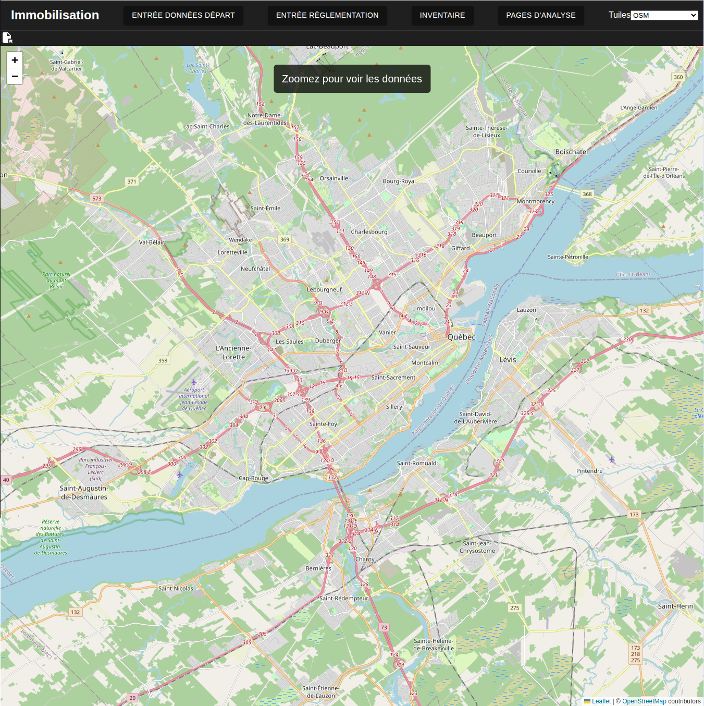
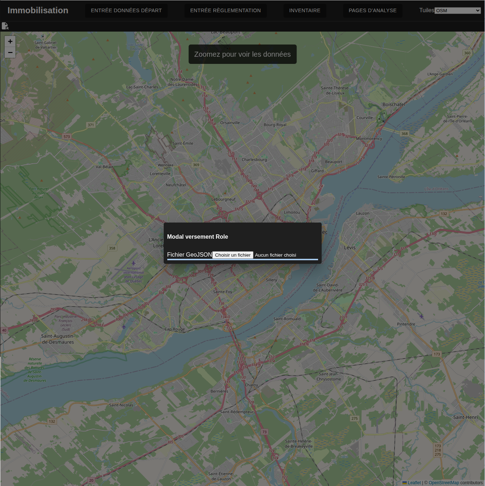
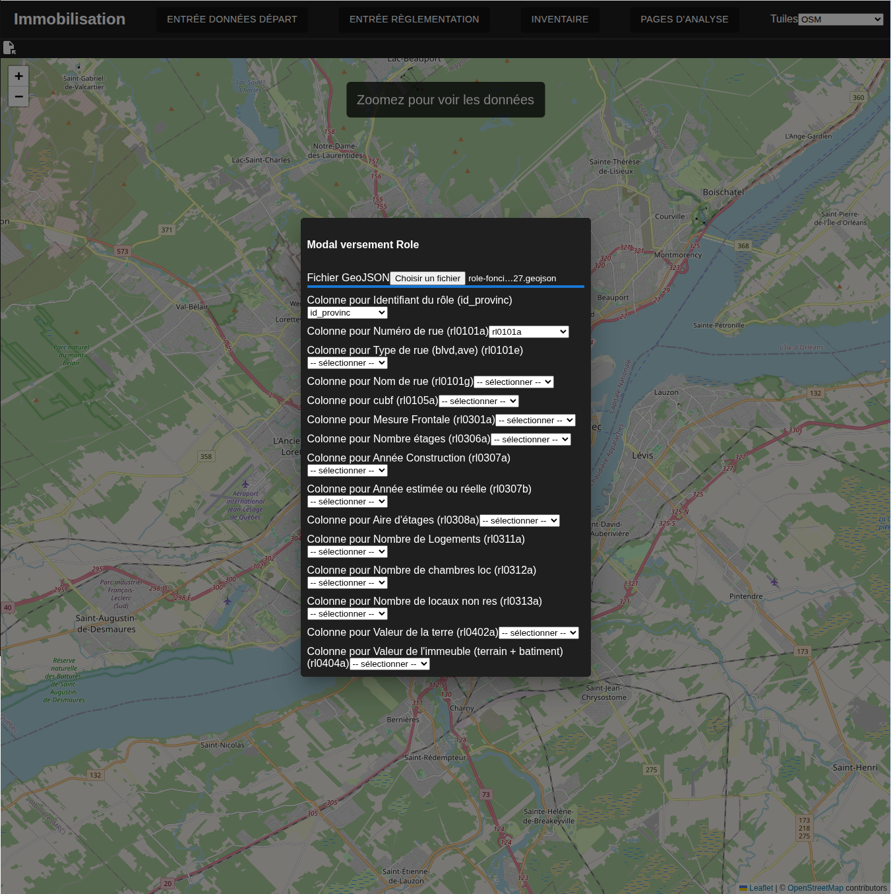
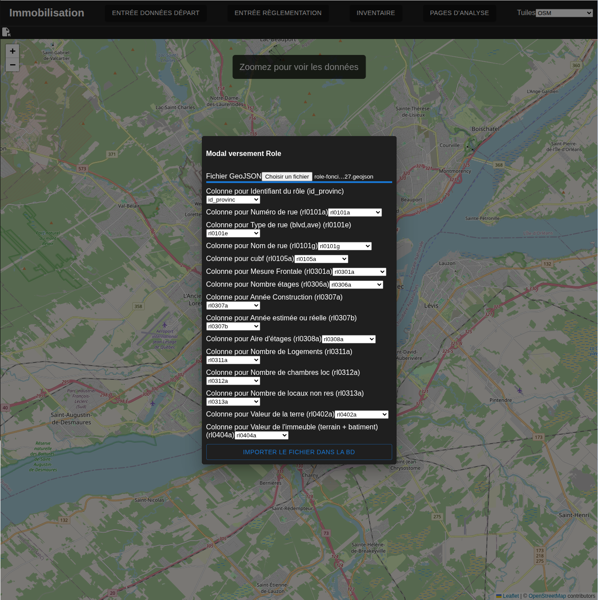
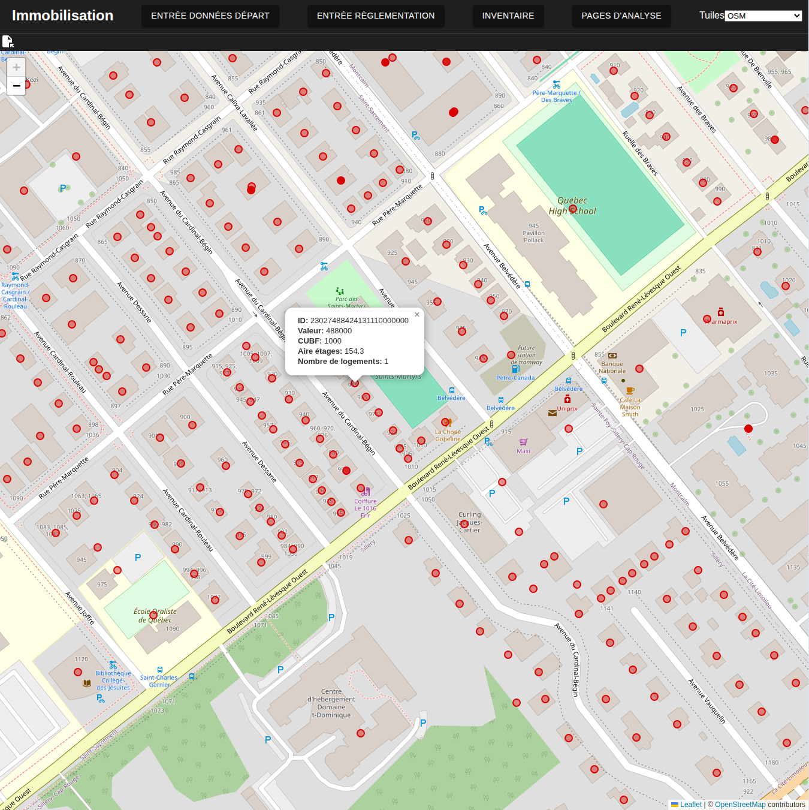

# Versement des données du rôle foncier

---
[^Tables des matières](../../README.md)|
[<Téléversement cadastre](022-VerseDonneesCadastre.md)| 
[Association du rôle au cadastre>](024-CreationAssocRoleCadastre.md)
---

## Interface
L'utilisateur commence par naviguer à la [page de versement des données de rôle foncier](http://localhost:3000/role-foncier). S'il y a des données dans la bd et que l'utilisateur zoom sur le territoire d'intérêt, il devrait être en mesure de voir les points du rôle foncier. Autrement, l'analyste peut verser les données.

## Téléchargement des données
Les données du rôle foncier peuvent être obtenues sur le site de [Données Québec](https://www.donneesquebec.ca/recherche/dataset/roles-d-evaluation-fonciere-du-quebec). Il est recommandé d'assurer la concordance des années entre le rôle foncier et le cadastre.
## Extraction de la municipalité pertinente et conversion geojson
Il est suggéré de télécharger le format FGDB et d'utiliser le [script fourni](../../serveur_calcul_python/utilitaires/0_conversion_FGDB_initiale.py) pour extraire seulement les données de la municipalité concernée. Commencez par installer un environnemetn conda avec les bonnes librairies:
```
conda env --file environment_python_conversion.yml
```
Vous pouvez trouver le code municipal à spécifier dans l'[index](https://www.donneesquebec.ca/recherche/dataset/roles-d-evaluation-fonciere-du-quebec/resource/d2db6102-9215-4abc-9b5b-2c37f2e12618). Modifiez les chemins et le code de municipalité dans le fichier pour extraire le dossier pertinent. Cette opération peut être assez longue pour les grandes municipalités
```
    MUNICIPALITE = str(CODEMUN)
    LOCALISATION_ROLE_FONCIER_FGDB = r"/DOSSIERSPEC/Role_20XX.gdb"
    outFolder= r"/DOSSIERSPEC"
```
Pour ce faire, téléchargez le rôle, modifiez les chemins des fichiers dans le script et le code de la municipalité à extraire selon les besoins.


## Versement des données

L'utilisateur peut verser des nouvelles données en cliquant sur l'icône de versement en haut à gauche en dessous de Immobilisation.

L'utilisateur choisit d'abord un fichier. 

Une fois le fichier choisi, il est nécessaire d'associer les colonnes du fichier. Cette étape est mise en place au cas où l'utilisateur utilise un fichier où les entêtes ont été modifiées. 

Une fois que toutes les colonnes sont associées, l'utilisateur peut verser le fichier sur la base de donnée en cliquant sur le bouton de versement. 

Il devrait alors être possible de voir les données dans la fenêtre en zoomant assez(le zoom limite la quantité de mémoire consommée)

