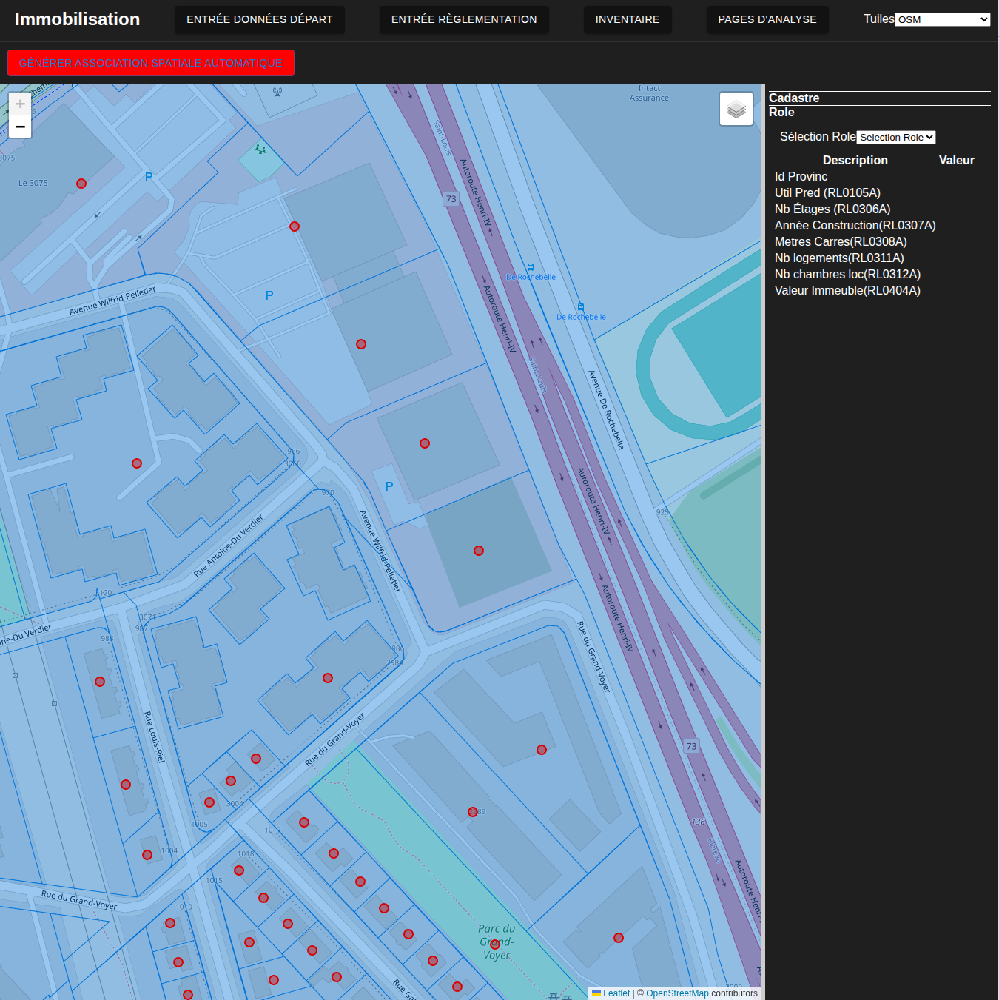
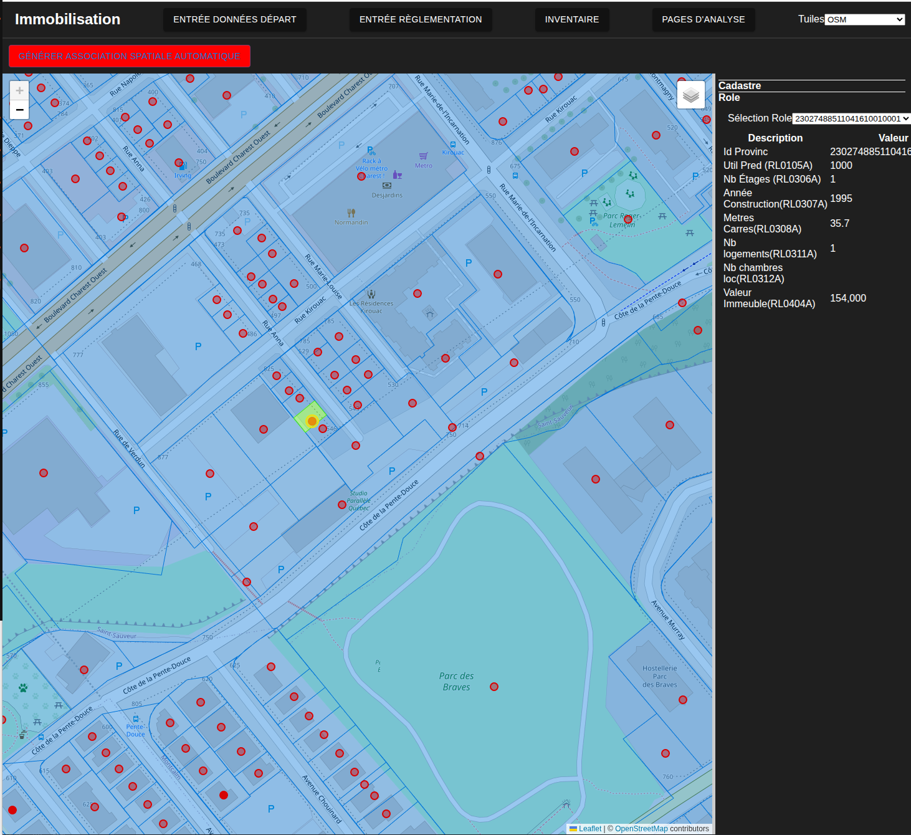
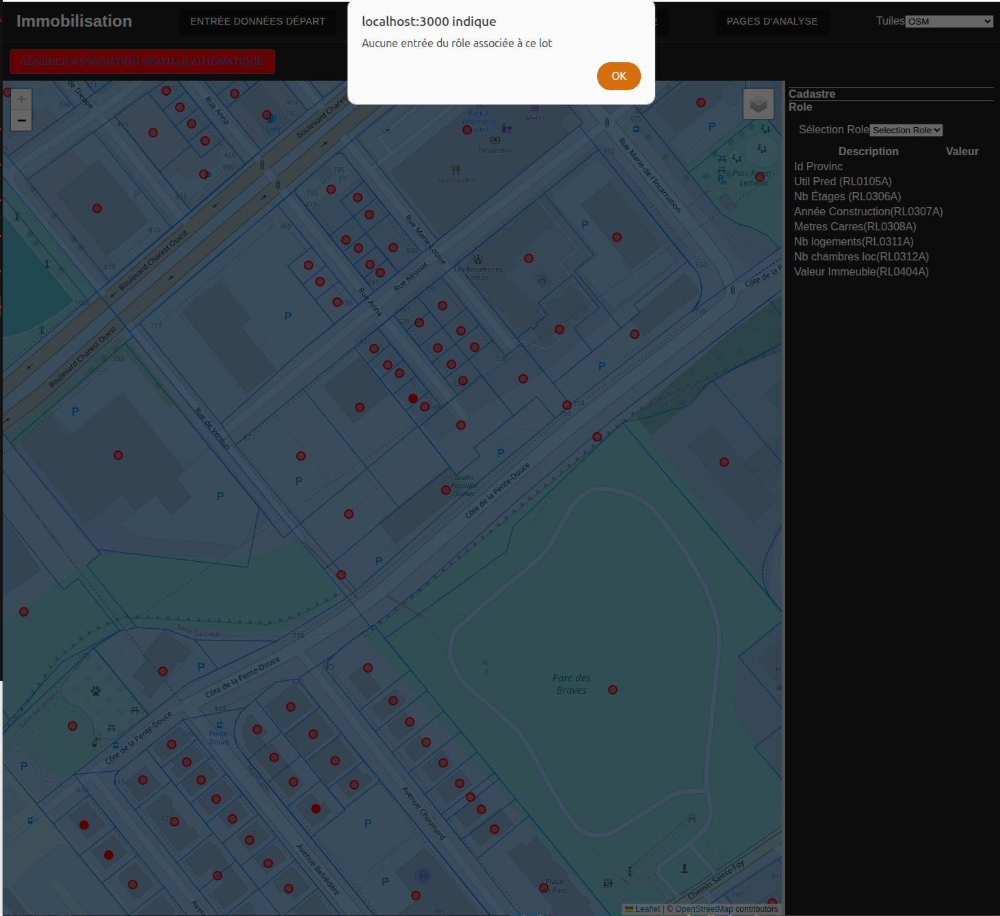

# Creation des associations rôle cadastre

---
[^Tables des matières](../../README.md)|
[<Téléversement du rôle](023-VerseDonneesCadastre.md)| 
[Versement des données de recensement>](025-VersementDonneesPopu.md)
---

La méthode de calcul utilise un méthode de jointure spatiale entre entre le rôle foncier et le cadastre. Cette approche est possible puisque le rôle foncier contient un point qui est généralement localisé au centre du lot. Cette approche est relativement simple. Pour faire ces associations, l'analyse navigue à la [page pertinente](http://localhost:3000/assoc-cadastre-role). En zoomant assez, l'analyste devrait voir les lots.

En cliquant sur un point(rôle) ou un polygone(cadastre), utilisateur devriat voir apparaitre un onglet tel que  montré à la figure suivante:

En appuyant sur le bouton montré, le site fait une recherche pour toutes les association du lot et sont montrés dans le ruban de droite

Si les associations existent déjà, le lot sera mis en couleur et les données chargées. Dans le cas échéant, un message d'erreur sera lancé

Si ce n'est pas le cas, l'analyste peut créer les associations automatiquement au moyen du bouton dans le ruban en haut de l'écran. Cette opération éliminera les associations précédentes donc il est à utiliser avec parsimonie. Aucune fonctionnalité n'a été implémentée pour [manuellement créer des associations ou créer des lots esclaves](https://github.com/EPMPaulPoly/immobilisation/issues/7)