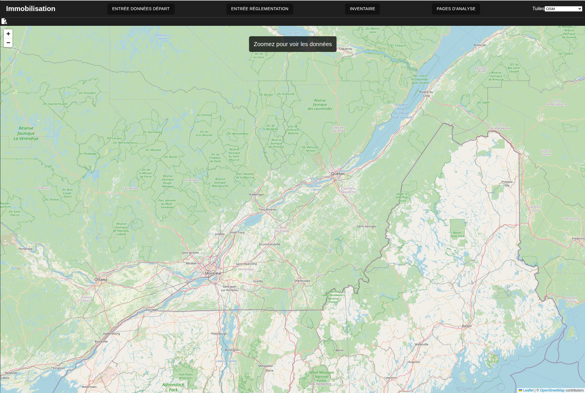
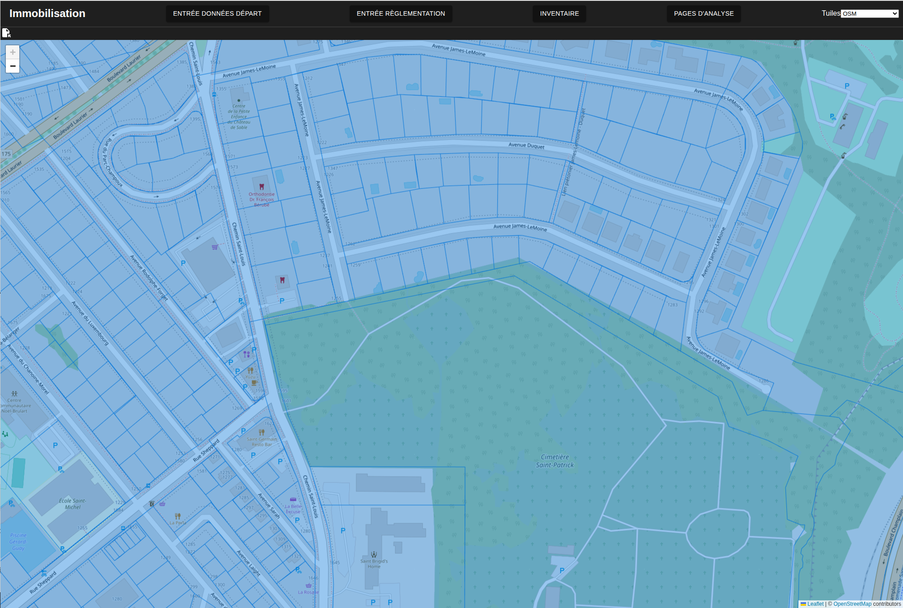
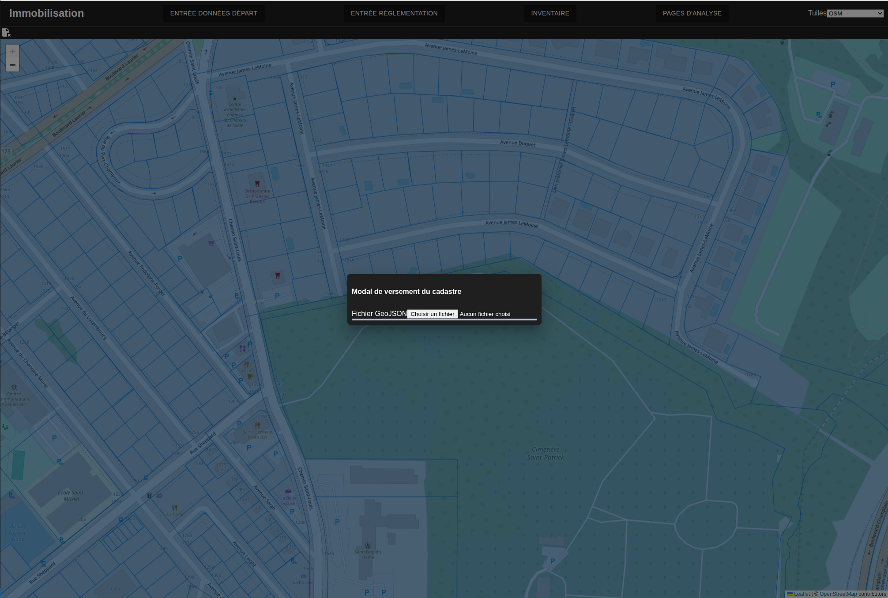
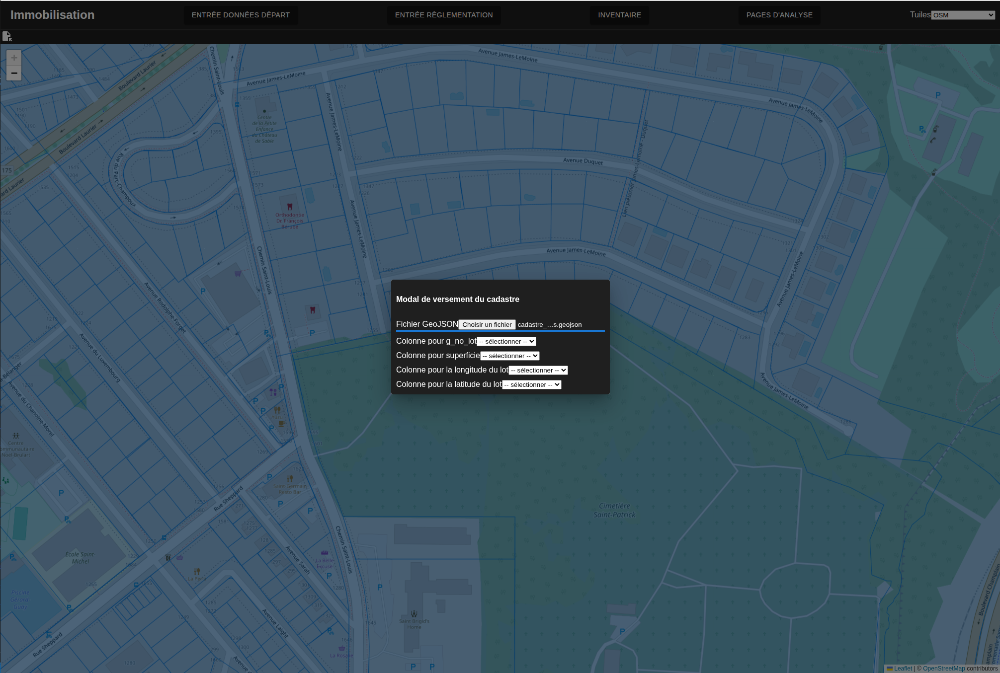
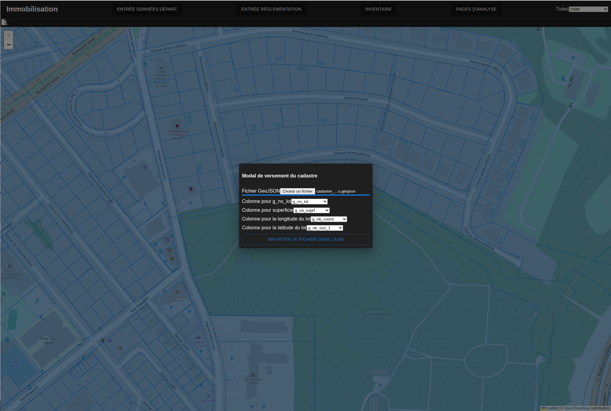
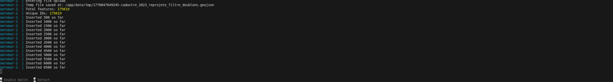

# Versement des données cadastrales

---
[<Téléversement unite](023-EntreeConversions.md)| 
[Versement des données du rôle>](025-VerseDonneesRole.md)
---

On peut maintenant verser les [données cadastrales](http://localhost:3000/cadastre). Si des données existent la page montrera la division cadastrale actuelle. L'utilisateur doit zoomer pour voir les données pour limiter la quantité de données chargées. 

L'icône en haut à gauche permet de verser de nouvelles données. Le versement se fait en deux étapes. L'utilisateur sélectionne d'abord le fichier qui est versé sur le serveur

L'utilisateur fait l'affectation entre les colonnes du fichier et les colonnes de la base de données à l'aide des listes déroulantes montrées:

Une fois que les affectations nécessaires sont faites, un bouton apparait pour verser les données dans la base de données. 

Cette étape est relativement longue et l'utilisateur devrait garder un oeil sur le terminal pour voir les progrès du versement qui se fait par lot de 500.

Il est important de noter que le versement de données élimine les données qui étaient présentes auparavant.