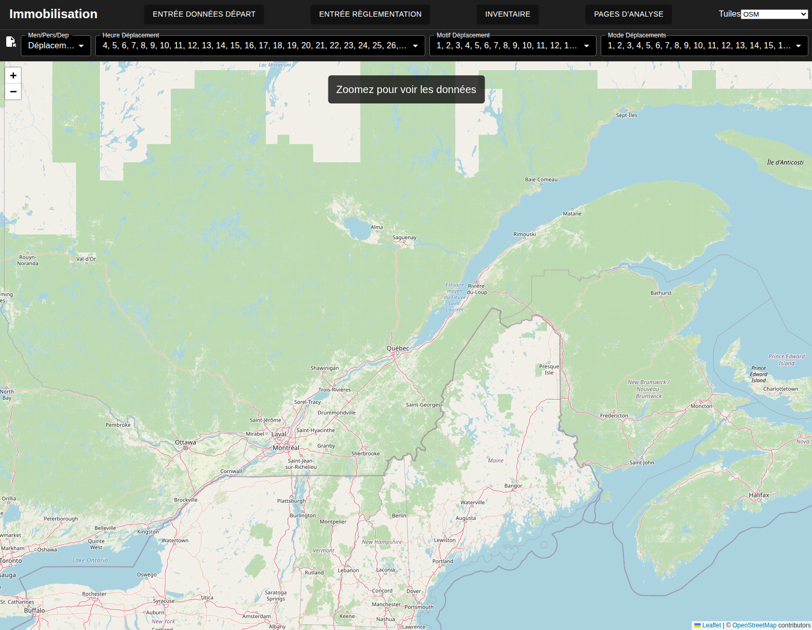
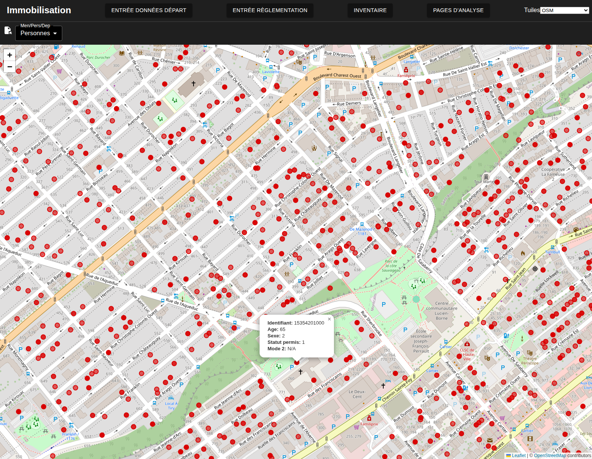
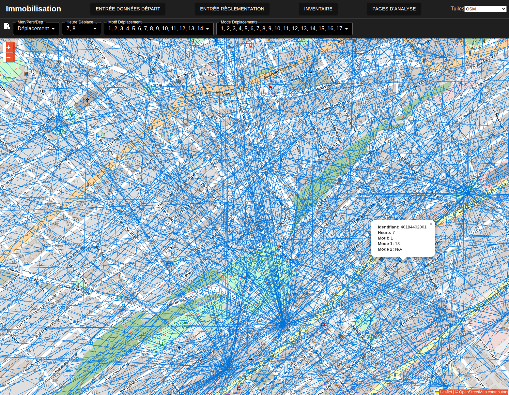
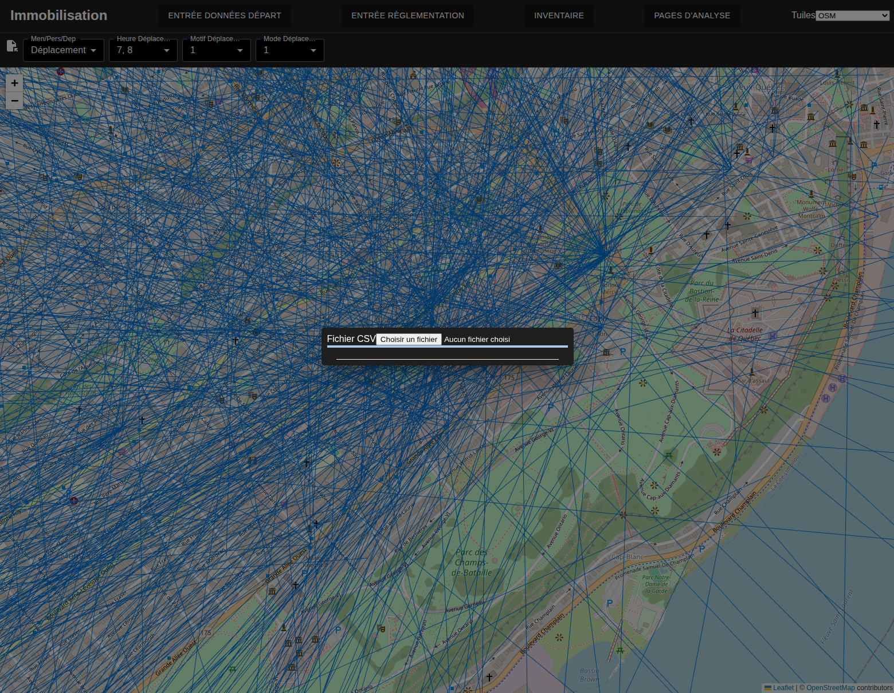
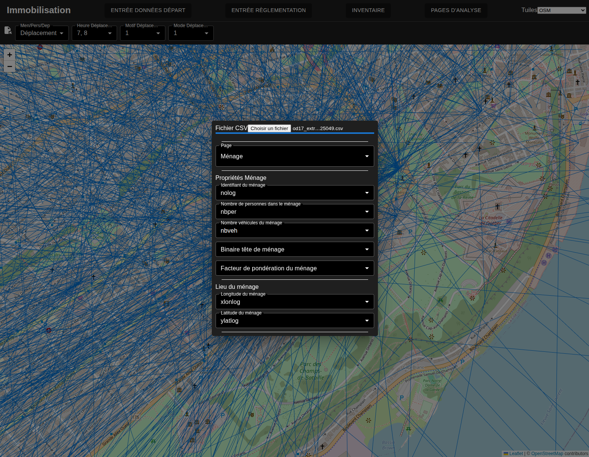
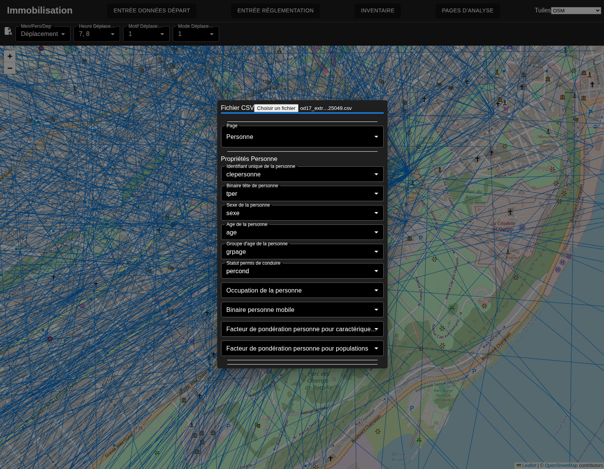
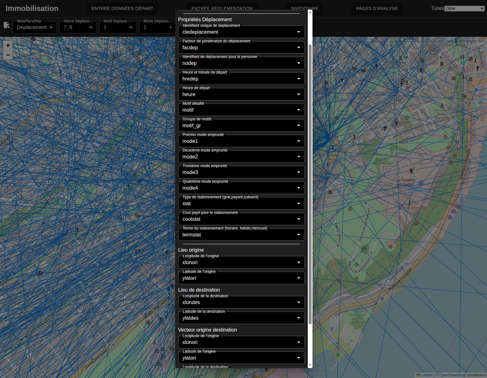
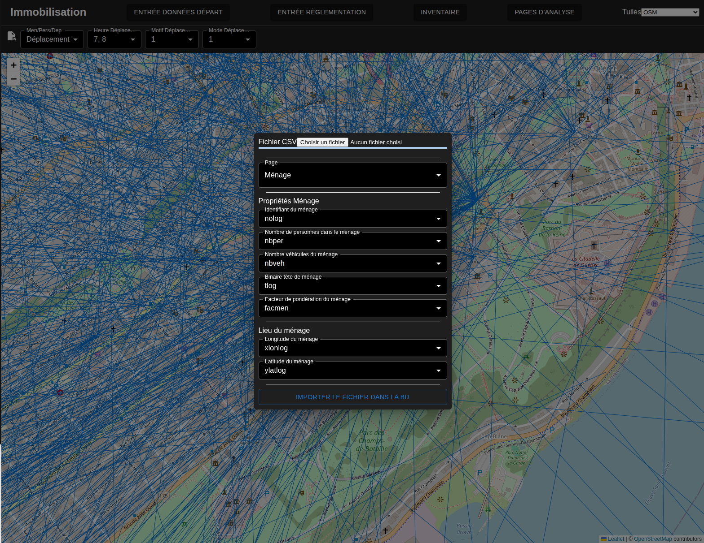
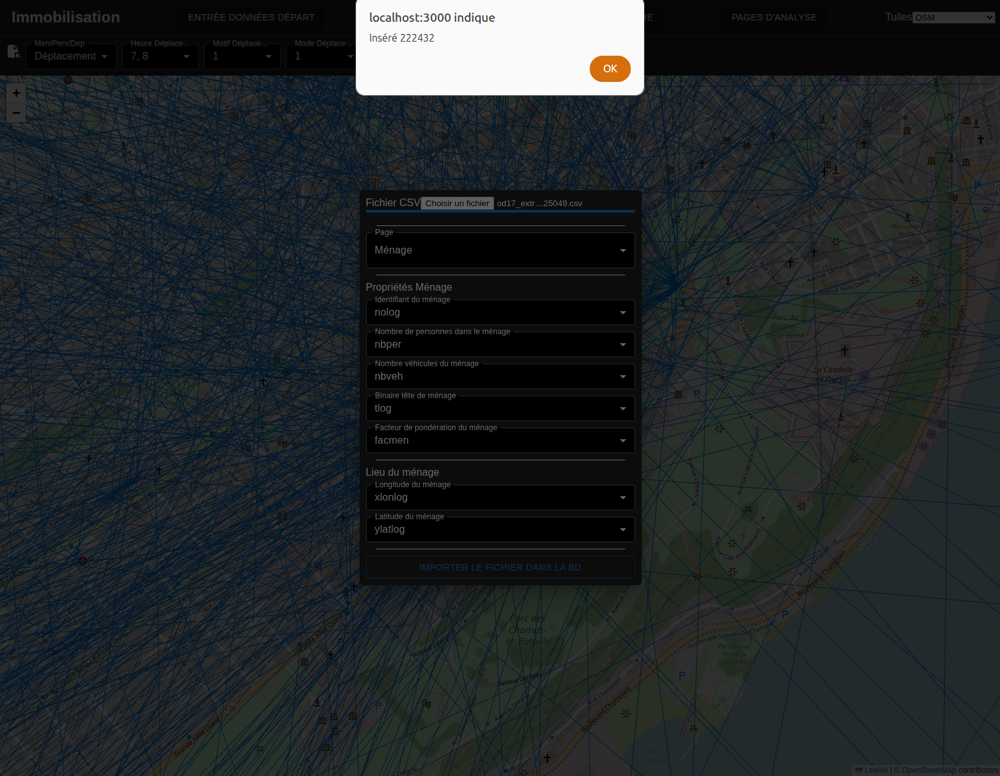
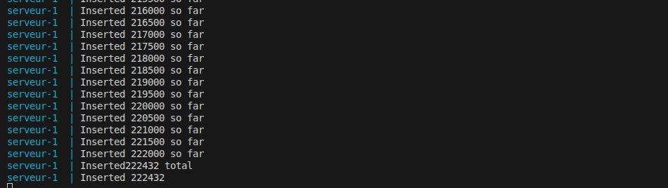

# Versement des données d'enquête Origine destination
---
[^Tables des matières](../../README.md)|
[<Versement des données du recensement](025-VersementDonneesPopu.md)| 
[Versement de l'historique>](030-VersementModifHistorique.md)
---
La présente montre la méthode pour verser des données d'enquête OD de type fichier plat. La méthode actuelle ne prend pas en compte comment les indices pour les modes pourraient changer mais permet de prendre en compte de légère variation dans les numéros de colonnes. Des améliorations futures devraient être mises en place pour [mieux gérer les données d'enquête](https://github.com/EPMPaulPoly/immobilisation/issues/59). La méthode est très similaire aux données de cadastre et du rôle, la page affiche normalement les données pertinentes au-dessus d'un niveau de zoom donné.

La figure suivante montre l'interface à l'arrivée sur la page. Par défaut, la page affiche les déaplcement mais on peut choisir de voir les ménages ou les personnes. Les barres déroulantes permettent de filtrer les entrées selon le mode le motif et l'heure de départ du déplacement. Pour limiter la quantité de données chargées en même temps, les données ne sont affichées qu'au dela d'un certain niveau de zoom. 

L'image suivante montre la visualisation des ménages de l'enquête OD. En cliquant sur le ménage, un pop-up apparait pour afficher certains détails du ménage. 

L'image suivante montre la même page en visualisant les personnes. Cliquer sur les boutons ne montrera que la dernière personne du ménage. Aucune fonction n'a encore été implémentée pour explorer plusieurs personnes au même domicile comme c'est le cas pour les entrées du rôle. Cette limitation est mentionnée dans cet [issue](https://github.com/EPMPaulPoly/immobilisation/issues/61)

Finalement, on peut visualiser les trajets et les filtrer. L'image suivante montre cet écran pour les départs de 7 et 8 heure:

Pour verser les données, on appuie sur le bouton à côté de la liste déroulante d'objet ouvrant le modal montré à la figure suivante:

Une fois le  fichier choisi, l'interface verse automatiquement le fichier sur le serveur dans un dossier temporaire et des listes déroulantes apparaissent. 

On remplit alors les champs pour permettre de faire l'équivalence entre les colonnes du fichier et les colonnes de la base de données. Ceci est mis en place pour prendre en compte de légère variations de fichiers. Les colonnes sont réparties sous trois sous pages: ménages, personnes, déplacements pour éviter que le modal ne soit trop énorme. Ces sous pages sont montrées dans cet ordre, partiellement remplies. Pour les colonnes de géométries, le fichier fait l'hypothèse que le fichier d'enquête contient les positions des origines et destinations en référentiel 4326 dans des colonnes séparées. Dans le cas des déplacements, l'origine et la destination sont entrées deux fois. Une première fois pour créer des colonnes pour l'origine et la destination et une deuxième fois pour créer un vecteur visuel qui est compilé au versement des donnnées.

Une fois les colonnes affectées, un bouton apparait permettant de compléter le versement des données depuis le dossier temporaire vers la base de données en utilisant l'affectation choisie par l'utilsateur. 

Une fois le bouton cliqué, les données commenceront à être versées sur le serveur. Cette opération prend environ une minute. Une fois le versement complété, une alerte s'affiche. 

L'utilsateur peut aussi suivre le progrès dans le terminal du serveur. Le versement se fait en lots de 500 pour éviter de charger trop de données en mémoire

Ceci complète la phase de versement des données d'enquête OD.