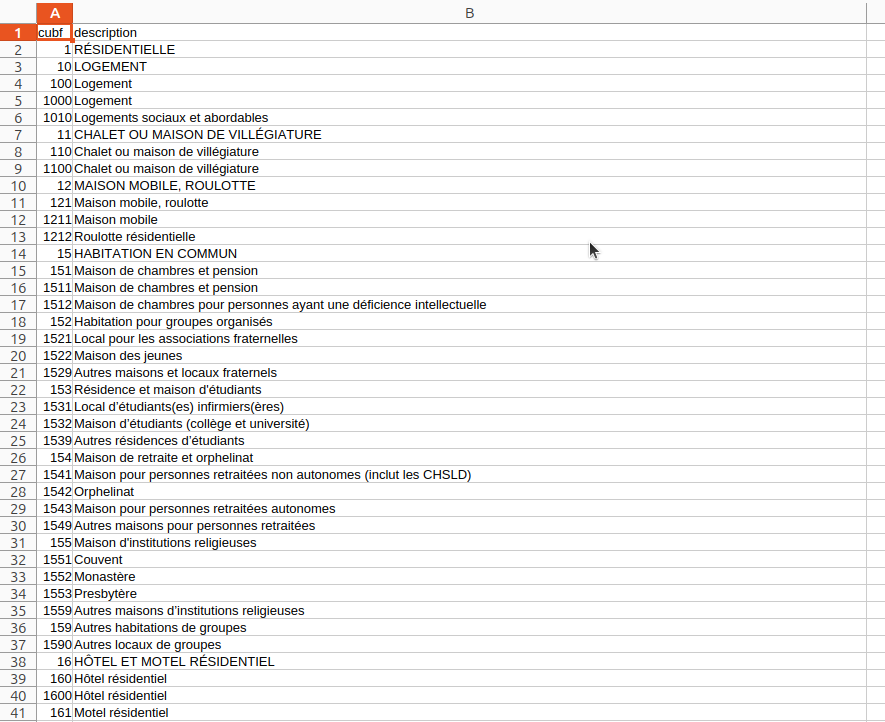
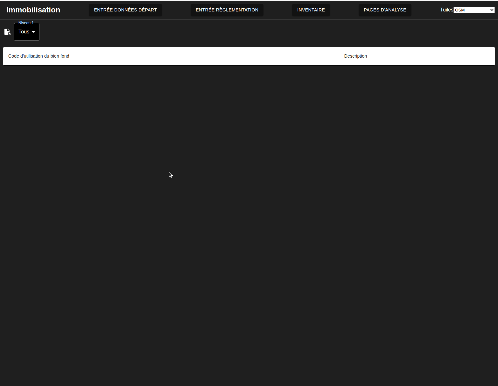
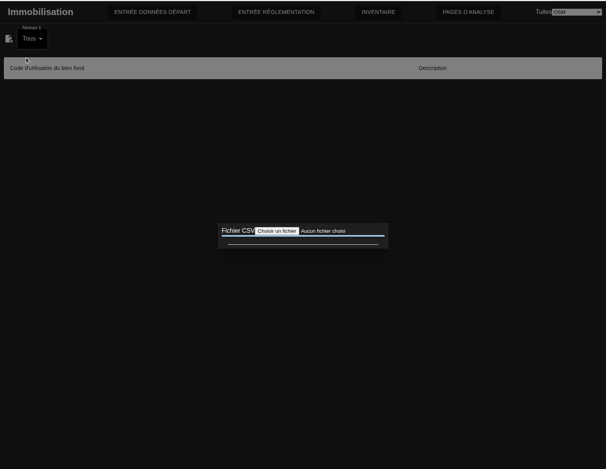
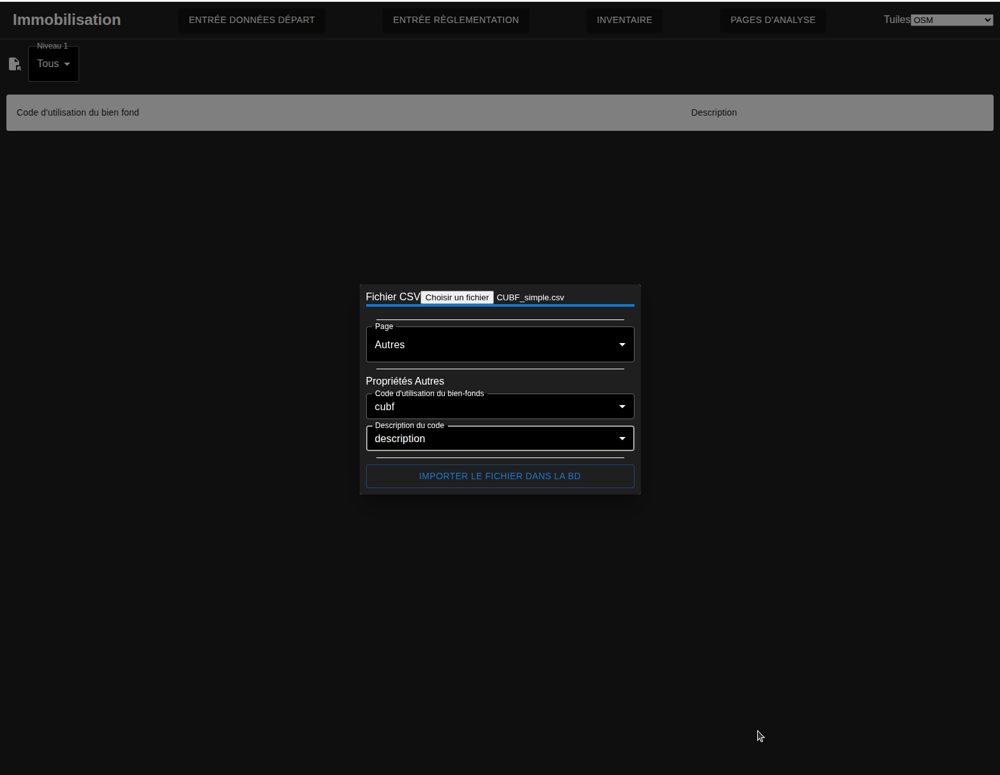
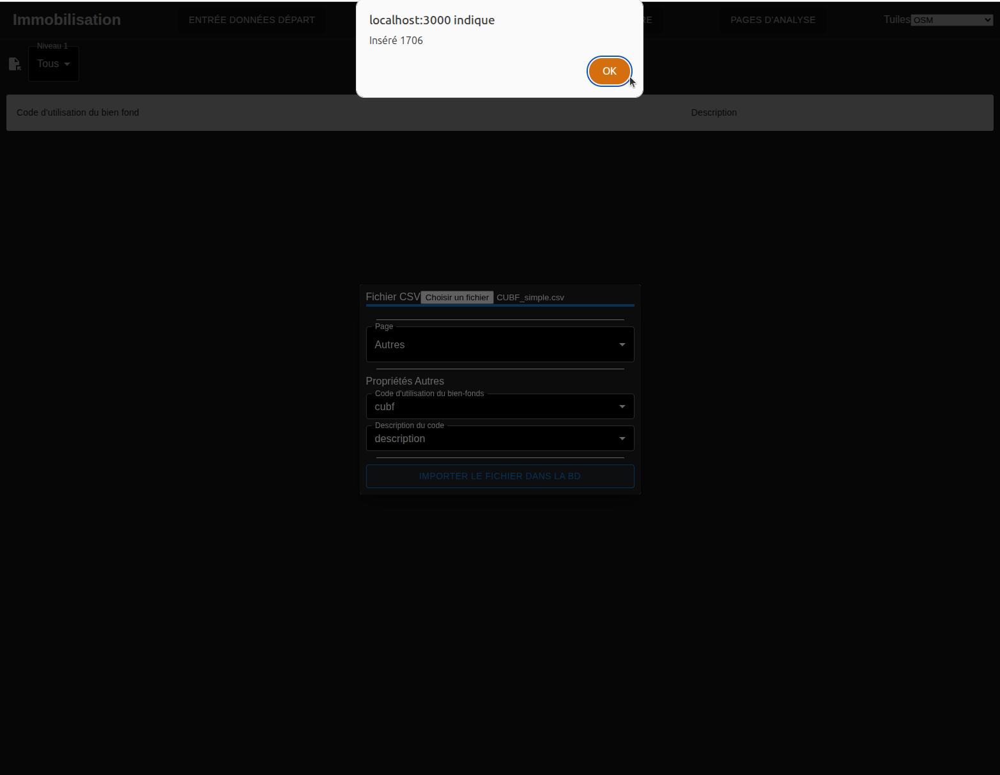
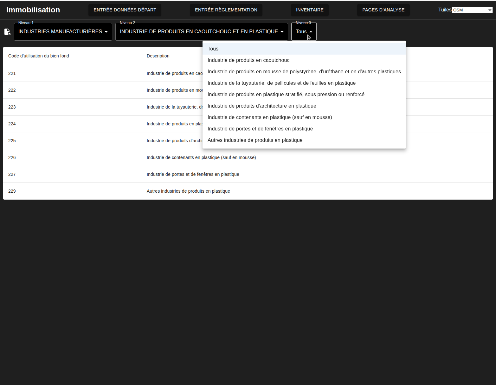

# Versement des codes d'utilisation du bien fonds
---
[^Tables des matières](../../README.md)|
[<Versement des données d'enquête OD](026-VerseDonneesOD.md)| 
[Création des opérateurs de règlements>](028-CreationOperateuresReglements.md)
---

Le ministère des affaires municipales garde à jour [une liste](https://www.quebec.ca/habitation-territoire/information-fonciere/evaluation-fonciere/manuel/codes-utilisation-biens-fonds) des codes d'utilsation du bien fonds

Afin d'inclure ces données il est nécessaire de faire un peu de pré-traitement:
- Ouvrez le fichier Excel dans un tableur. 
- Enlevez les colonnes d'entêtes et de fin de table
- Enlevez la colonne de code SCIAN
- copiez la ligne "2-3" | "INDUSTRIES MANUFACTURIÈRES" pour créer deux lignes séparées (i.e. 2 industries manufacturères et 3 industries manufacturières)
- Sauvegardez les données en format csv

Le fichier devrait avoir l'apparence suivante dans votre tableur:

Vous pouvez maintenant naviguer à la page de versement des CUBF qui devrait ressembler à ceci:

Vous pouvez ouvrir le modal avec l'icône d'ouverture des fichiers:

Choisissez le fichier dans la fenêtre qui s'ouvre en appuyant sur le bouton d'ouverture de fichier. Une fois le fichire sélectionné, faites l'affectation des colonnes du fichier aux champs de la base de données

Une fois le versement complété, vous recevrez une alerte:

Les CUBF apparaitront maintenant dans la table. La table fonctione comme un arbre, en modifiant les valeurs dans les listes déroulantes en haut de la page vous pourrez explorer les code d'utilisation

