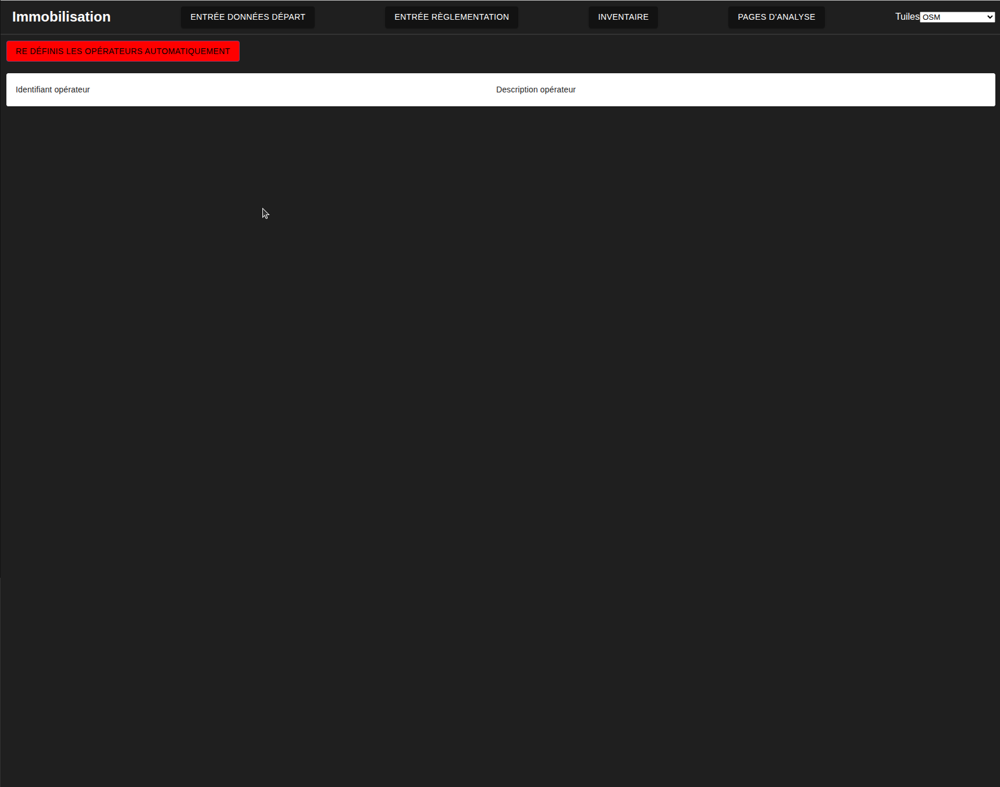
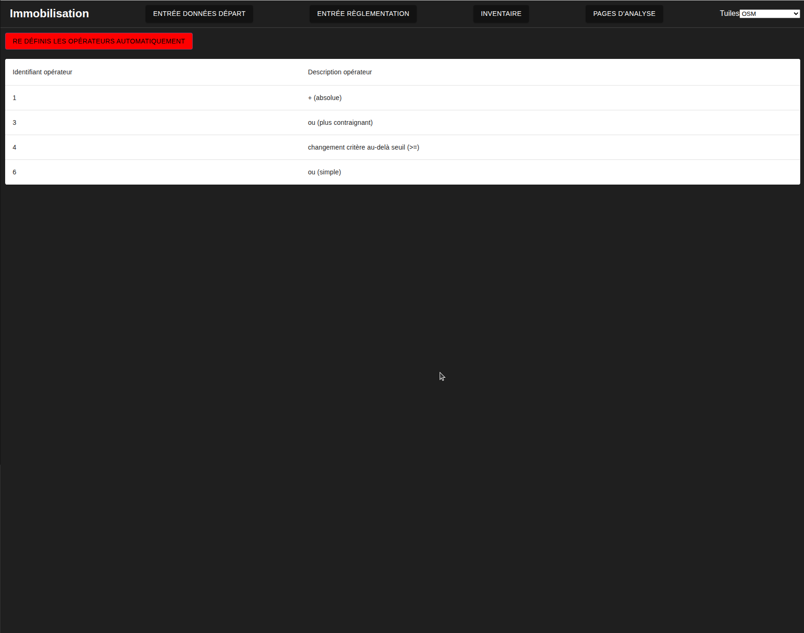

# Création des opérateurs de règlements
---
[^Tables des matières](../../README.md)|
[<Versement CUBF](027-VersementCUBF.md)| 
[Sommaire des versements>](029-SommaireVersements.md)
---

Les opérateurs doivent aussi être créées. Ces derniers sont "hard-coded" dans la procédure de calcul mais doivent être instanciés dans la base de données pour permettre la création. Un interface simple a été crée pour automatiquement les créer et les montrer.

## Comment faire?

Naviguer à la [page pertinente](http://localhost:3000/operateurs-reg). Vous devriez tomber sur un tableau vide tel que montré à l'image suivante:

Cliquez sur le bouton rouge. Une alerte devrait apparaitre indiquant le nombre d'opérateurs insérés avant que les opérateurs ne soient affichés dans la table

Ceci complète le processus de création des opérateurs

[Retour au début](#création-des-opérateurs-de-règlements)