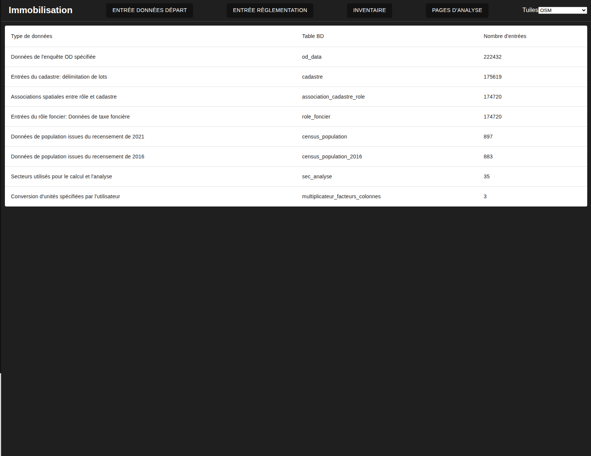

# Sommaire des données versées
---
[^Tables des matières](../../README.md)|
[<Versement des données d'enquête OD](027-VersementCUBF.md)| 
[Tutoriel règlementation>](030-IntroductionReglementation.md)
---

Une fois les données de base versées, on peut aller voir un sommaire de versements donnant le nombre d'entrées de chaque type pour vérifier en un coup d'oeil si tout a été versé selon les désirs de l'utilisateur. L'image suivant montre ce sommaire

Ceci conclut la section très procédurale des versements. La section suivante montrera l'entrée manuelle des règlements et les différentes associations nécessaires au calcul.