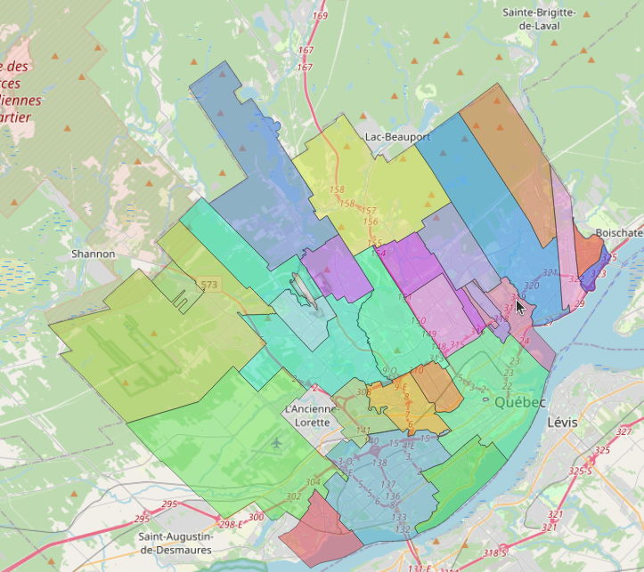
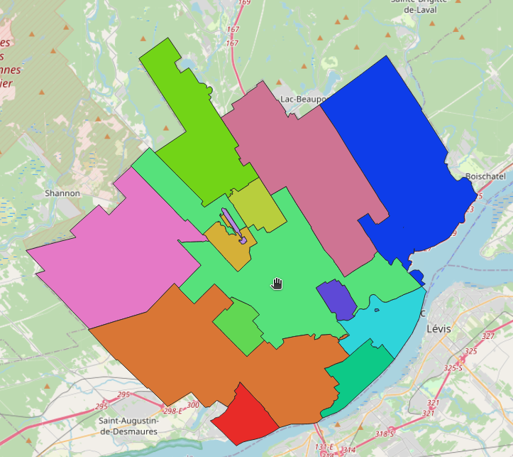
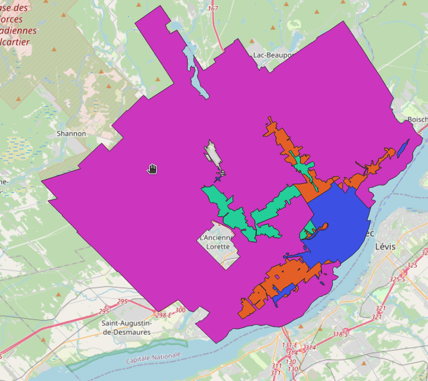

# Introduction aux règlements
---
[^Tables des matières](../../README.md)|
[<Sommaire des versements](028-SommaireVersements.md)| 
[Révision des unités>](031-RevisionDesUnites.md)
---

Cette section donnera une introduction sur la création de réglementation en vue de créer une estimation de l'inventaire. Pour ce faire un exemple simplifié sera montré. Les paramètres de cet exemple seront spécifiés dans cette page avant que chaque partie d'implémentation soit montrée pour chacun des objets.

## Références utiles:
Élections Québec maintient des [données géospatiales](https://www.electionsquebec.qc.ca/cartes-electorales/carte-electorale-du-quebec/atlas-historique-des-circonscriptions-electorales-du-quebec/) sur les limites des municipalités jusque dans le milieu des années 60. La plupart des municipalités ont des archives sur les codes d'urbanisme. Les références suivantes sont suggérées pour  quelques municipalités québecoises:
 - Province:
    - https://memento.heritagemontreal.org/boite-a-outils/references-urbanisme-et-reglementation/   
 - Montréal:
    - https://archivesdemontreal.com/2025/08/25/les-divisions-electorales-a-montreal/
    - Synthèse des règlements d'urbanismes actuels: https://memento.heritagemontreal.org/boite-a-outils/references-urbanisme-et-reglementation/reglements-durbanisme-ville-de-montreal/
    - Archives des règlements: une recherche du mot zonage plus les noms plus vieux des quartiers permet parfois de tracer l'historique https://archivesdemontreal.ica-atom.org/reglements-municipaux-1840-2001

- Québec
    - Historique des fusions: https://www.ville.quebec.qc.ca/citoyens/patrimoine/archives/jalons_historiques/docs/reperes_chronologiques_ville.pdf
    - Historique des codes d'urbanismes: https://archives.urb.ville.quebec.qc.ca
    - Règlements actuels: https://reglements.ville.quebec.qc.ca/fr/document/rc/R.V.Q.1400/
    - Affectation des zones pour le stationnement:  
        - Grille spécification: https://www.donneesquebec.ca/recherche/dataset/grille-de-specifications-du-zonage
        - Zones: https://www.donneesquebec.ca/recherche/dataset/vque_56

## Exemple 

Un exemple simplifié de la ville de québec sera montré. Cet exemple ne reflète pas l'évolution réelle du territoire mais est représentatif des tendances (fusions des municipalités, réduction de l'offre hors rue dans les quartiers centraux, différentiation des codes selon la densité du cadre bâti). Il sera utilisé dans les pages suivantes à titre d,exemple d'entrée de données

### Historique

À des fins de simplification, l'exemple comportera trois périodes montrées au tableau suivant. Ceci ne représent pas l'historique réel de la ville ou celui utilisé dans le mémoire mais est présenté ici à des fins d'instructions.

---
| Description             | Année Début      | Année fin         |
|-------------------------|------------------|-------------------|
| Pré automobile          | 0                | 1930              |
| Ère moderne             | 1930             | 2002              |
| Post Fusions            | 2002             | En vigueur        |
---

La division géographique pour la période  pré automobile est montrée ci-dessous. Dans ce cas de figure, on a la configuration la plus fragmentée de la ville de Québec disponible dans les archives:

La division géographique pour l'ère moderne est montrée ci-dessous, on conserve la fusion du secteur des rivières mais les règlements sont différenciés entre ce secteur et le centre-ville

La division geographique pour l'ère post fusion est montrée ci-dessous:

[Retour au début](#références-utiles)

### Règlements

À des fins d'instructions des codes d'urbanisme sont décrits ici. ils sont représentatifs de ce qui a été constaté dans la pratique ainsi que des cas plus complexe pour montrer la méthode de codification. Sauf indication contraire, les règlements en exemple seront mis en palce sur les 9 catégories de Code d'utilsiation du bien fonds suivants:
 - 1 : CUBF 1000 à 1999 : résidentiels
 - 2 : CUBF 2000 à 2999 : industriel
 - 3 : CUBF 3000 à 3999 : industriel
 - 4 : CUBF 4000 à 4999 : transport, électricité et utilité publique
 - 5 : CUBF 5000 à 5999 : Commercial
 - 6 : CUBF 6000 à 6999 : Service
 - 7 : CUBF 7000 à 7999 : Récréation et utilité publique
 - 8 : CUBF 8000 à 8999 : Extraction de ressources naturelles et agricultures
 - 9 : CUBF 9000 à 9999 : Immeubles non-exploités

Certains règlements plus complexes ont été inclus pour donner des exemples de ce 

#### Ère pré automobile

Règlements en vigueur partout

| Utilisation du sol    | Description du règlement | Formulation du règlement| Entrée en vigueur | Abrogation |
|-----------------------|--------------------------|-------------------------|-------------------|------------|
| 1 - Résidentielle     | Règlement résidentiel    | 0 places par logement   | 0                 |1930        |
| 2 - Industrielle      | Règlement Industriel     | 0 places par mètre carré| 0                 |1930        |
| 3 - Indutrielle       | Règlement Industriel     | 0 places par mètre carré | 0                |1930        | 
| 4 - Transport         | Règlement infrastructure | 0 places par mètre carré | 0                |1930        | 
| 5 - Commercial        | Règlement commercial     | 0 places par mètre carré | 0                |1930        | 
| 6 - Services          | Règlement services       | 0 places par mètre carré | 0                |1930        | 
| 7 - Récréation        | Règlement récréation     | 0 places par mètre carré | 0                |1930        | 
| 8 - Ress Nat          | Règlement ress. nat      | 0 places par mètre carré | 0                |1930        | 
| 9 - inexploité        | Règlement ress. nat      | 0 places par mètre carré | 0                |1930        | 

[Retour au début](#références-utiles)

#### Ère moderne

##### Ville de québec - haute ville-basse-ville
| Utilisation du sol    | Description du règlement | Formulation du règlement | Entrée en vigueur | Abrogation |
|-----------------------|--------------------------|------------------------- |-------------------|------------|
| 1 - Résidentielle     | Règlement résidentiel    | 0.6 places par logement  | 1931              |2001        |
| 2 - Industrielle      | Règlement Industriel     | 1 place par 200m²        | 1931              |2001        |
| 3 - Indutrielle       | Règlement Industriel     | 1 place par 200m²        | 1931              |2001        |
| 4 - Transport         | Règlement infrastructure | 1 place par 200m²        | 1931              |2001        |
| 5 - Commercial        | Règlement commercial     | 1 place par 20m²         | 1931              |2001        |
| 582 - Restaurants     | Règlement bouffe         | 1 place par 5 sièges ou une place par 10m² | 1931|2001    |
| 6 - Services          | Règlement services       | 1 place par 30m²         | 1931              |2001        |
| 7 - Récréation        | Règlement récréation     | 1 place par 4 sièges ou une place par 10m²  | 1931 |2001  |
| 8 - Ress Nat          | Règlement ress. nat      | 0 places par mètre carré | 1931              |2001        | 
| 9 - inexploité        | Règlement ress. nat      | 0 places par mètre carré | 1931              |2001        |

#### Autres 
| Utilisation du sol    | Description du règlement | Formulation du règlement | Entrée en vigueur | Abrogation |
|-----------------------|--------------------------|------------------------- |-------------------|------------|
| 1 - Résidentielle     | Règlement résidentiel    | 1-3 log: 1 place par logement / 4+ logements:1.5pl. par logement  |1931 |2001|
| 2 - Industrielle      | Règlement Industriel     | 1 place par 200m²        | 1931              |2001        |
| 3 - Indutrielle       | Règlement Industriel     | 1 place par 200m²        | 1931              |2001        |
| 4 - transport         | Règlement infrastructure | 1 place par 200m²        | 1931              |2001        |
| 5 - Commercial        | Règlement commercial     | 0-500m²: 1 place par 20m² / 500+m²: 25 pl. +1 place par 50m² au-delà de 500m² | 1931 |2001 |
| 582 - Restaurants     | Règlement bouffe         | 1 place par 4 sièges ou une place par 10m² avec un plancher de 10 places | 1931|2001    |
| 6 - Services          | Règlement services       | 1 place par 30m²         | 1931              |2001        |
| 6516 - Sanatorium     | Règlement Santé avec hébergement | 1 place par médecin + 1 place par 4 lits + 1 place par 2 employés | 1931 |2001 
| 7 - Récréation        | Règlement récréation     | 1 place par 4 sièges ou une place par 10m²  | 1931              |2001        |
| 8 - Ress Nat          | Règlement ress. nat      | 0 places par mètre carré | 1931              |2001        | 
| 9 - inexploité        | Règlement ress. nat      | 0 places par mètre carré | 1931              |2001        |

[Retour au début](#références-utiles)
#### Post Fusion
##### Urbain Dense
| Utilisation du sol    | Description du règlement | Formulation du règlement | Entrée en vigueur | Abrogation |
|-----------------------|--------------------------|------------------------- |-------------------|------------|
| 1 - Résidentielle     | Règlement résidentiel    | Minimum 0.25 places par logement Maximum: 2 places par logement  | 1931              |2001        |
| 2 - Industrielle      | Règlement Industriel     | 1 place par 200m²        | 1931              |2001        |
| 3 - Indutrielle       | Règlement Industriel     | 1 place par 200m²        | 1931              |2001        |
| 4 - Transport         | Règlement infrastructure | 1 place par 200m²        | 1931              |2001        |
| 5 - Commercial        | Règlement commercial     | 0-1000m² 1 place par 35m² / 1000m²+: 34 places + 1 place par 50m² au-delà de 1000m² | 1931 |2001 |
| 582 - Restaurants     | Règlement bouffe         | 1 place par table        | 1931              |2001        |
| 6 - Services          | Règlement services       | 1 place par 35m²         | 1931              |2001        |
| 7 - Récréation        | Règlement récréation     | Mimimum: 0-800 sièges: 1 place par 7 sièges/ 800+ sièges: 115 places + 1 place par 9 sièges au-delà de 800 sièges Maximum: aucun sous 500 sièges, une place par 5 sièges au-delà  | 1931 |2001  |
| 8 - Ress Nat          | Règlement ress. nat      | 0 places par mètre carré | 1931              |2001        | 
| 9 - inexploité        | Règlement ress. nat      | 0 places par mètre carré | 1931              |2001        |

##### Structurant A et B 
| Utilisation du sol    | Description du règlement | Formulation du règlement | Entrée en vigueur | Abrogation |
|-----------------------|--------------------------|------------------------- |-------------------|------------|
| 1 - Résidentielle     | Règlement résidentiel    | Minimum 0.5 places par logement Maximum: 2 places par logement | 1931              |2001        |
| 2 - Industrielle      | Règlement Industriel     | 1 place par 200m²        | 1931              |2001        |
| 3 - Indutrielle       | Règlement Industriel     | 1 place par 200m²        | 1931              |2001        |
| 4 - Transport         | Règlement infrastructure | 1 place par 200m²        | 1931              |2001        |
| 5 - Commercial        | Règlement commercial     | 0-1000m² 1 place par 30m² / 1000m²+: 34 places + 1 place par 50m² au-delà de 1000m² | 1931 |2001 |
| 582 - Restaurants     | Règlement bouffe         | 1 place par table        | 1931              |2001        |
| 6 - Services          | Règlement services       | 1 place par 30m²         | 1931              |2001        |
| 7 - Récréation        | Règlement récréation     | Mimimum: 0-800 sièges: 1 place par 7 sièges/ 800+ sièges: 115 places + 1 place par 9 sièges au-delà de 800 sièges Maximum: aucun sous 500 sièges, une place par 5 sièges au-delà  | 1931 |2001  |
| 8 - Ress Nat          | Règlement ress. nat      | 0 places par mètre carré | 1931              |2001        | 
| 9 - inexploité        | Règlement ress. nat      | 0 places par mètre carré | 1931              |2001        |

##### Général

| Utilisation du sol    | Description du règlement | Formulation du règlement | Entrée en vigueur | Abrogation |
|-----------------------|--------------------------|------------------------- |-------------------|------------|
| 1 - Résidentielle     | Règlement résidentiel    | Minimum 1 places par logement / Aucun maximum | 1931              |2001        |
| 2 - Industrielle      | Règlement Industriel     | 1 place par 200m²        | 1931              |2001        |
| 3 - Indutrielle       | Règlement Industriel     | 1 place par 200m²        | 1931              |2001        |
| 4 - Transport         | Règlement infrastructure | 1 place par 200m²        | 1931              |2001        |
| 5 - Commercial        | Règlement commercial     | 0-1000m² 1 place par 30m² / 1000m²+: 34 places + 1 place par 50m² au-delà de 1000m² | 1931 |2001 |
| 582 - Restaurants     | Règlement bouffe         | 1 place par table        | 1931              |2001        |
| 6 - Services          | Règlement services       | 1 place par 30m²         | 1931              |2001        |
| 7 - Récréation        | Règlement récréation     | Mimimum: 0-800 sièges: 1 place par 7 sièges/ 800+ sièges: 115 places + 1 place par 9 sièges au-delà de 800 sièges Maximum: aucun sous 500 sièges, une place par 5 sièges au-delà  | 1931 |2001  |
| 8 - Ress Nat          | Règlement ress. nat      | 0 places par mètre carré | 1931              |2001        | 
| 9 - inexploité        | Règlement ress. nat      | 0 places par mètre carré | 1931              |2001        |
