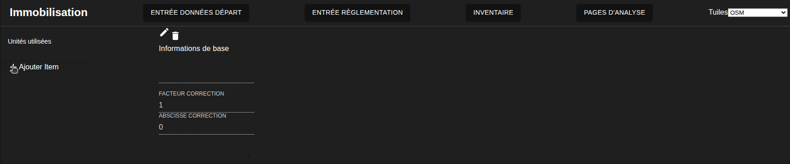
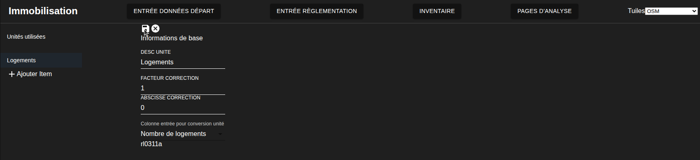
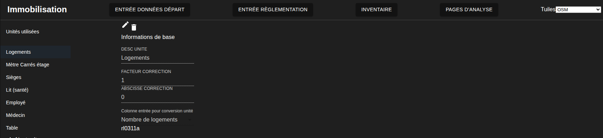
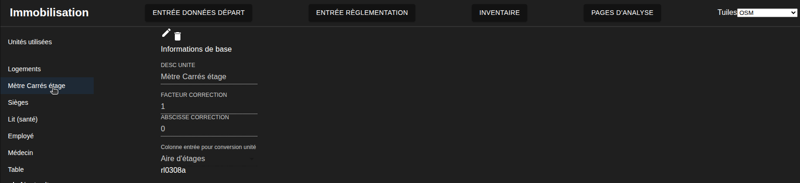
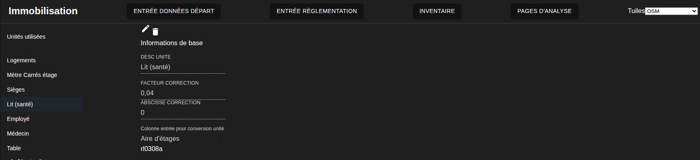
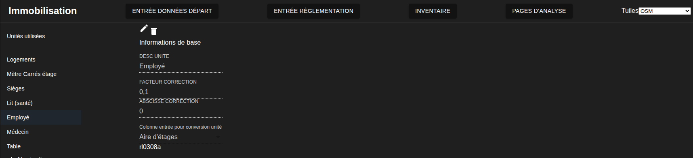
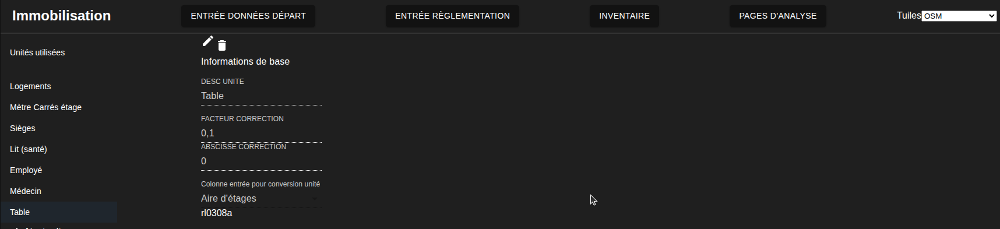

# Révision des règlements
---
[^Tables des matières](../../README.md)|
[<Introduction aux règlements](030-IntroductionReglementation.md)| 
[Création des règlements>](032-RegCreation.md)
---

## Introduction
La première étape consiste à valider que toutes les unité nécessaires ont été compilées dans la base de données. Ensuite on entre les unités manquantes dans la base de données

[Retour au début](#révision-des-règlements)
## Hypothèses de conversion

Les unités suivantes ont été recensées dans les règlements présentés à la section précédente ainsi que les facteurs de conversion qui seront utilisés dans l'exemple ces derniers sont utilisés à titre indicatif puisque les conversions d'unité sont l'un des facteurs majeurs contribuant aux erreurs de prédiction.

| Unité                  | Utilisée dans        | Ordonnée à l'origine | Pente     | Colonne rôle | Description        |
|------------------------|----------------------|----------------------|-----------|--------------|--------------------|
| Logements              | Partout              |  0                   | 1         | rl0311a      | 1 pour 1           |
| Superficie d'étages    | Partout              |  0                   | 1         | rl0308a      | 1 pour 1           |
| Sièges                 | Restaurant, assemblée|  0                   | 0.5       | rl0308a      | 1 siège par 2m²    |
| Lit                    | Santé                |  0                   | 0.04      | rl0308a      | 1 lit par 25m²     |
| Employé                | Santé / Industrie    |  0                   | 0.1       | rl0308a      | 1 employé par 10m² |
| Médecin                | Santé                |  0                   | 0.01      | rl0308a      | 1 médecin par 100m²| 
| Table                  | Restauration         |  0                   | 0.1       | rl0308a      | 1 table par 10m²   |   

[Retour au début](#révision-des-règlements)
## Procédure

On retourne donc à la page de conversion d'unités pour entrer les unités pertinentes (http://localhost:3000/unite)

1. On commence par cliquer sur le plus dans la colonne de gauche

2.  On voit alors apparaitre les champs vides pour les unités. On commence par les logemnts

3. On clique alors sur la petite disquette si l'on veut sauvegarder l'unité en question ou on peut appuyer sur la croix pour annuler

4. On répète les opérations 1 à 3 pour chacune des unités à entrer jusqu'à obtenir l'arborescence et les facteurs suivants

On peut maintenant continuer pour rentrer l'historique de la ville

[Retour au début](#révision-des-règlements)