# Versement des données de l'historique de la ville
---
[^Tables des matières](../../README.md)|
[<Versement des Données de l'enquête OD](028-VersementDonneesOD.md)| 
[Création des règlements>](031-RegCreation.md)
---
## Introduction
On commence par créer un historique de la ville avant de verser les limites géographiques des secteurs pour les différentes périodes. Tel que mentionné précédemment, on va créer un cas de figure avec trois périodes.
[Retour au début](#versement-des-données-de-lhistorique-de-la-ville)
## Création de l'historique

On commence par créer des périodes en cliquant sur l'icone + dans la barre de gauche:
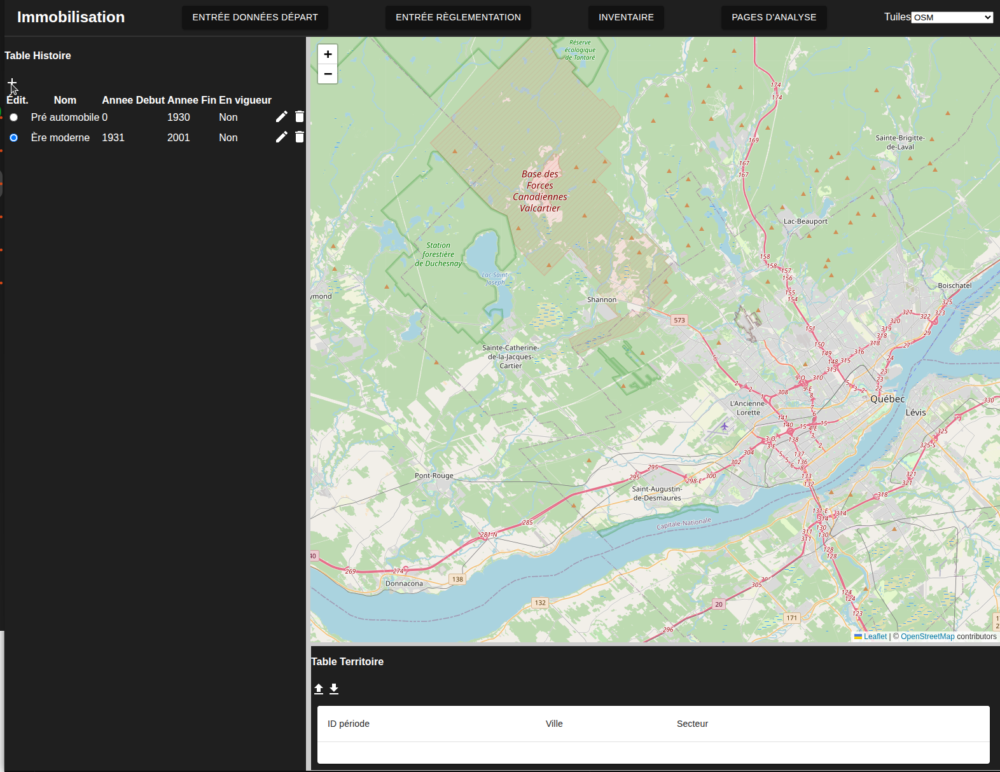

Il apparait alore une nouvelle ligne dans l'historique:

En cliquant sur la case à cocher on peut dire qu'une période est encore en vigueur.

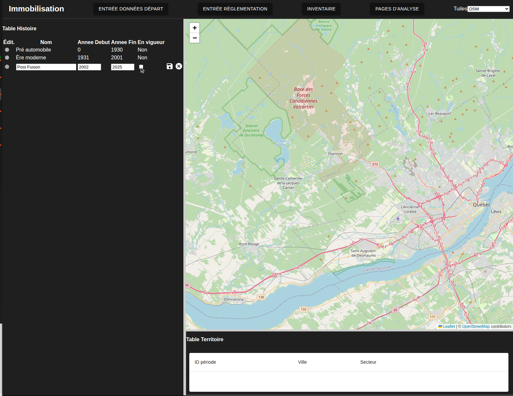

la boite de texte pour l'année de fin disparait alors. 

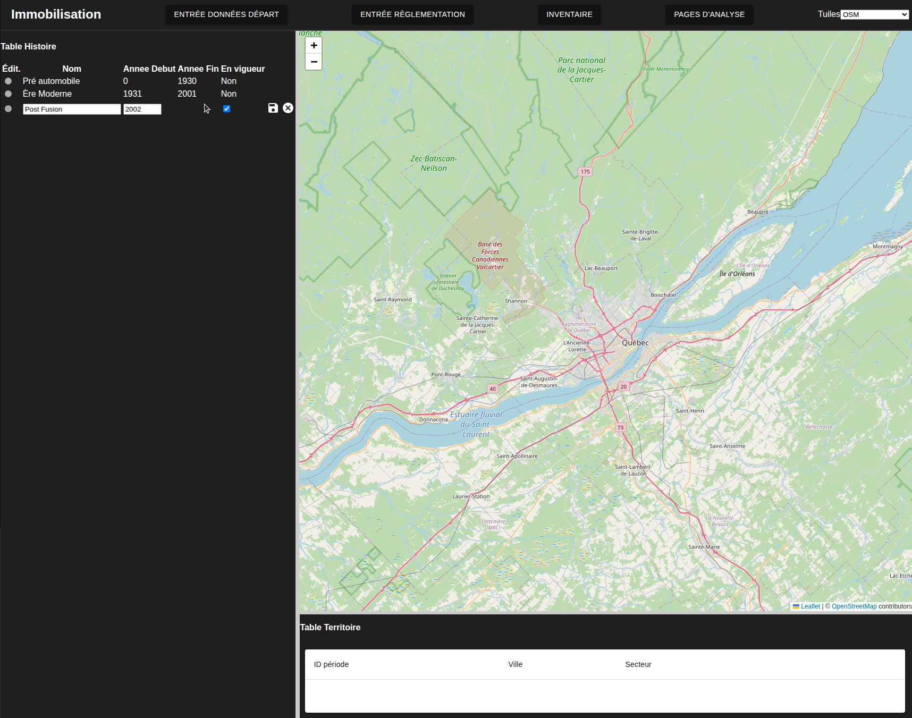

En cliquant sur la petite disquette, on sauvegarde sur la base de données. On peut vérifier que tout a été correctement chargé en rechargeant la page dans le fureteur

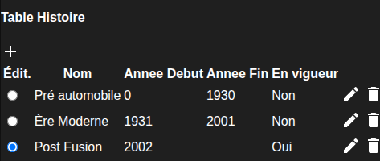

[Retour au début](#versement-des-données-de-lhistorique-de-la-ville)

## Versement des municipalités et zones

On  peut maintenant sélectionner une des période en sélectionnant le bouton radio à gauche du nom de la période. On peut dérouler le bandeau en bas et on clique sur le bouton de flèche vers le haut

Un modal devrait alors s'ouvrir qui permet de choisir un fichier
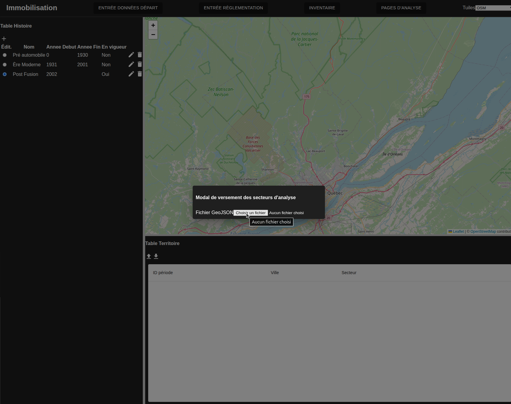

En cliquant sur le bouton, une page de sélection de fichier ouvre:

On doit alors faire l'affectation des colonnes du fichier aux colonnes attendues dans la base de données:

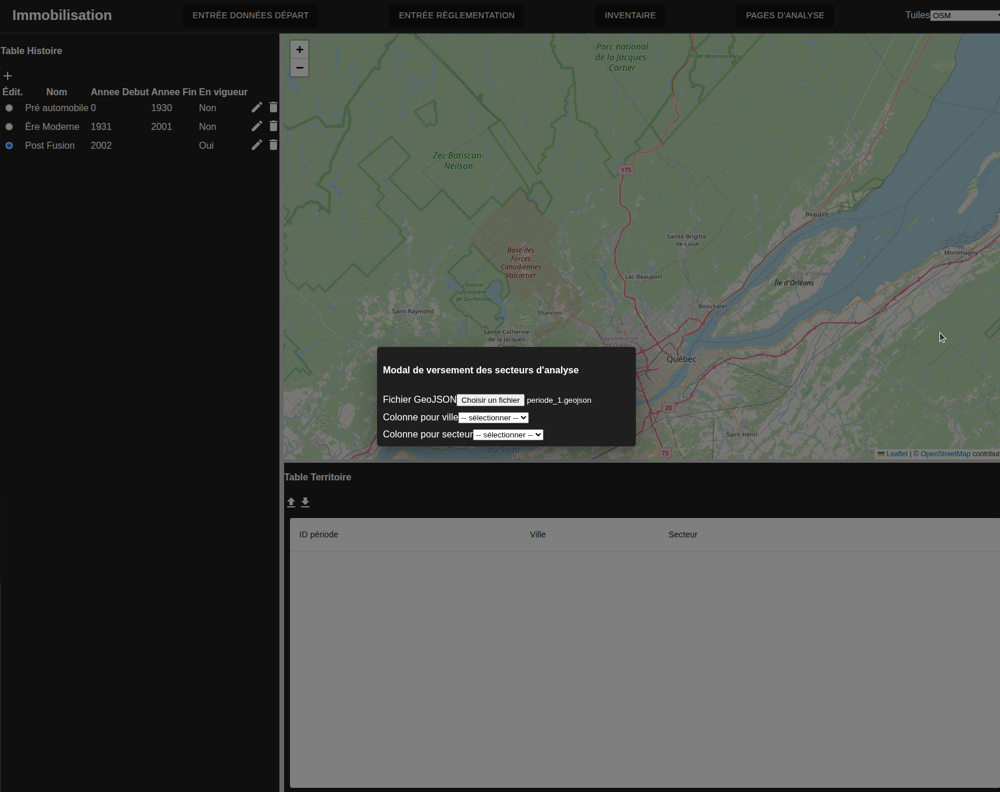

Une fois les colonnes obligatoires affectées, un bouton permet de charger les données localement (sans verser sur le serveur)
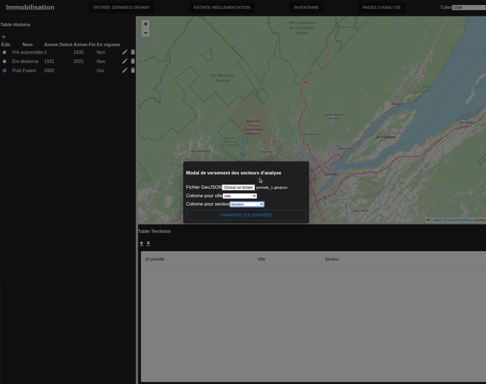

Les secteurs devraient apparaitre dans la carte et en cliquant sur les secteurs on peut voir leurs définition. Notez que l'interface attend un fichier de limite relativement léger. Si un fichier très lourd est utilisé une approche alternative devra être développée:
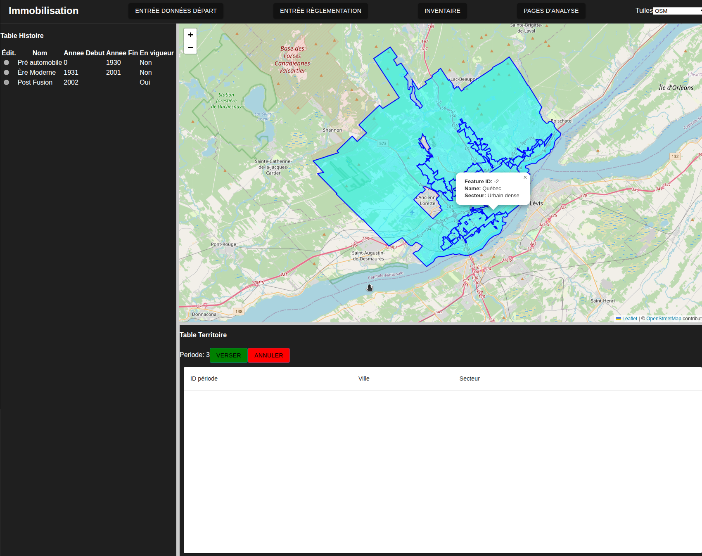

On peut alors cliquer sur le bouton vert verser ou le bouton rouge pour évacuer la carte choisie. En répétant les étapes pour chaque période on peut maintenant vérifier que tout a été versé correctement

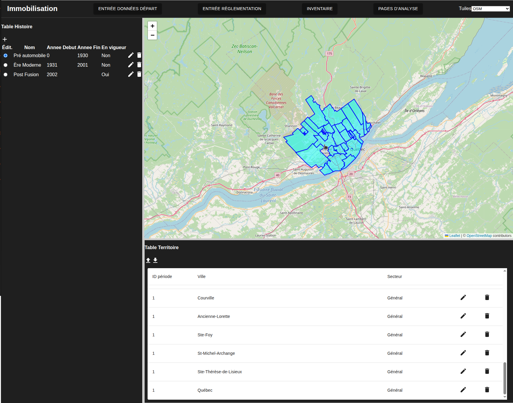

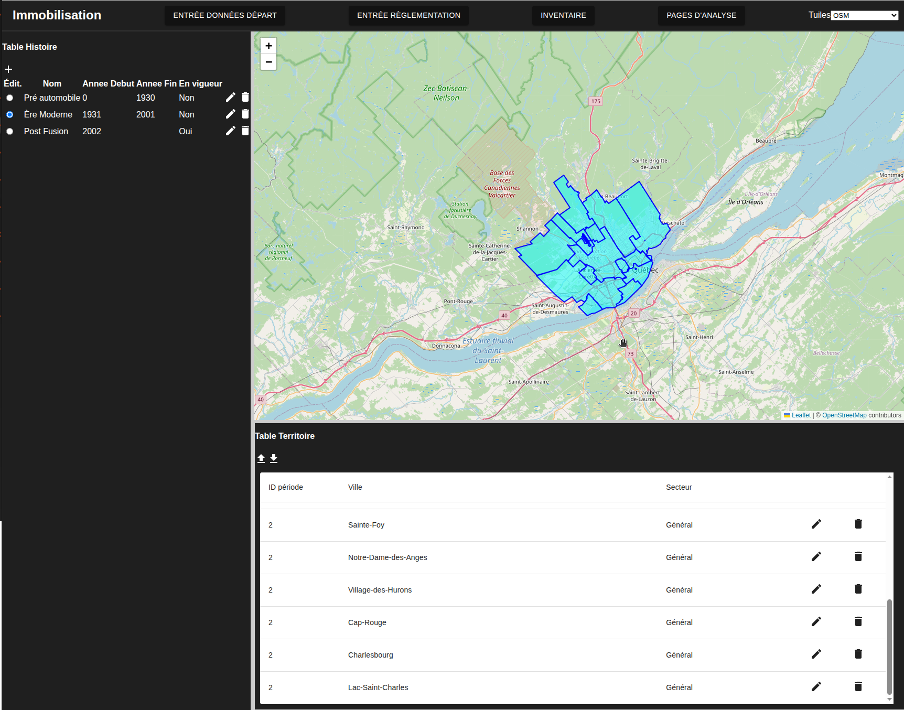

[Retour au début](#versement-des-données-de-lhistorique-de-la-ville)

## !!!Note importante!!!!
L'implémentation actuelle ne écrase les limites actuelles de la période si elle existe sans nécessairement modifier les assocations des territoires aux ensembles de règlement en aval. La modification de projets actuels doit donc être faite avec beaucoup de diligence. 

Des changements textuels ne changeront rien mais des suppressions ou le versement de nouveaux territoires risque de casser les liens avec les ensembles de règlements. 

La suppression d'une période ne supprime pas ces territoires dans la base de données mais ils auront un lien orphelin et seront difficiles à obtenir dans l'interface. 

On peut réparer ces liens en utilisant pgadmin au besoin mais il faudra alors faire le travail de détective pour trouver les identifiants des différentes composantes et modifier les bonnes table. L'utilsateur peut se référer au mémorie po

[Retour au début](#versement-des-données-de-lhistorique-de-la-ville)

## Altérations

Des modifications sont possibles aux champs de texte en cliquant sur les icones de crayon autant pour l'historique que pour les descriptions des territoires aucune modification n'est possible pour les limites

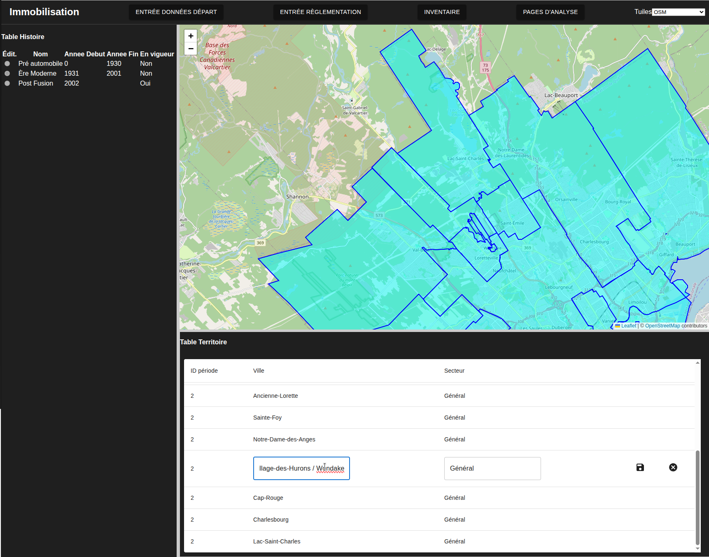

La figure suivante montre le résultat après avoir appuyé sur le bouton de disquette.
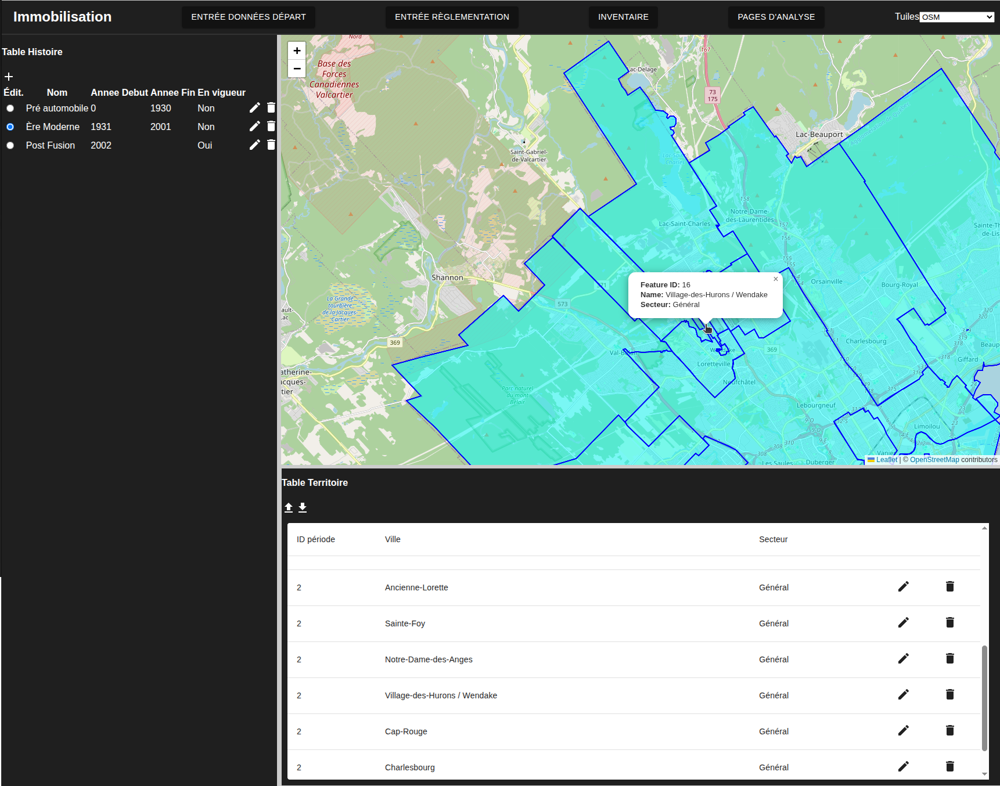

On peut supprimer un territoire si on l'a importé par erreur. Ici on va supprimer Notre-Dame-Des-Anges puisque ce lieu ne fait pas partie de la municipalité de Québec en appuyant sur l'icone de corbeille. On voit le résultat à l'image suivante;
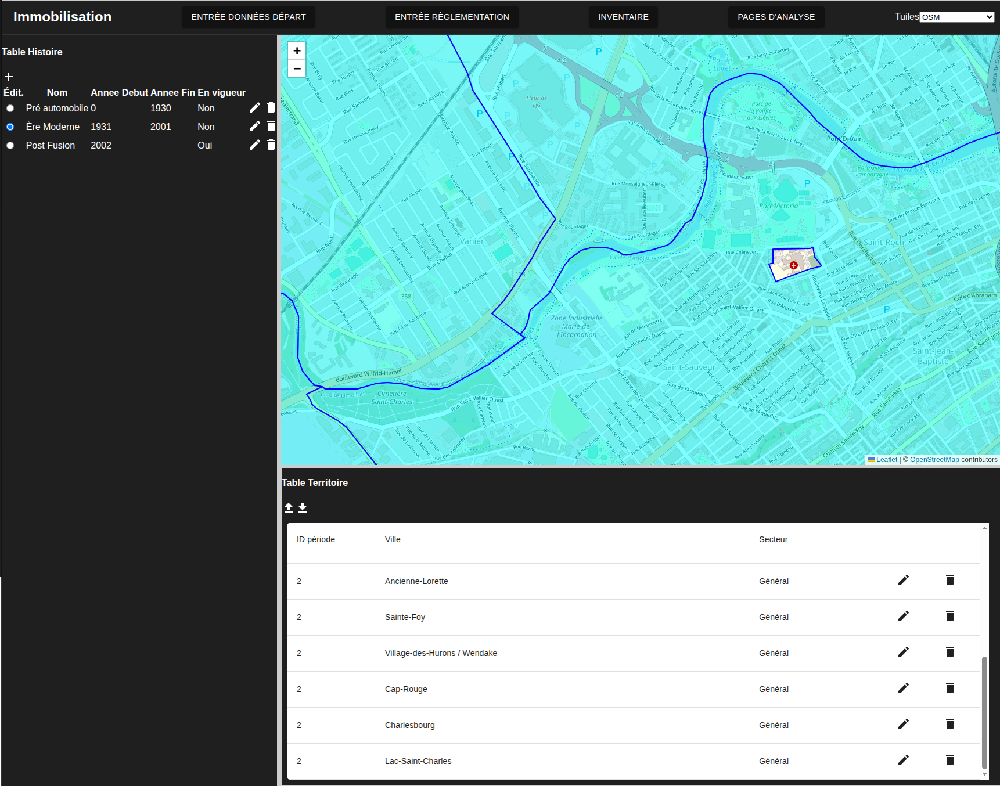

[Retour au début](#versement-des-données-de-lhistorique-de-la-ville)
