# Création des règlements

---
[^Tables des matières](../../README.md)|
[<Versement de l'historique](030-VersementModifHistorique.md)| 
[Création des ensembles de règlements>](032-EnsRegCreation.md)
---


## Table des matières locale
- [Introductin](#introduction)
- [Structure des données](#structure-des-données)
    - [État actuel](#état-actuel)
    - [Structure](#structure)
    - [Opérateurs](#opérateurs)
    - [Robustesse et travail à faire](#robustesse-et-travail-à-faire)
- [Règlement simple](#règlement-simple)
    - [Ex 1: Logement - Ère Moderne- HV-BV](#exemple-1-logement-hv-bv-ère-moderne)
- [Règlement par seuil simple](#règlement-par-seuil-simple)
    - [Ex 2: Résidentiel - Ère Moderne - Autres](#exemple-2-résidentiel-pour-lère-moderne-pour-les-autres-secteurs)
    - [Ex 3: Commercial - Ère Moderne - Autres](#exemple-3-commercial-pour-lère-moderne-pour-les-autres-secteurs)
- [Règlement par addition simple](#règlement-par-addition-simple)
    - [Ex 4: Sanatorium - Ère Moderne - Autres](#exemple-4-sanatorium-ère-moderne---autres)
- [Règlement de deux sous-ensembles simple](#règlement-de-deux-sous-ensembles-simples)
    - [Ex 5: Industriel Ère Moderne - Autres](#exemple-5-formulations-avec-unités-alternatives---industriel---ère-moderne---autres)
    - [Ex 6: Formulation avec plancher](#exemple-6-formulations-avec-plancher-sur-le-nombre-minimal-de-places)
    - [Ex 7: Formulation avec plafond](#exemple-7-formulations-de-minimum-avec-plafond-maximum-sur-le-nombre-de-places)
- [Règlements complexes](#règlements-les-plus-complexes)
    - [Ex 8: Clinique médicale modifiée](#exemple-8-une-clinique-médicale-avec-une-formulation-par-addition-et-une-formulation-simple)
- [Solution pour les règlements de l'exemple](#étude-de-cas-courante)
    - [Solution pour l'ère pré automobile](#pré-automobile)
    - [SOlution pour l'ère moderne](#ère-moderne)
    - [Solution pour l'ère post fusion](#post---fusion)

## Introduction

On va maintenant passer à l'étape de création de règlements. Cette étape risque d'être celle qui mène au plus grand nombre d'erreurs du fait de la fragilité du modèle actuel de la formulation des règlements. Cette section passera au-travers d'un règlement simple pour commencer puis augmentera la difficulté des règlements

[Retour au début](#création-des-règlements)

## Structure des données

### État Actuel
#### Structure
Les information sur les règlements sont entrposés dans deux tables. La première contient les informations administratives (dites entêtes) de règlements tandis que la deuxième (les règlements empilés ou définition mathématique) contient la définition mathématique:

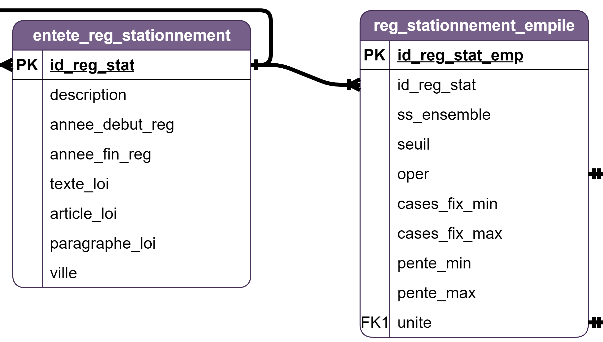

L'entête est transparente en termes de ses noms de champs. Passons en revue la définition des règlements empilés:
 - id_reg_stat_emp: identifiant unique pour chaque ligne
 - id_reg_stat: identifiant unique du règlement. Fait référence à l'entête de règlement
 - ss_ensemble: une sous division de règlement. Ce champs permet diviser le règlement en sous partie. Sera discuté dans les sections sur les règlement de [deux sous-ensembles](#règlement-de-deux-sous-ensembles-simples) et les règlements [complexes](#règlements-les-plus-complexes). Chaque sous ensemble représente une formulation soit par addition ou une formulation par seuils avec un opérateur qui définit le choix entre les deux sous-ensembles.
 - seuil: champ utilisé pour les règlements par seuil pour définir la limite inférieure d'applicabilité du règlement. La borne supérieur est définie par le premier seuil supérieur à celui de la ligne 
 - oper: champ utilisé pour définir autant le type de sous-ensemble que les opérations entre sous-ensembles. 
    - S'il s'agit de la première ligne du premier sous-ensemble, le champs est vide (valeur null)
    - S'il s'agit de la première ligne de tout sous-ensemble subséquent, le champs est fixé pour l'opérateur entre le sous-ensemble décrit à la ligne et le sous-ensemble précédent (ou simple / ou au plus contraignant)
    - S'il s'agit de toute autre ligne du sous-ensemble, l'opérateur interne du sous-ensemble est spécifié (addition ou seuil)
 - pente_min/pente_max: spécifie la variation du nombre de place en fonction de l'unité spécifiée
 - cases_fix_min/cases_fix_max: spécifie un nombre fix qui s'ajoute à la valeur calculée en fonction de la pente. Il s'agit de l'ordonnée à l'origine.
 - unite: spécifie le covariant des places de stationnement. Il faut y penser comme places par la valeur spécifiée

#### Opérateurs
4 opérateurs ont été implémentés qui se divisent en deux catégories. La première catégorie sont les opérateurs applicables à l'intérieur d'un sous ensemble. Ils sont listés dans le tableau suivant: 

| Opérateur                            | Description                                            | Exemple                                                                           |
| -------------------------------------|--------------------------------------------------------|-----------------------------------------------------------------------------------|
| + (absolue)                          | Somme le nombre de place calculées pour chaque ligne   | Restaurant : 1 place par employé plus une place par table                         |
| changement critère au-delà seuil (>=)| Changement de critère en fonction de la valeur d'entrée| Logements: 1-2 logements: 1 pl. par logement / 3+ logements: 1.25 pl. par logement|

Les deux autres opérateurs s'opèrent entre sous-ensembles. Ils sont listés dans le tableau suivant
| Opérateur                            | Description                                            | Exemple                                                                           |
| -------------------------------------|--------------------------------------------------------|-----------------------------------------------------------------------------------|
| ou simple                            | Formulations alternatives. On pose l'hypothèse que le promoteur prendra l'option avec le nombre minimums de place le moins contraignant  | Restaurant : 1 place par 20m² ou une place par table |
| ou au plus contraignant              | Formulations alternatives ou | Lieu d'assemblée: 1 place par 7 sièges ou une place par 10m² au plus contraignant|

Dans le cas du ou plus contraignant, il est aussi utiliser pour imposer des valeurs planchers et plafonds dans l'implémentation qui a été faite. Deux exemples de règlements sont donnés plus bas:
 - 1 places par 10m² jusqu'à concurrence de 10 places
 - 1 places par 50m² avec un minimum de 5 places  

L'ordre de saisie de données à un effet ici puisqu'aucune procédure robuste d'ordonnancement des données n'a été mise en place ce qui peut rendre la saisie de donnée un peu sensible aux erreurs. C'est ce constat en fin de mémoire qui a mené aux réflexions sur la section suivante.

#### Robustesse et travail à faire
Un enjeu soulevé par cette formulation est qu'elle est très sensible aux erreurs de sémantiques et relativement peu robuste aux alterations. Une proposition de structure de données alternative qui est plus déconstruite mais plus robuste est données dans la [section des problèmes du dépôt github](https://github.com/EPMPaulPoly/immobilisation/issues/50)

[Retour au début](#création-des-règlements)

## Recherche de règlements

Il est possible de chercher des règlements en cliquant sur le bouton de filtre en haut à gauche de l'écran
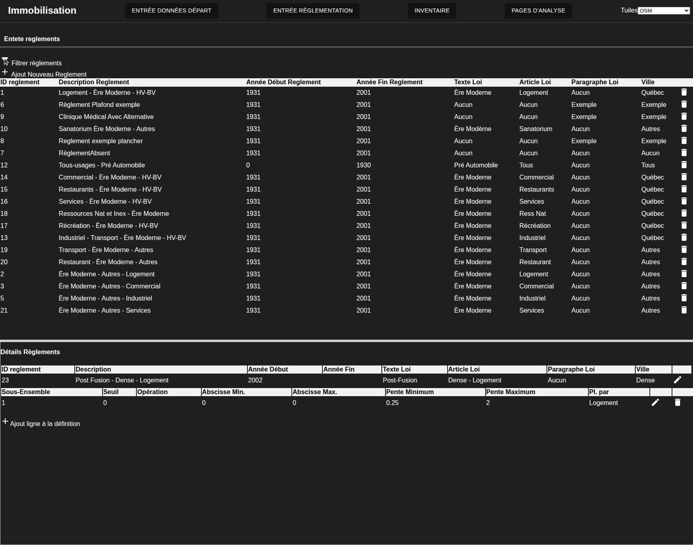

Un modal s'ouvre alors, on peut cliquer sur les boites a cocher pour activer des filtres:
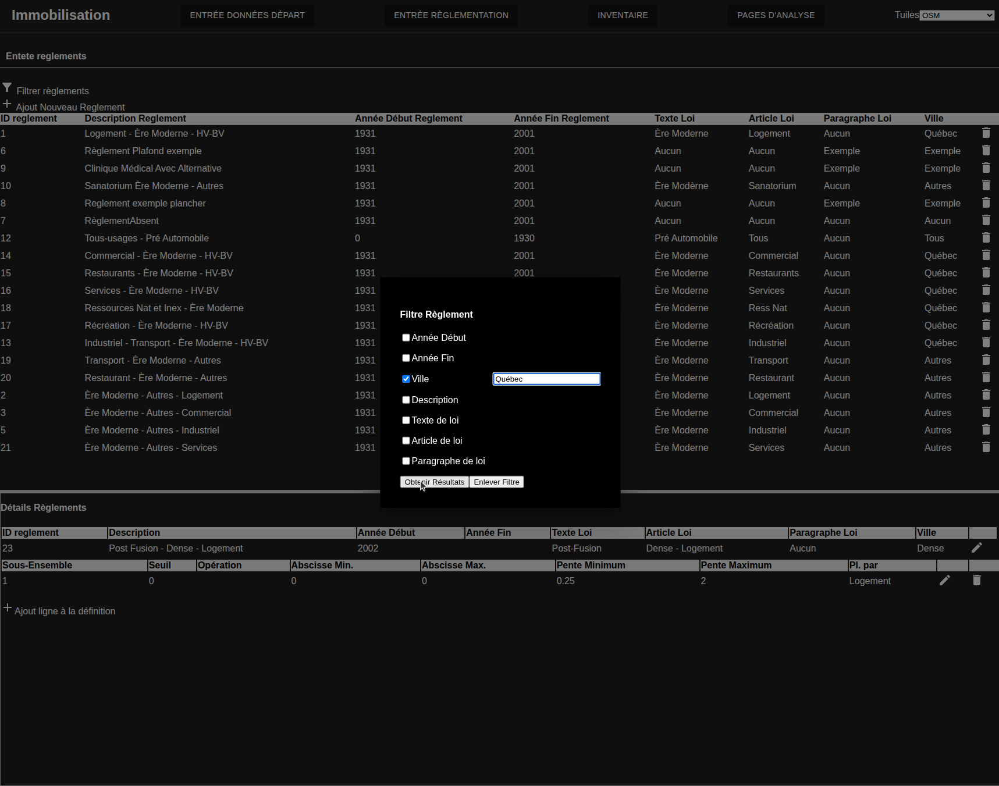


On obtient alors une liste réduite de règlements:
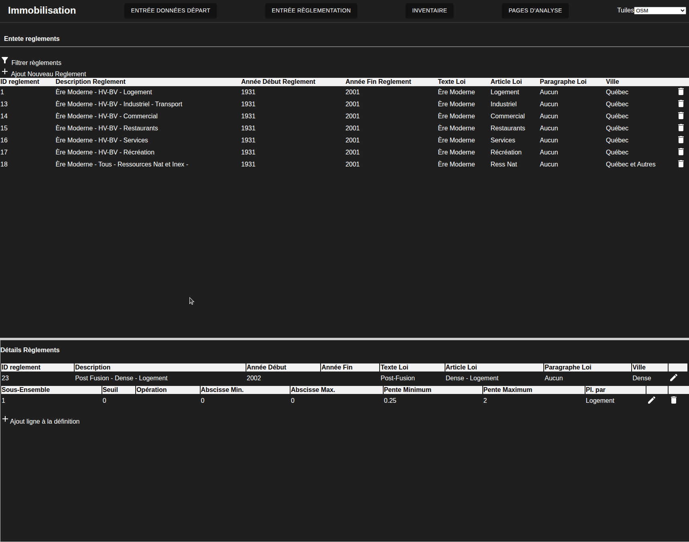
## Règlement simple
Les règlements simples constituent environ 75% des règlements recensés pour la ville de Québec. On va donner un cas type ici.

### Exemple 1: Logement HV-BV Ère moderne

À titre de rappel, le règlement est formulé comme suit: 
| Utilisation du sol    | Description du règlement | Formulation du règlement | Entrée en vigueur | Abrogation |
|-----------------------|--------------------------|------------------------- |-------------------|------------|
| 1 - Résidentielle     | Règlement résidentiel    | 0.6 places par logement  | 1931              |2001        |


On commence par naviguer à la [page des règlements](http://localhost:3000/reg) qui devrait ressembler à ce qui suit:


On clique sur le bouton + pour ajouter un règlement menant à la configuration suivante pour la page:


On remplit les champs tel que motnré ci-dessous 


On peut mainenant sauvegarder l'entête en cliqaunt sur le disquette, faisant apparaitre l'entête dans la liste principale:


Il faut maitenant créer la définition mathématique du règlement" on clique sur le bouton + ajout ligne à la définition. Une fois les champs remplis pour remplir la définition discutée ci-haut on obtient ceci:


On clique sur la disquette permettant de sauvegarder, la page devrait maintenant ressemble à ce qui suit:


[Retour au début](#création-des-règlements)
#### optionnel: vérification pg_admin

Vous pouvez vérifier la formulation complète des règlements en allant regarder la vue visu_reg_tete_a_reg_empile_2. Cela devrait maintenant ressembler à ceci:


[Retour au début](#création-des-règlements)


## Règlement par seuil simple

Le règlement de seuil simple change le nombre de place requises en fonction d'une variable d'entrée dans tous les cas recensés à Québec, les seuils étaient formulés en fonction de l'unité de formulation mathématiques (sauf certains cas discutés dans la section des règlements complexes). Ce type d'opération s'opère
### Exemple 2: Résidentiel pour l'ère moderne pour les autres secteurs

On augmente maintenant légèrement la complexité en mettant en place des seuils

| Utilisation du sol    | Description du règlement | Formulation du règlement |
|-----------------------|--------------------------|------------------------- |
| 1 - Résidentielle     | Règlement résidentiel    | 1-3 log: 1 place par logement / 4+ logements:1.5pl. par logement  |

La première partie de l'entrée de donnée est la même où l'on crée l'entête pour le règlements


On entre ensuite le seuil le plus bas, il est important de ne pas remplir l'opératuer sur la première ligne. Les champs rentrés sont montrés ci-dessous:


On sauvegarde cette première ligne avant de rappuye sur le bouton d'ajout. Sur toutes les lignes après la première ligne il est nécessaire d'ajouter un opérateur. s'il s'agit de la première ligne d'un nouveau sous-ensemble, il faut utiliser un opérateur ou, autrement on doit rentrer un opérateur d'addition ou de seuil. Un seul opérateur peut être utilisé par sous-ensement. La figure suivante montre la deuxième ligne complétée:


On appuie maintenant sur la disquette pour sauvegarder la deuxième ligne.


La figure montre le règlement complété:


#### optionel validation.

Comme dans le cas précédent on peut aller valider les choses dans pgadmin


On peut aussi aller regarder la table de définition en rentrant la requête suivante en remplaçant l'identifiant de règlement au besoin
``` 
SELECT * FROM public.reg_stationnement_empile
where id_reg_stat = 2
ORDER BY id_reg_stat_emp ASC 
```
Obtenir le résultat suivant:
|id_reg_stat_emp|id_reg_stat|ss_ensemble|seuil|oper |cases_fix_min|cases_fix_max|pente_min|pente_max|unite|
|---------------|-----------|-----------|-----|-----|-------------|-------------|---------|---------|-----|
|2              |2          |1          | 0   | null|0            |null         | 1       |  null   | 1   |
|3              | 2         | 1         |4    | 4   | 0           |null         |  1.5    | null    | 1   |


[Retour au début](#création-des-règlements)


### Exemple 3: Commercial pour l'ère moderne pour les autres secteurs

| Utilisation du sol    | Description du règlement | Formulation du règlement |
|-----------------------|--------------------------|------------------------- |
| 5 - Commercial        | Règlement commercial     | 0-500m²: 1 place par 20m² / 500+m²: 25 pl. +1 place par 50m² au-delà de 500m² |

La procédure est la même que dans les cas précédents de manière très générale. Dans ce cas de figure, il faut calculer l'ordonnée à l'origine pour la deuxième partie de la courbe.
 - En dessous de 500m²
    - L'ordonnée à l'origine est nulle donc cases_fix_min est fixé à 0
    - Le pente est de 1 place par 20m² ce qui correspond a 0.05 (=1/20) pl par m²
    - À 500m²: 500 x 0.05 = 25
 - Au dessus de 500m²
    - La valeur à 500m² doit être de 25 places
    - La pente est de 1 place par 50m² ce qui correspond à 0.02 (=1/50) pl par m²
    - Or 0.02 x 500 m² = 10 pl.. L'ordonnée à l'origine est donc de 25-10 = 15 pl.

La figure suivante montre le résultat final dans l'interface:
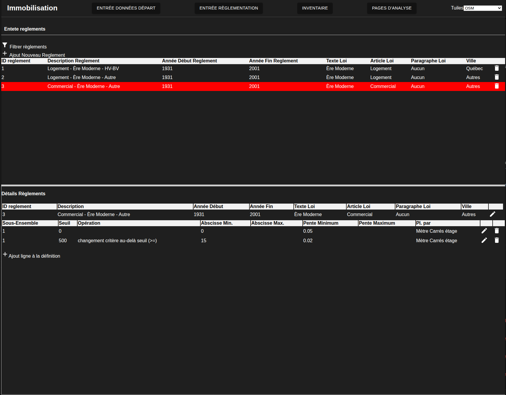

[Retour au début](#création-des-règlements)

## Règlement par addition simple
Le deuxième type de règlement un peu plus complexe est un règlement où l'on somme des places en fonction de plusieurs objets sur la propriété. C'est souvent le cas pour des lieux industriels ou des cliniques. Un exemple sera montré ci-dessous

### Exemple 4: Sanatorium Ère Moderne - Autres
L'exemple du sanatorium est réitéré ci-dessous:
| Utilisation du sol    | Description du règlement | Formulation du règlement |
|-----------------------|--------------------------|------------------------- |
| 6516 - Sanatorium     | Règlement Santé avec hébergement | 1 place par médecin + 1 place par 4 lits + 1 place par 2 employés |

Concernant les valeurs numériques à utiliser:
 - Dans tous les cas l'ordonnée à l'origine est de zéro
 - Pour le médecin, il s'agit d'une place par médecin, on fixe la pente à 1
 - Pour les lits, on a une place par 4 lits soit une pente sur le minimum de 0.25 (1/4) pl./lit
 - Pour les employé, on a une place par 2 employé soit une pente sur le minimum de 0.5 (1/2) pl./employé

On utilise l'interface pour créer la structure suivante pour le règlement

## Règlement de deux sous-ensembles simples
Une autre formulation possible est lorsque le règlement est une alternance entre deux type d'unités. Une autre possibilité est mise en place pour mettre des valeurs plancher ou plafond au nombre de places. Certains de ces cas ne sont pas soulevés dans l'exemple et seront donc définis ad-hoc ici.

### Exemple 5: formulations avec unités alternatives - Industriel - Ère moderne - Autres
La formulation du règlement décrite dans l'introduction est reproduite ici:

| Utilisation du sol    | Description du règlement | Formulation du règlement | 
|-----------------------|--------------------------|------------------------- |
| 2 - Industrielle      | Règlement Industriel     | 1 place par 200m² ou une place par employé(e) au plus contraignant| 

Commençons par déterminer les pentes et les ordonnées à l'origine:
 - Dans les deux cas, l'ordonnée à l'origine est fixée à zéro
 - La pente est fixée à 0.005 pl/m² pour la partie en fonction de l'aire d'étages
 - La pente est fixée à 1 pl/ employé pour la partie en fonctrion des employés

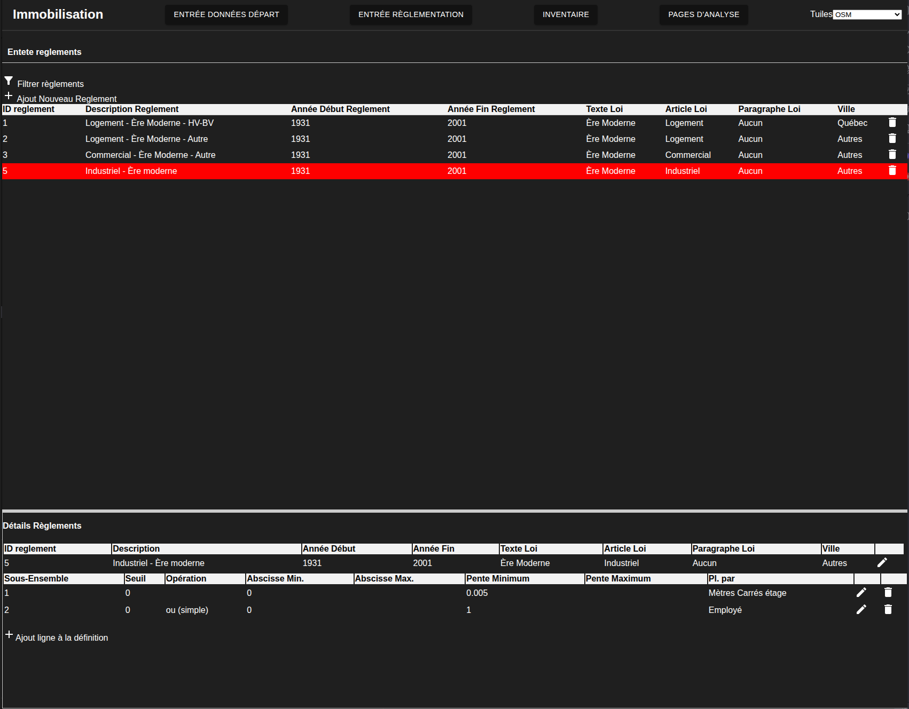

Il est important de noter que la deuxième ligne est sur un sous-ensemble différent de la première

[Retour au début](#création-des-règlements)

### Exemple 6: Formulations avec plancher sur le nombre minimal de places

Prenons maintenant un exemple où la municipalité impose un nombre minimums de places ainsi qu'un règlement traditionnel. Un exemple est donné ci-dessous:
| Utilisation du sol    | Description du règlement | Formulation du règlement |
|-----------------------|--------------------------|------------------------- |
| 5413 - Dépanneur sans vente d'essence | Dépanneur| 1 place par 20m² avec un minimum de 10 places| 

On crée donc deux sous-ensembles, un pour la contrainte de nombre minimal de places et l'autre pour la composante variable. Les paramètres sont comme suit:
 - Composante plancher:
    - cases_fix_min: 10
    - pente_min: non utilisée 
    - unité: pl/ m²
 - Composante variable
    - cases_fix_min: 0
    - pente_min: 0.05 pl./ m²

L'unité est fixée de manière identique dans les deux cas pour permettre la création de graphiques. On fixerait une contrainte de ou (plus contraignant). L'image suivante montre comment le règlement est représenté dans l'interface de création des règlements

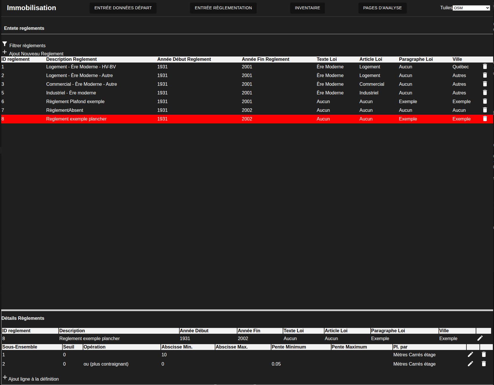

Cette formulation pourrait aussi être complété en fixant des seuils appropriés. Dans ce cas, ci en fixant un seuil à 200m²
 - Seuil inférieur:
    - seuil: 0
    - pente_min: 0
    - oper: S/V
    - cases_fix_min:10
    - unite: m²
 - Seuil supérieur
    - Seuil: 200
    - oper: changemetn au delà seuil
    - cases_fix_min:0
    - pente_min: 0.05
    - unité: m²

[Retour au début](#création-des-règlements)

### Exemple 7: Formulations de minimum avec plafond maximum sur le nombre de places
Une formulation alternative constatée est l'imposition d'un minimum jusqu'à concurrence d'une valeur donnée. Un exemple est donné ci-dessous:
| Utilisation du sol    | Description du règlement | Formulation du règlement |
|-----------------------|--------------------------|------------------------- |
| 6241 - Salon funéraire| Salon funéraire | 1 place par 10m² jusqu'à un maximum de 15 places|


On crée donc deux sous-ensembles, un pour la contrainte de nombre minimal de places et l'autre pour la composante variable. Les paramètres sont comme suit:

 - Composante plafond:
    - cases_fix_max: 15
    - pente_max: non utilisée 
    - unité: pl/ m²
 - Composante variable
    - cases_fix_min: 0
    - pente_min: 0.1 pl./ m²

Dans ce cas-ci, l'algorithme fixerait la valeur du max à la valeur donnée à toutes les valeurs. Le minimum pour sa part est attribué à la valeur calculée en-dessous du maximum avant de saturer à la valeur du maximum. La figure suivante donne un aperçu de la formulation de ce type de règlement:
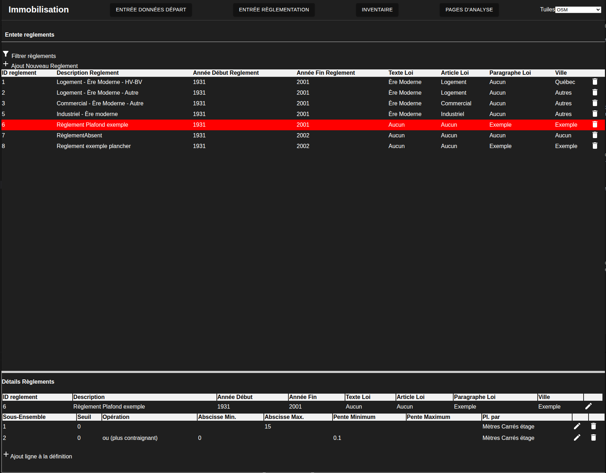

[Retour au début](#création-des-règlements)

## Règlements les plus complexes
En plus des règlements stipulés plus hauts, des règlements peuvent inclure un combinaison d'une formulation par seuil et d'une formulation par addition(ou d,une formulation simple). Un exemple constaté et d'autres exemples potentiellement faisables sont montrés dans cette section. 
### Exemple 8 une clinique médicale avec une formulation par addition et une formulation simple
| Utilisation du sol    | Description du règlement | Formulation du règlement |
|-----------------------|--------------------------|------------------------- |
| 6516 - Sanatorium     | Règlement Santé avec hébergement | 1 place par médecin + 1 place par 4 lits + 1 place par 2 employés OU une place par 20m² au plus contraignant |

Reprenant la formulation de [l'exemple 4](#exemple-4-sanatorium-ère-moderne---autres) et en ajoutant la contrainte par mètre carré. Concernant les valeurs numériques à utiliser:
 - Dans tous les cas l'ordonnée à l'origine est de zéro
 - Pour le médecin, il s'agit d'une place par médecin, on fixe la pente à 1
 - Pour les lits, on a une place par 4 lits soit une pente sur le minimum de 0.25 (1/4) pl./lit
 - Pour les employé, on a une place par 2 employé soit une pente sur le minimum de 0.5 (1/2) pl./employé
 - Pour la fonction des mètres carrés, on a une place par 20m² soit une pente sur le minimum de 0.05 (1/20) pl/m²

On implémente cette formulation de la manière suivante. Le premier sous-ensemble capture les 3 premières unités de la même manière que pour l'exmple 4. On crée cependant un deuxième sous-ensemble pour la contrainte par superficie d'étage. La figure suivante montre comment ce règlement serait implémenté dans l'interface.


[Retour au début](#création-des-règlements)

## Quelques exemples de maximums

### Exemple 9: Logement - Dense

Le cas de logement dense est reproduit ici:

| Utilisation du sol    | Description     | Formulation du règlement                            | Entrée en vigueur | Abrogation |
|-----------------------|-----------------|-------------------------                                         |------|----------|
| 1 - Résidentielle     | Résidentiel     | Minimum 0.25 places par logement Maximum: 2 places par logement  | 2002 | 2022      |

Ici, il n'y a aucun seuil on devrait être capable de tout formuler sur une ligne montrée ci-dessous:

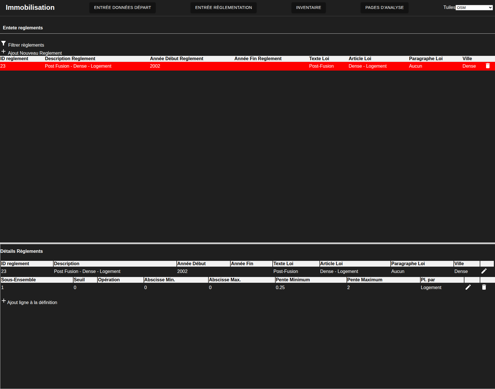

[Retour au début](#création-des-règlements)
### Exemple 10: Lieux d'assemblée: minimum avec seuil - maximum au delà d'une certaine capacité

Un minimum peut se superposer à un maximum avec potentiellement des seuils différents comme c'est le cas dans l'actuelle ville de québec. Le tableau suivant donne un  exemple:
| Utilisation du sol    | Description     | Formulation du règlement                            | Entrée en vigueur | Abrogation |
|-----------------------|-----------------|-------------------------                                         |------|----------|
| 7 - Récréation        | Récréation      | Mimimum: 0-800 sièges: 1 place par 7 sièges/ 800+ sièges: 115 places + 1 place par 9 sièges au-delà de 800 sièges Maximum: aucun sous 500 sièges, une place par 5 sièges au-delà                                   | 2002 |En vigueur |

Décomposons ce règlement:
 - de zéro à 500 sièges:
    - Minimum:  1 places par 7 sièges / cases_fix_min: 0 pente_min: 0.142857 unite: pl/ siège
    - Maximum: aucun
 - de 500 à 800 sièrges
     - Minimum 1 place par 7 sièges / cases_fix_min: 0 pente_min: 0.142857 unite: pl / siège
     - Maximum: 1 place par 5 sièges / cases_fix_min: 0 pente_min: 0.2 unite: pl / siège
 - 800+ sièges:
     - Minimum 1 place par 9 sièges / cases_fix_min: (0.142857 - 0.11111) x 800 = 25.39 pente_min: 0.11111111 unite: pl / siège
     - Maximum: 1 place par 5 sièges / cases_fix_min: 0 pente_min: 0.2 unite: pl / siège

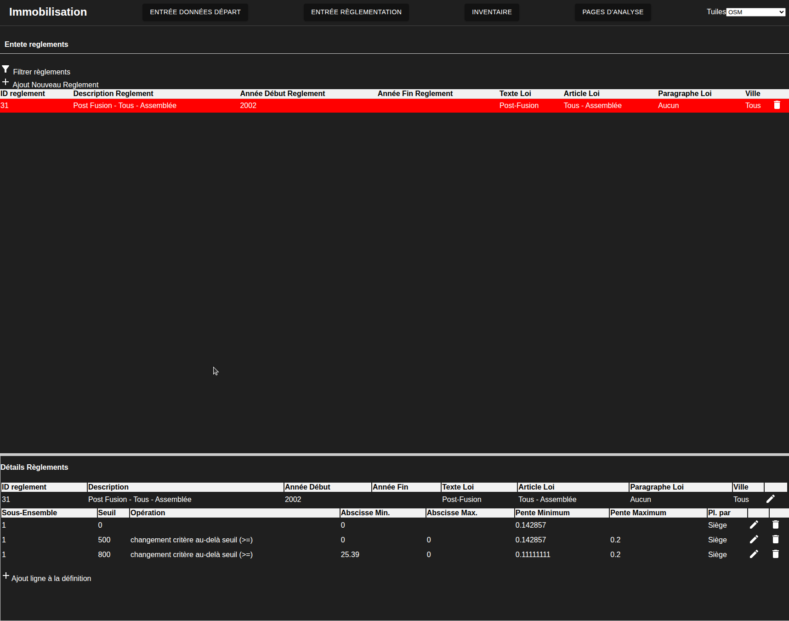

[Retour au début](#création-des-règlements)

## Étude de cas courante

Chaque règlement discuté dans la section d'introduction seront montrés dans cette section. Il est suggéré d'essayer de compléter cette section soi-même avant de la lire afin de comprendre la création de règlements.

### Pré automobile

Un seul règlement requis 0 places peu importe les conditions

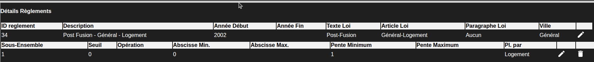

[Retour au début](#création-des-règlements)

### Ère moderne

L'image suivante donne un résumé des règlements à créer

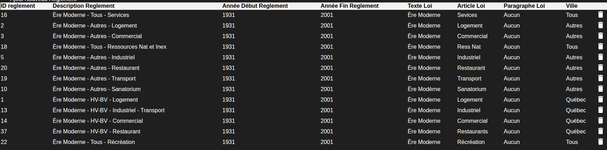

[Retour au début](#création-des-règlements)

#### Règlements communs
Plusieurs règlements ont une formulation commune entre la Haute ville basse ville et le reste de l'agglomération. Commençons par les services dont le règlement est formulé comme suit


Le règlement pour les lieux d'assemblée est formulé comme suit:
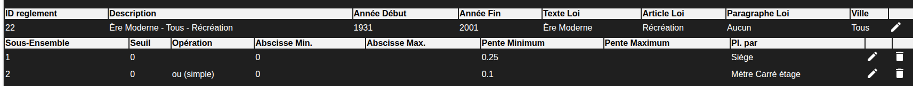

Le règlement pour les ressources naturelles et les immeubles inexploités:
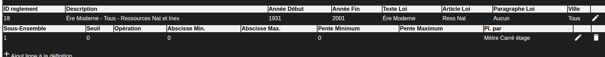
####  HV-BV
Commençons par le logement qui est formulé comme suit:
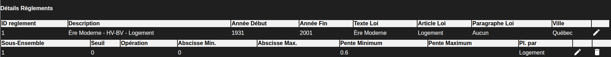

Le règlement industriel est formulé comme suit. Il est aussi utilisé pour le transport dans les autres quartiers.
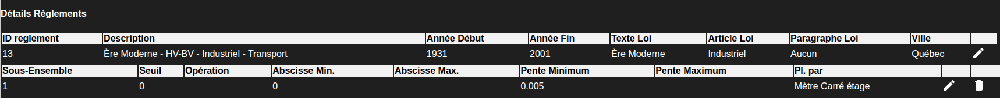

Le règlement commercial est formulé comme suit:
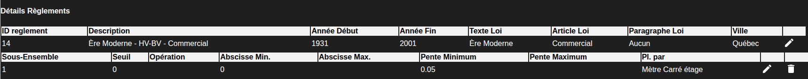

Le règlement pour les restaurants est formulé comme suit:
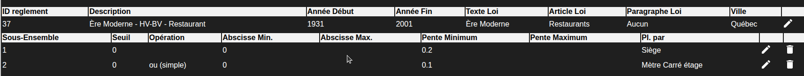

[Retour au début](#création-des-règlements)

#### Autres
Le logement est formulé comme suit pour les quartiers périphériques pour cette période:
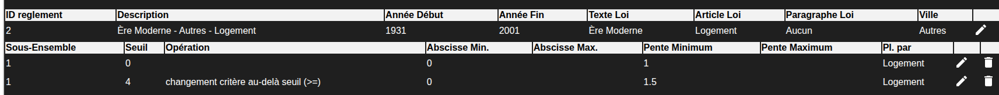

Le règlement industriel est formulé comme suit:
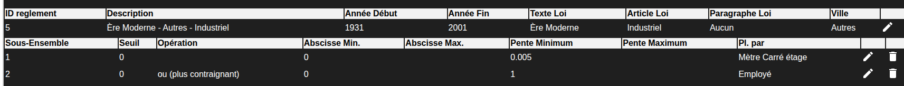

Le règlement pour les propriétés commerciales est formulé comme suit:
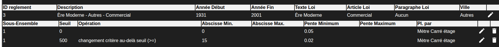

Le règlement pour les restaurants est formulé comme suit:
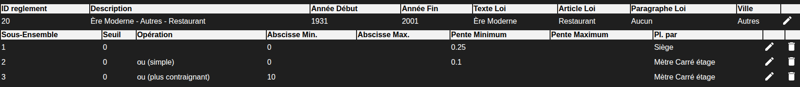

Ceci complète la section pour l'ère moderne

[Retour au début](#création-des-règlements)

### Post - Fusion
La section passerat d'abord au travers des règlements communs avant de passer sur les règlements uniques à chaque jurdiction dans la dernière période de l'historique. La figure suivante donne un résumé des règles à créer pour la période post fusion

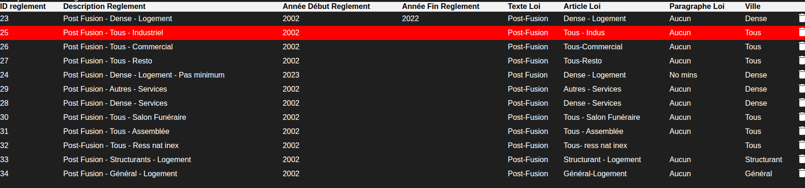


[Retour au début](#création-des-règlements)


#### Règlements communs

Tous les règlements sauf les règlements de logement et de services ont une définition commune dans notre ville fictive. Pour les propriétés industrielles, le règlement est défini comme suit:
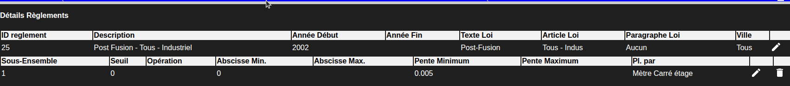

Dans le cas de propriétés commerciales, les requis de stationnement sont définis comme suit:
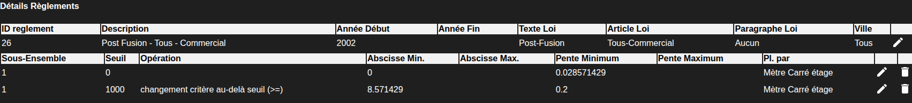

Dans le cas de restaurants, les requis de stationnement sont définis comme suit:
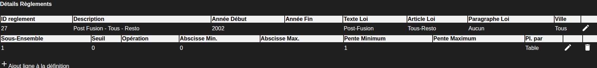

Dans le cas des salons funéraires, les requis de stationnement sont définis comme suit:
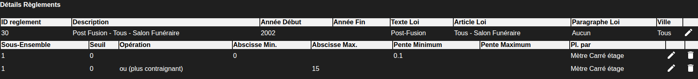

Pour les lieux d'assemblée, les requis de stationnement sont définis comme suit:


Pour les propriétés d'exploitation des ressources naturelles et les immeubles inexploités les requis de stationnement sont définis comme suit:
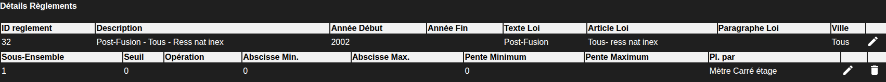

[Retour au début](#création-des-règlements)

#### Quartiers Denses Règlements spécifiques

Les règlements pour le logement et les services sont différenciés pour la catégorisation dense. D,autre part, le règlement de logement varie pendant la période ce qui requiert un règlement supplémentaire. Le règlement de début de période est montré ci-bas. Notez l,année d'abrogation différente des règlements communs qui ne changent pas
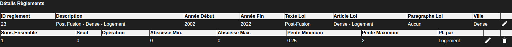

Les minimums sont les suivants après l'abroation des minimums dans le secteur dense pour le logement:
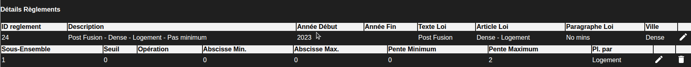

Les minimums pour le service sont définis comme suit:
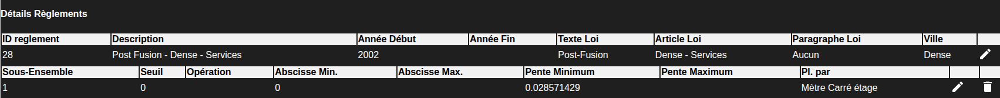

[Retour au début](#création-des-règlements)

#### Éléments communs des quartiers Structurants et généraux

Les quartiers structurants et les quartiers de définition générale partagent une même définition des requis pour les propriétés dont l'utilisation des sols est pour le service. Cette définition est montré à la figure suivante:
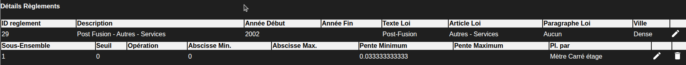

[Retour au début](#création-des-règlements)

#### Logements dans les quartiers structurants

Les logements dans les quartiers structurants ont les requis de stationnemetn spécifiés de la manière suivante:
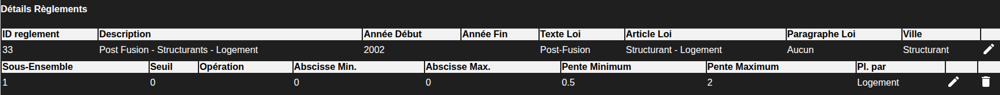

[Retour au début](#création-des-règlements)

#### Logements dans les quartiers généraux

Les logements dans les quartiers généraux ont la définition de règle suivante

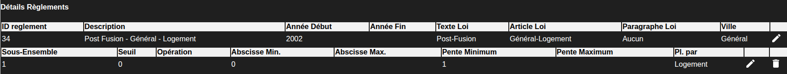

[Retour au début](#création-des-règlements)