# Création des règlements

---
[^Tables des matières](../../README.md)|
[<Versement de l'historique](030-VersementModifHistorique.md)| 
[Création des ensembles de règlements>](032-EnsRegCreation.md)
---

## Introduction

On va maintenant passer à l'étape de création de règlements. Cette étape risque d'être celle qui mène au plus grand nombre d'erreurs du fait de la fragilité du modèle actuel de la formulation des règlements. Cette section passera au-travers d'un règlement simple pour commencer puis augmentera la difficulté des règlements

[Retour au début](#création-des-règlements)

## Règlement simple : Logement HV-BV Ère moderne

À titre de rappel, le règlement est formulé comme suit: 
| Utilisation du sol    | Description du règlement | Formulation du règlement | Entrée en vigueur | Abrogation |
|-----------------------|--------------------------|------------------------- |-------------------|------------|
| 1 - Résidentielle     | Règlement résidentiel    | 0.6 places par logement  | 1931              |2001        |


On commence par naviguer à la [page des règlements](http://localhost:3000/reg) qui devrait ressembler à ce qui suit:

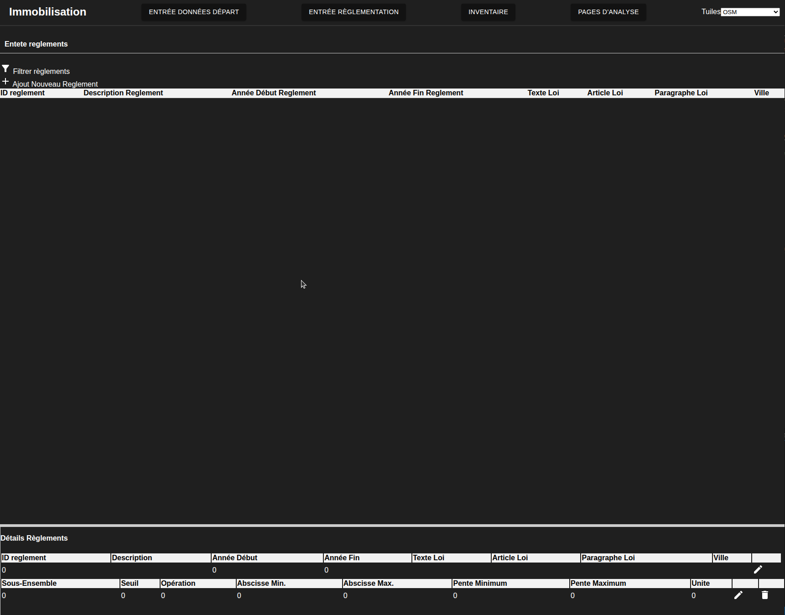

On clique sur le bouton + pour ajouter un règlement menant à la configuration suivante pour la page:

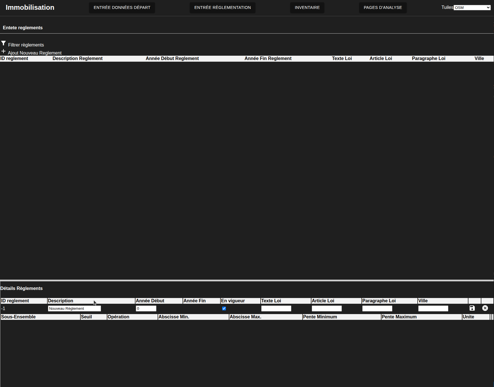

On remplit les champs tel que motnré ci-dessous 
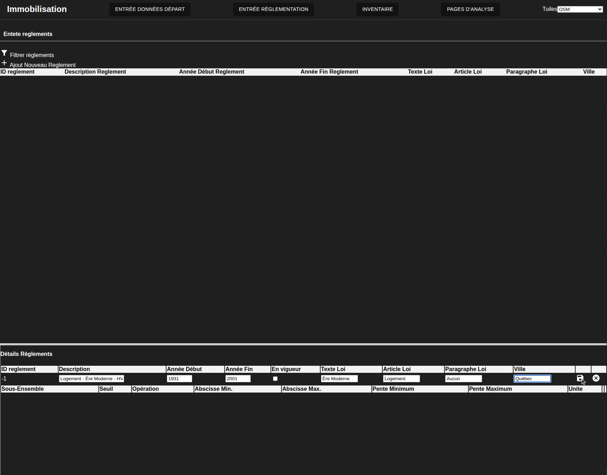

On peut mainenant sauvegarder l'entête en cliqaunt sur le disquette, faisant apparaitre l'entête dans la liste principale:

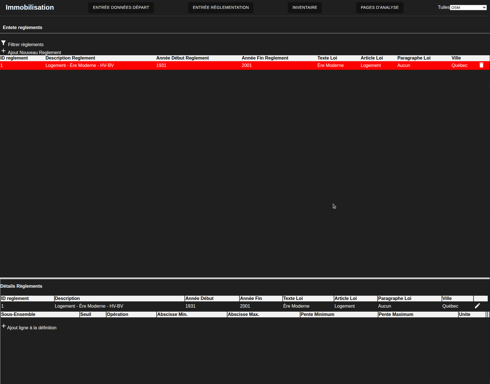

Il faut maitenant créer la définition mathématique du règlement" on clique sur le bouton + ajout ligne à la définition. Une fois les champs remplis pour remplir la définition discutée ci-haut on obtient ceci:
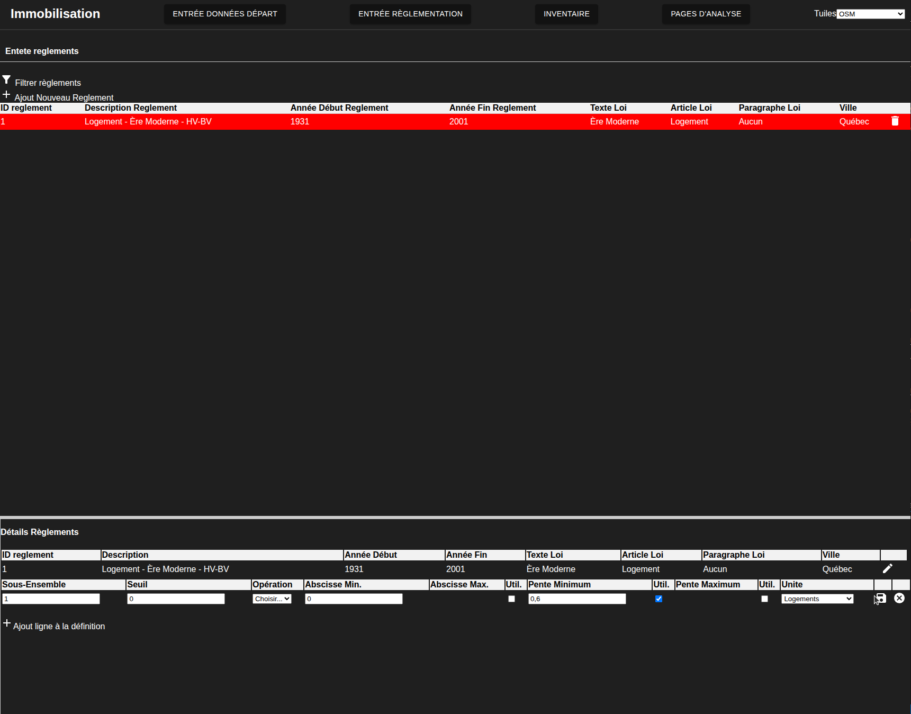

On clique sur la disquette permettant de sauvegarder, la page devrait maintenant ressemble à ce qui suit:


[Retour au début](#création-des-règlements)
### optionnel: vérification pg_admin

Vous pouvez vérifier la formulation complète des règlements en allant regarder la vue visu_reg_tete_a_reg_empile_2. Cela devrait maintenant ressembler à ceci:

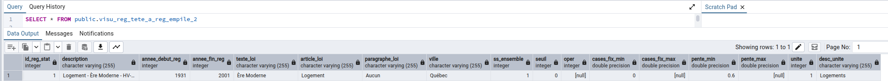


[Retour au début](#création-des-règlements)


## Règlement par seuil simple
### Exemple 1: Résidentiel pour l'ère moderne pour les autres secteurs

On augmente maitenant légèrement 
| Utilisation du sol    | Description du règlement | Formulation du règlement | Entrée en vigueur | Abrogation |
|-----------------------|--------------------------|------------------------- |-------------------|------------|
| 1 - Résidentielle     | Règlement résidentiel    | 1-3 log: 1 place par logement / 4+ logements:1.5pl. par logement  |1931 |2001|

La première partie de l'entrée de donnée est la même où l'on crée l'entête pour le règlements
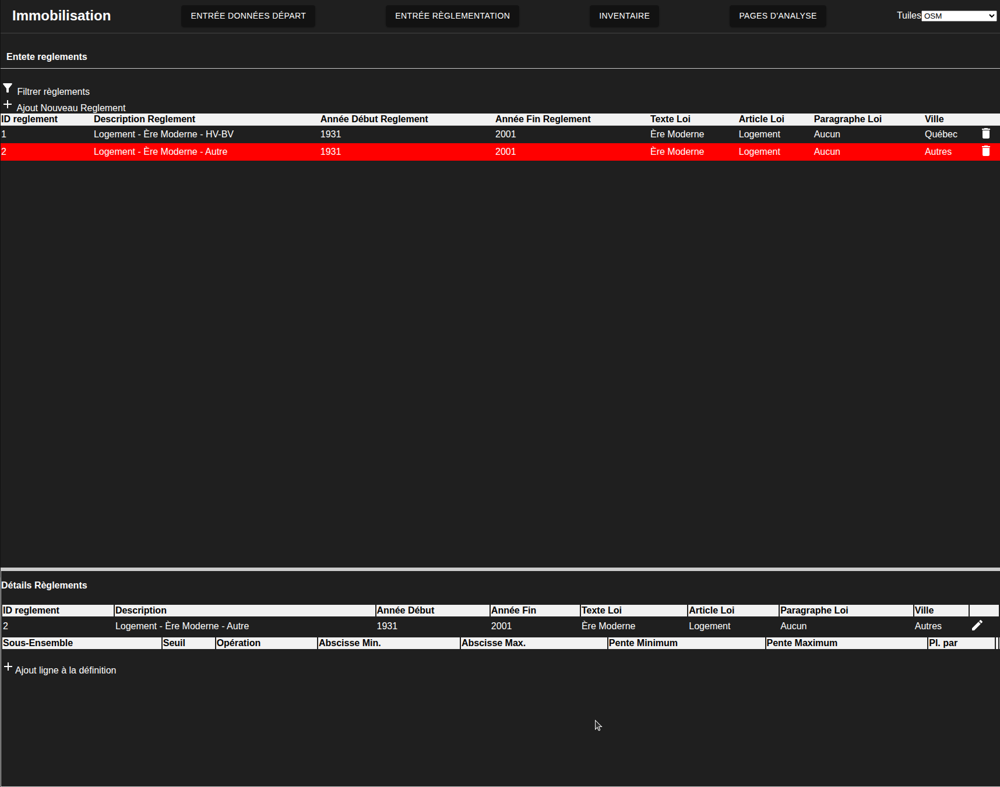

On entre ensuite le seuil le plus bas, il est important de ne pas remplir l'opératuer sur la première ligne. Les champs rentrés sont montrés ci-dessous:
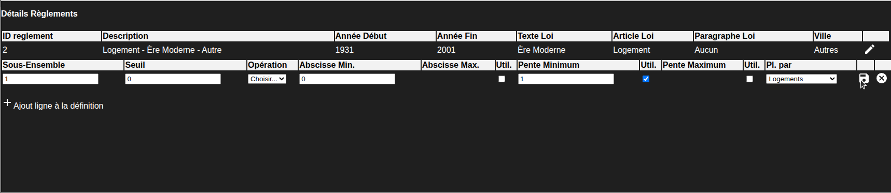

On sauvegarde cette première ligne avant de rappuye sur le bouton d'ajout. Sur toutes les lignes après la première ligne il est nécessaire d'ajouter un opérateur. s'il s'agit de la première ligne d'un nouveau sous-ensemble, il faut utiliser un opérateur ou, autrement on doit rentrer un opérateur d'addition ou de seuil. Un seul opérateur peut être utilisé par sous-ensement. La figure suivante montre la deuxième ligne complétée:
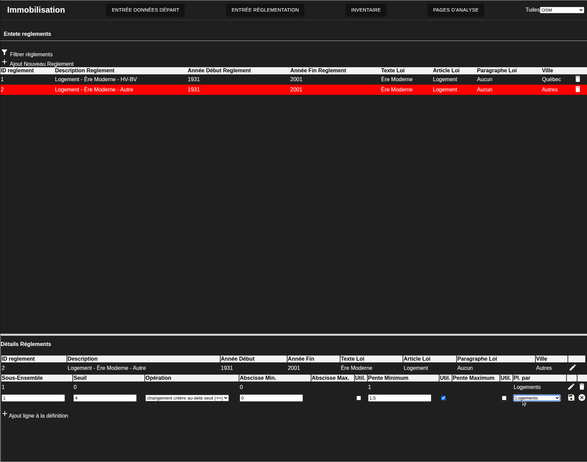

On appuie maintenant sur la disquette pour sauvegarder la deuxième ligne.


La figure montre le règlement complété:
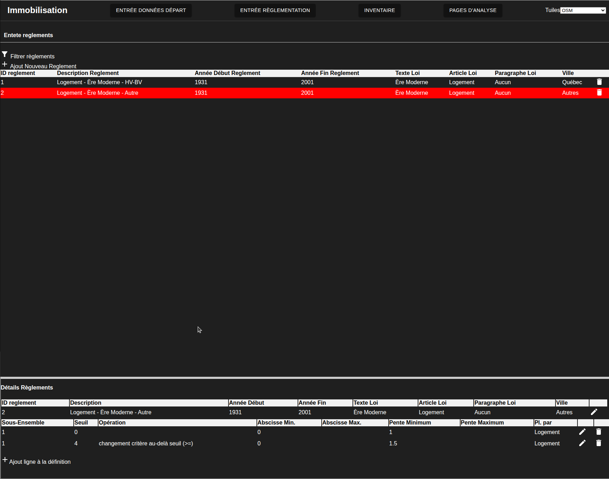

#### optionel validation.

Comme dans le cas précédent on peut aller valider les choses dans pgadmin
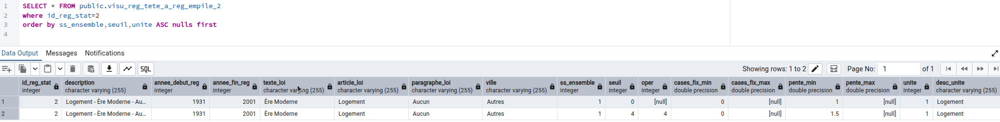

On peut aussi aller regarder la table de définition en rentrant la requête suivante en remplaçant l'identifiant de règlement au besoin
``` 
SELECT * FROM public.reg_stationnement_empile
where id_reg_stat = 2
ORDER BY id_reg_stat_emp ASC 
```
Obtenir le résultat suivant:
|id_reg_stat_emp|id_reg_stat|ss_ensemble|seuil|oper |cases_fix_min|cases_fix_max|pente_min|pente_max|unite|
|---------------|-----------|-----------|-----|-----|-------------|-------------|---------|---------|-----|
|2              |2          |1          | 0   | null|0            |null         | 1       |  null   | 1   |
|3              | 2         | 1         |4    | 4   | 0           |null         |  1.5    | null    | 1   |


[Retour au début](#création-des-règlements)

### Exemple 2: Commercial pour l'ère moderne pour