 # Assocation des règles aux codes d'utilisation du sol

 ---
 [^Tables des matières](../../README.md)|
[<Création des règlements](031-RegCreation.md)| 
[Association des ensembles de règlements aux territoires>](033-EnsRegTerrCreation.md)
---

## Introduction
L'étape suivant la création des règlements est l'affectation des règlements aux utilisation du sol pour créer des ensembles de règlements. Ces dernires constitue un bloc de règlementation applicable à n'importe quelle propriété dans le rôle foncier

### Définition minimale d'un ensemble de règlements
Minimalement, un ensemble de règlement aura une entête avec une description et des dates d'entrée en vigueur et d'abrogation. L'interface ne permet à l'heure aucune validation entre les dates des règlements et les dates des ensembles de règlements

Au minimum les 9 code code d'utilisation du bien fonds suivants doivent avoir une affectation pour assurer une couverture de toutes les propriétés:
 - 1 : RÉSIDENTIEL
 - 2 : INDUSTRIES MANUFACTURIÈRES
 - 3 : INDUSTRIES MANUFACTURIÈRES
 - 4 : TRANSPORTS, COMMUNICATIONS ET SERVICES PUBLICS
 - 5 : COMMERCIAL
 - 6 : SERVICES
 - 7 : CULTURELLE, RÉCRÉATIVE ET DE LOISIRS
 - 8 : PRODUCTION ET EXTRACTION DE RICHESSES NATURELLES
 - 9 : IMMEUBLES NON-EXPLOITÉS ET ÉTENDUES D'EAU

Ceci conclut le préambule sur les ensembles de règlements. Contrairement aux règlements, la structure de données est relativement simple et les partis intéressés peuvent se référer au mémoire

## Création d'un ensemble de règlements minimal

Cette section donnera chaque étape de la création d'un ensemble de règlements.

On commence par aller à la [page des ensembles de règlements](localhost:3000/ens-reg) qui ressemble à ce qui suit:
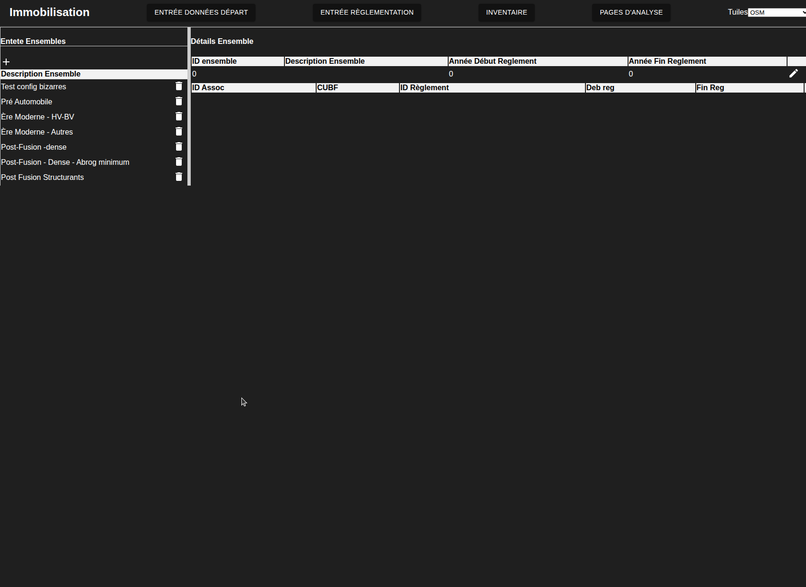

La barre de gauche contient une liste des ensembles de règlements tandis que le panneau de droite se remplit quand on clique sur un item de la barre de gauche.

Pour créer un nouvelle ensemble de règlement, on clique sur le bouton + en haut à gauche de la page, puis on remplit les champs qui deviennent éditables
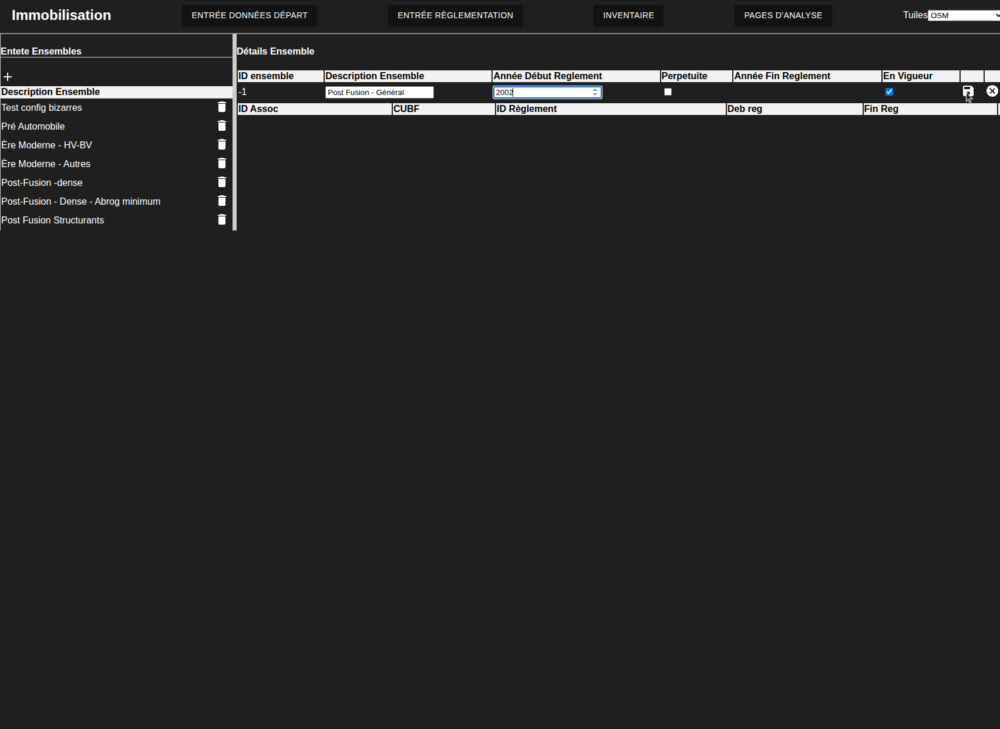

On peut mainenant commencer à affecter les règlements aux code d'utilisation du bien fonds. Pour ce faire on appuie sur le bouton "+ Ajouter Association" qui devrait apparaitre en-dessous de l'entête:
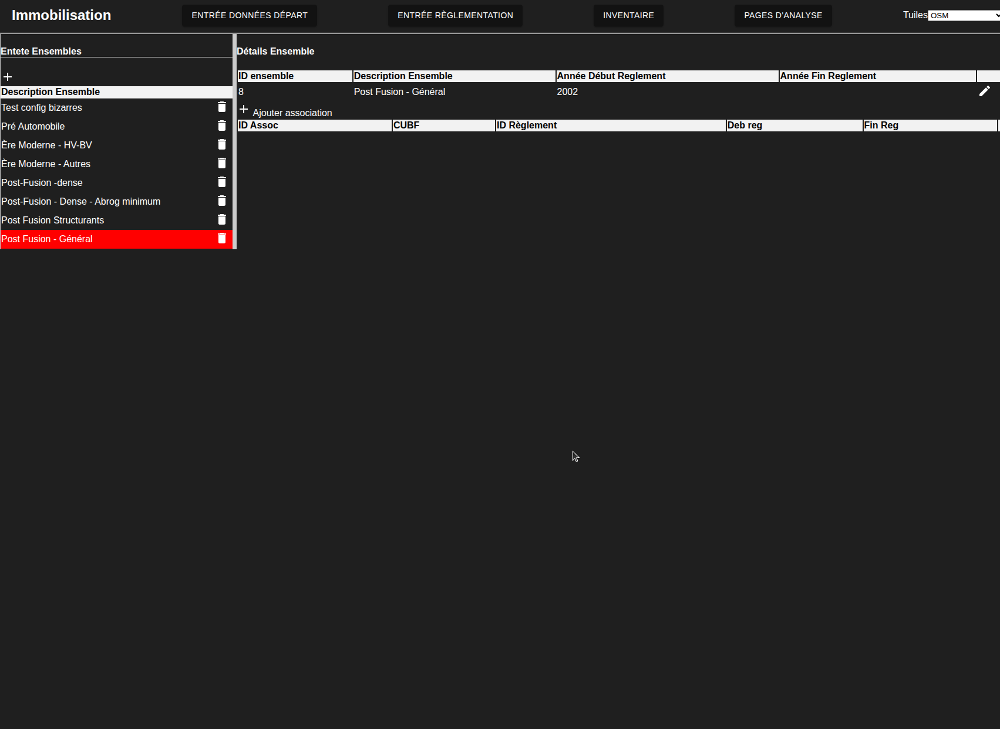

Un modal devrait maintenant apparaitre à votre écran avec deux colonnes. La colonne de gauche permet de sélectionner le code d'utilisation du bien fonds. La colonne de droite permet de sélectionner la règlement à affecter:

On sélectionne les codes d'utilisation du bien fonds en utilisant les listes déroulantes. Lorsqu'on sélectionne à un niveau, cela montre le niveau suivant en dessous permettant d,explorer les codes d'utilisation du bien fonds relativement rapidement. Une fonction de recherche n,a pas encore été implémentée 
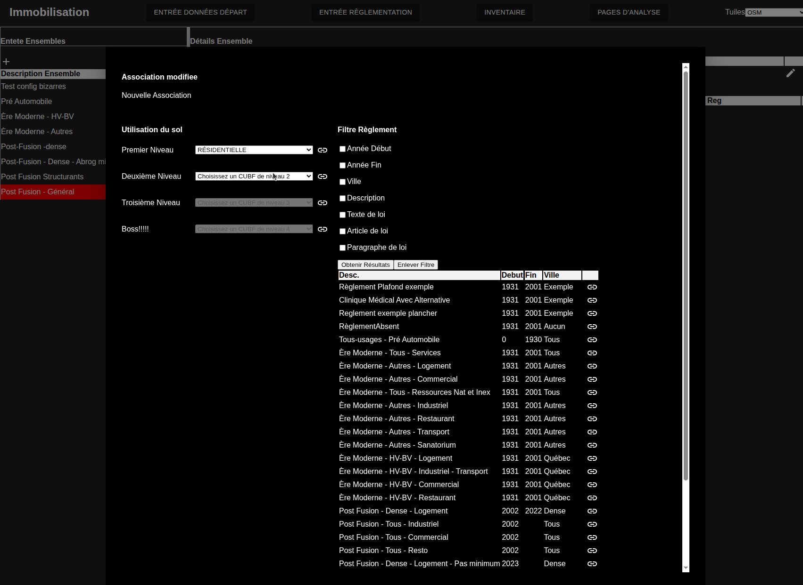
Le CUBF est ajouté à l'association en cliquant sur le petit chainon à côté des listes déroulantes. de la même manière, on peut sélectionner le règlement à affecter en cliquant sur un chainon. On peut aussi filtrer les règlements:
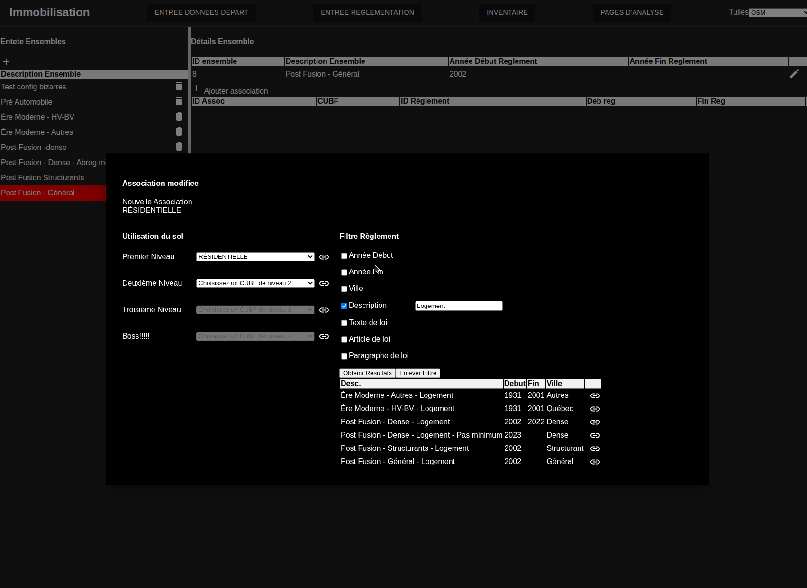

Une fois le cubf et le règlement affecté, une petite disquette apparaitra permettant de sauvegarder l'association et de fermer le modal
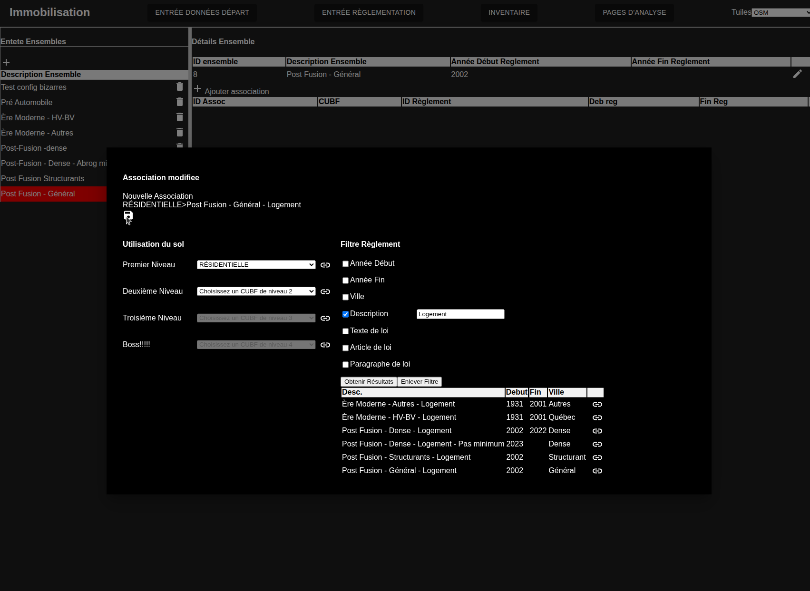

La nouvelle association devrait apparaitre dans le tableau en-dessous de l'entête tel que montré ci-dessous:
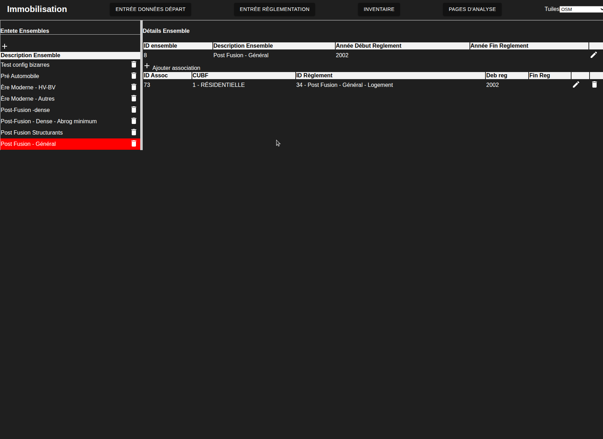

Ce processus est répété jusqu'à temps d'avoir une définition complète tel que montré ci-dessous
## Présentation des ensembles de règlements pour l'exemple

Cette section donnera une solution possible pour le cas présenté à l'introduction

### Pré automobile

Le cas pré automobile est simple puisqu'on affecte le même règlement avec un requis de zéro à toutes propriétés:
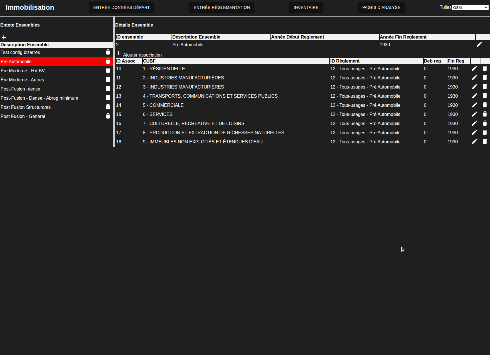

### Ère Moderne

L'ère moderne requiert deux ensembles de règlements pour distinguer entre le centre ville et les quartiers en périphérie. Lensemble de règlements pour le centre ville est montré ci-dessous:
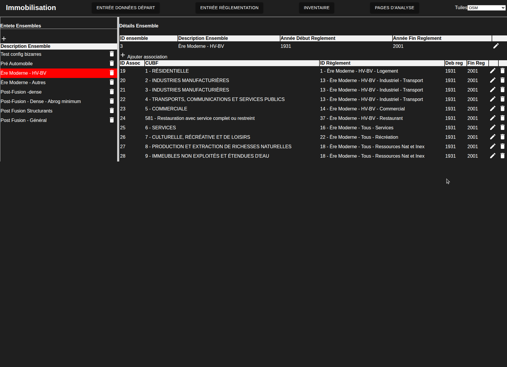

L'ensemble de règlements pour les autres quartiers est défini comme suit:
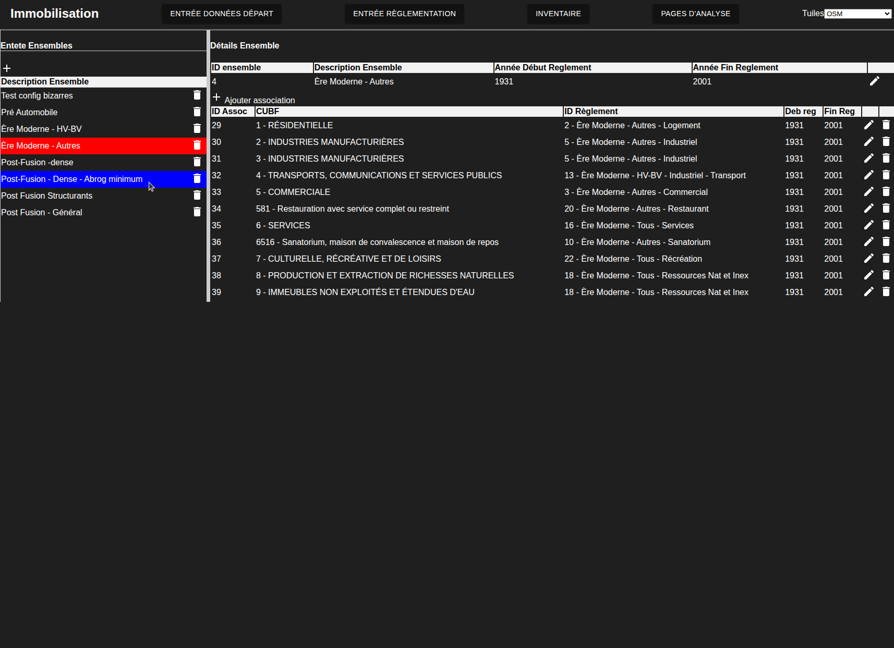

### Post fusion

Quatre ensembles de règlements doivent être créés pour spécifier la période post fusion. Deux pour le secteur denses du fait du changement règlementaire en 2022 et 1 chacun pour les quariers structurants et généraux. 

#### Quartiers denses
Commençons par les règlements juste après la fusion

On a ensuite un ensemble de règlement après l'abrogation des minimums. Notez la différence de date et de règlement résidentiel
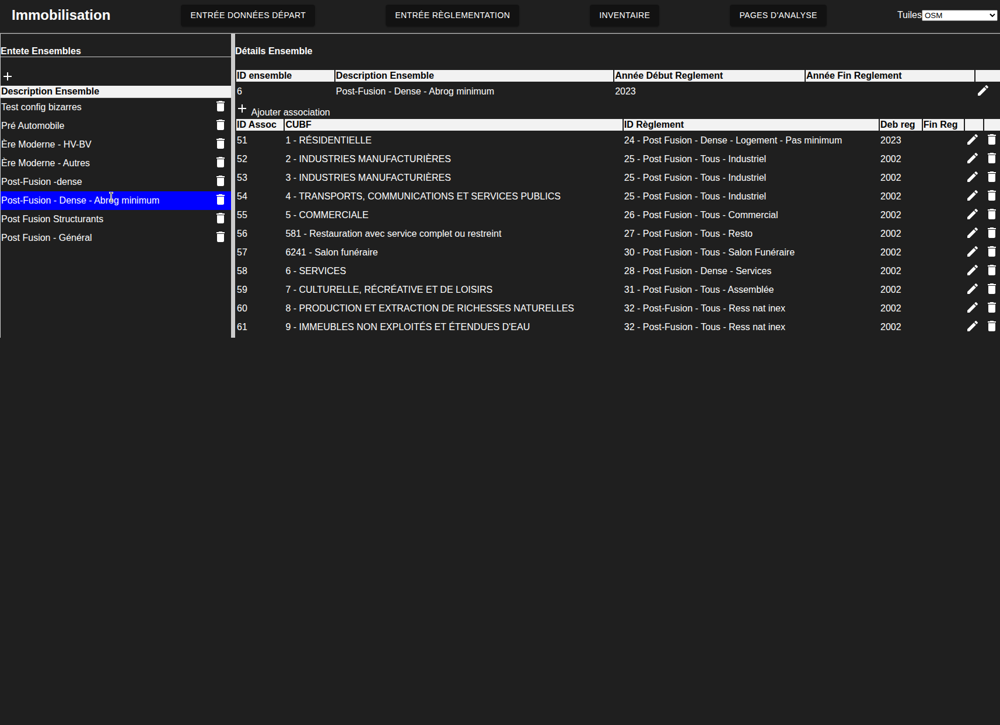

#### Quartiers structurants

On peut maintenant passer aux quartiers structurants dont l'ensemble de règlements est spécifié ci-dessous

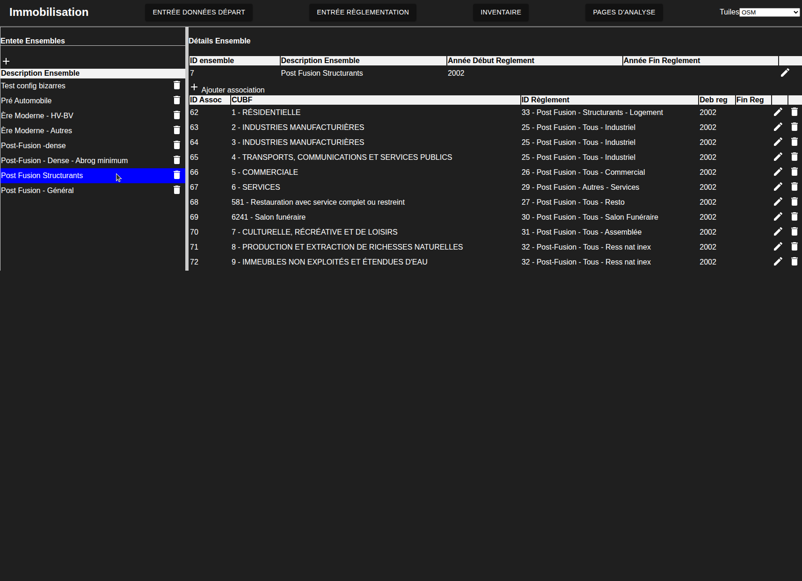

#### Règlements généraux

On peut finalement passer aux règlements les plus généraux

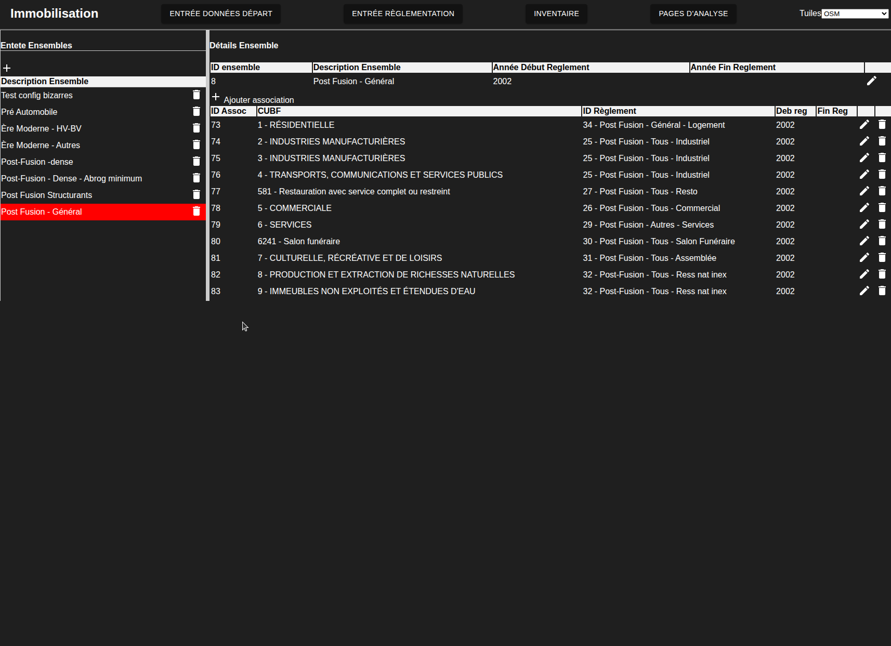

Ceci complète la création des ensembles de règlements