# Association des ensembles de règlements aux territoires historiques

---
[^Tables des matières](../../README.md)|
[<Création des ensembles de règlements](032-EnsRegCreation.md)| 
[Visualisation Règlements>](034-VisualisationReg.md)
---

## Introduction

Les Ensemebles de Règlements-territoires associent la règlementation au territoire. Plusieurs ensembles de règlements peuvent être affectés 
à un même territoire tant que leurs dates de validité ne se chevauchent pas. Ce chapitre commencera par démontrer comment créer ces association avant de donner une
solution pour le cas donnée en introduction de la section sur les règlements

## Procédure d'affectation

Pour notre démonstration on utilisera les quartiers denses de la période post fusion qui voient un changement règlementaire

On commence par naviguer à la [page de création des ensembles de règlements territoires](localhost:3000/ens-reg-terr)
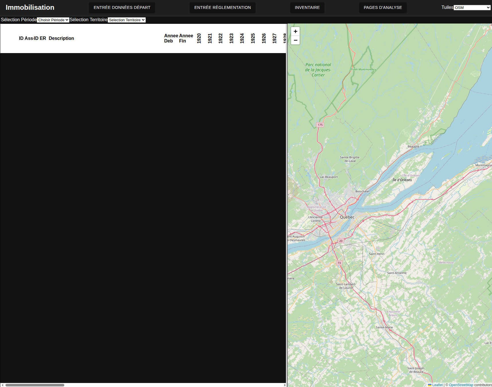

Pour modifier un territoire, on commence par choisir une période dans la liste déroulante en haut à gauche. Dans notre cas, on choisit la période post fusion
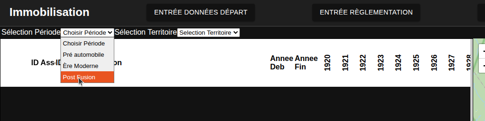

On sélectionne ensuite le territoire dont on veut définir la réglementation. Ici on va choisir Urbain Dense:

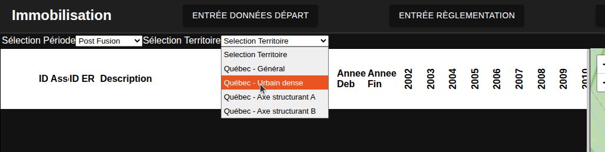

Un bouton "+" en bas de page devrait mainteant apparaitre pour ajouter un ensemble de règlement au territoire et la carte du territoire devrait apparaitre à droite
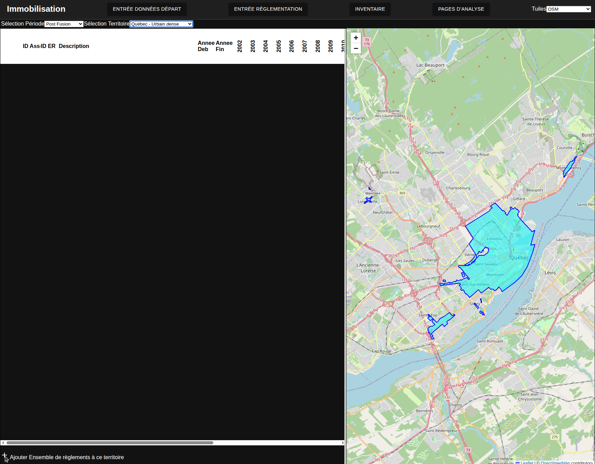

En cliquant sur ce "+", une nouvelle ligne apparaitra dans le tableau avec une liste déroulante. Dans notre cas, on commence par sélectionner l'ensemble de règlemetns "Post-fusion dense"

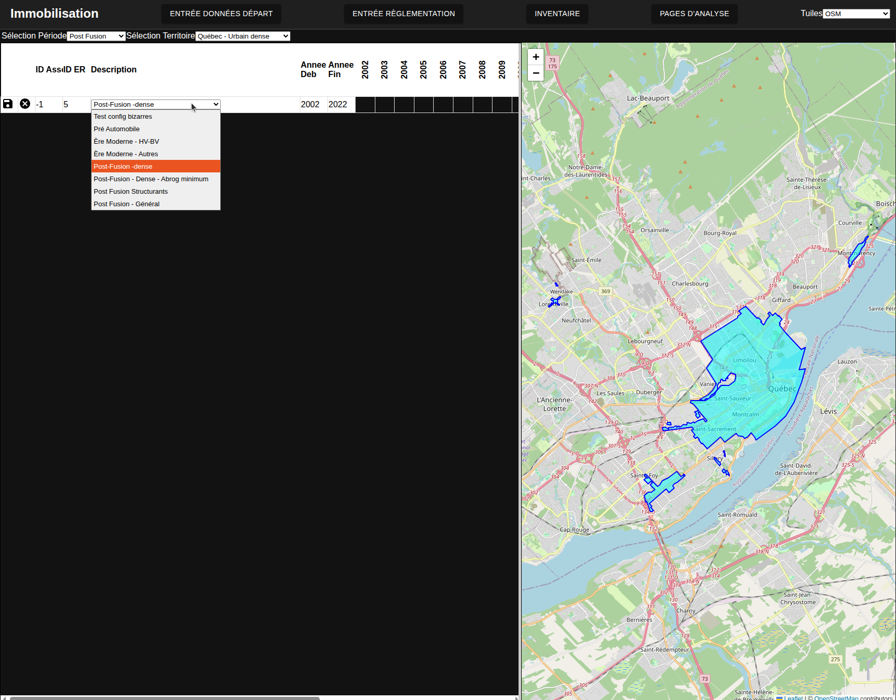

En cliquant sur la disquette à gauche de la ligne, on sauvegardera l'association. En défilant le long des années, on constate que les années 2023 à 2026 n'ont pas de règlementation affectée:
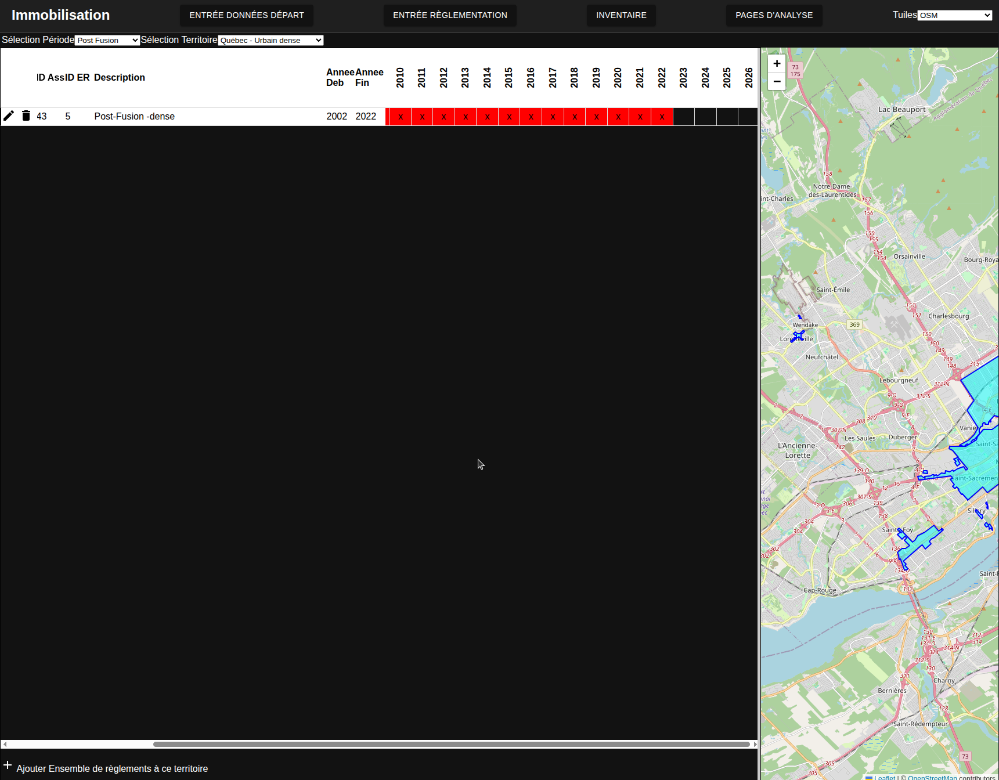

On répète les étapes précédentes pour ajouter l,ensemble de règlements "Post-Fusion - Dense - Post Abrog" et on constate que toutes les années ont maintenant un règlement affecté:

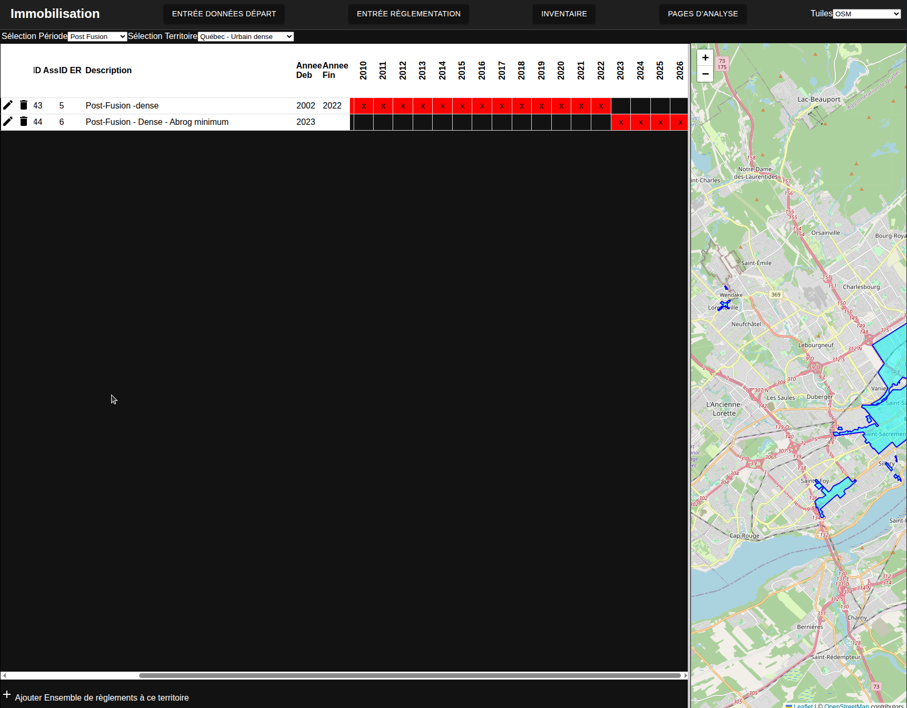

## Affectations pour l'exemple de cette section:

### Pré automobiles

Tous les territoires ont l'affectation suivante:
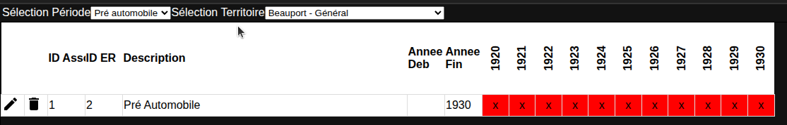

### Ère moderne

Tous les secteurs sauf le centre (haute-ville / basse-ville) ont l,affecation suivante:
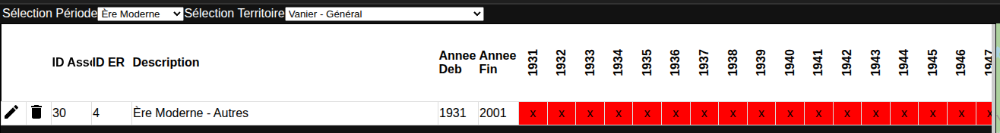

La Haute ville et la basse ville ont l'affectation suivante:
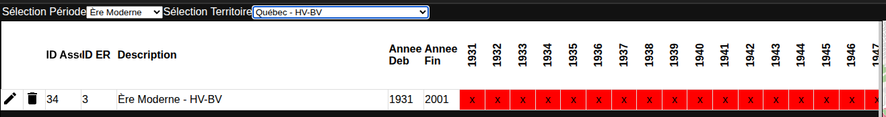

### Post fusion

Les deux secteurs structurants ont la même affectation:
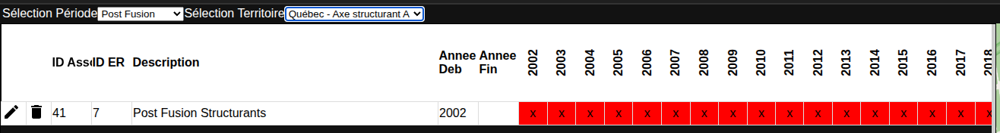

Les quartiers ayant la définition générale ont l'affectation suivante:
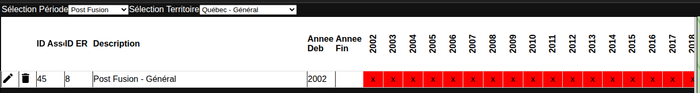

L'affectation pour les quartiers denses a été montrée dans la procédure