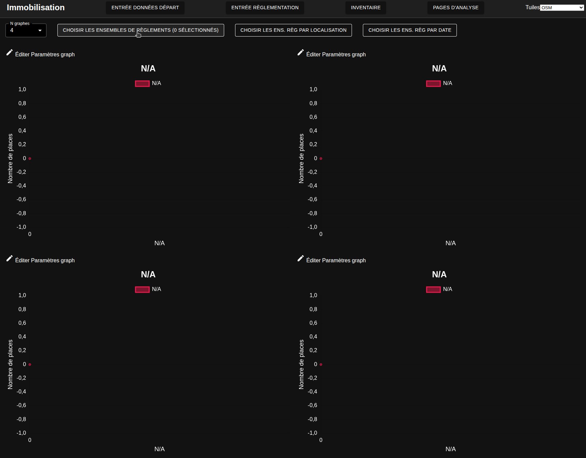
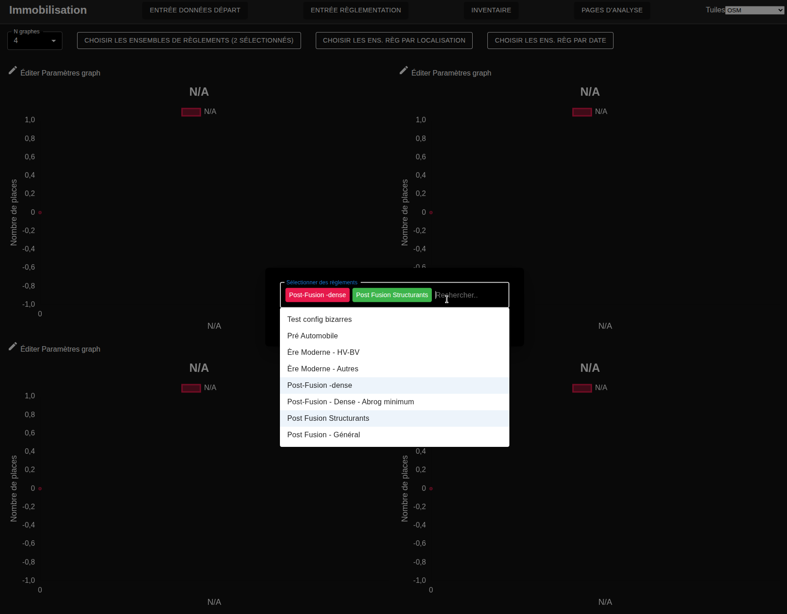
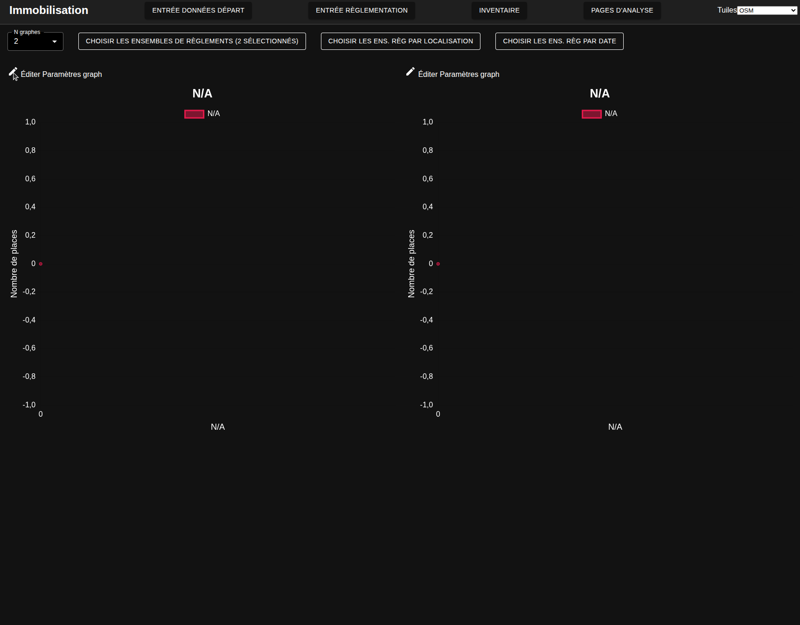
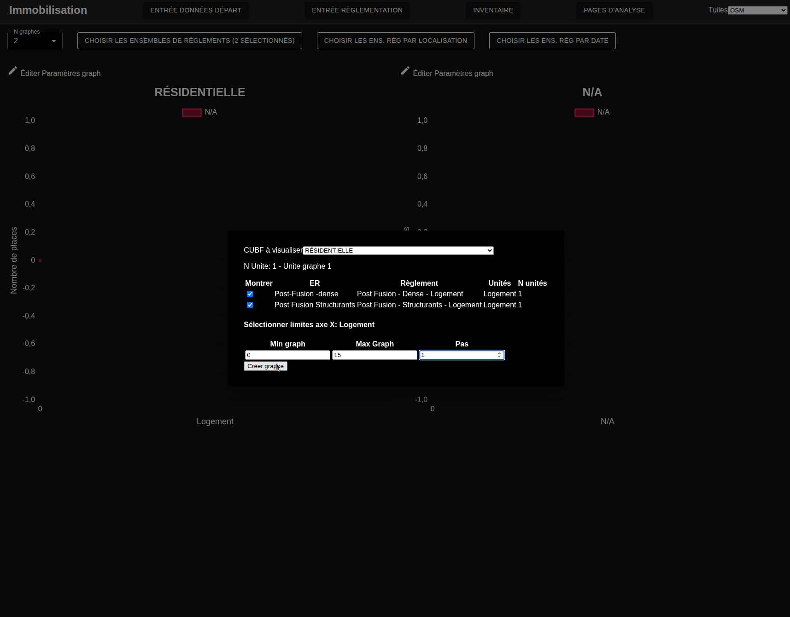
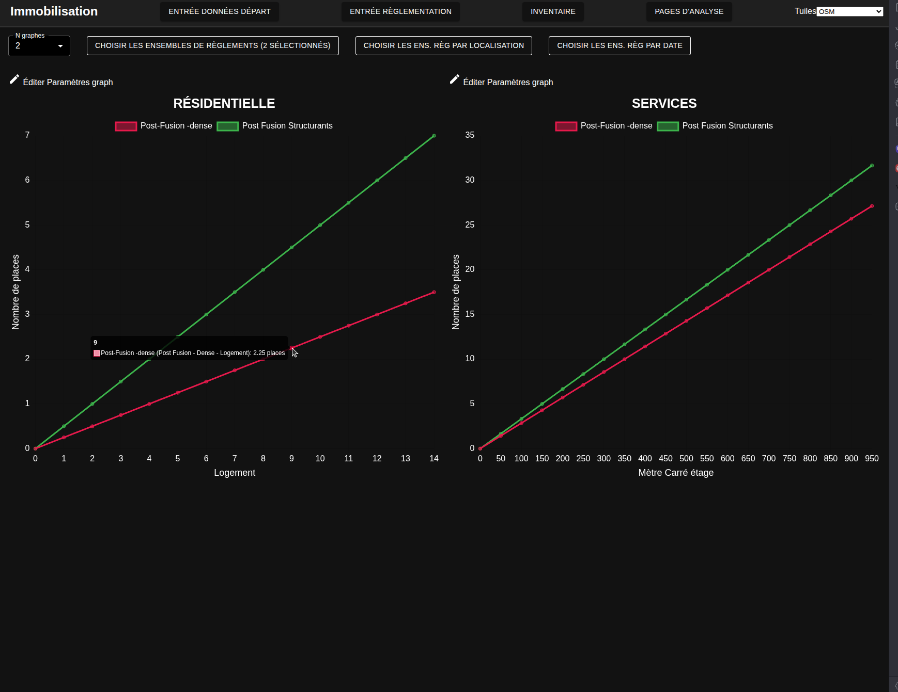
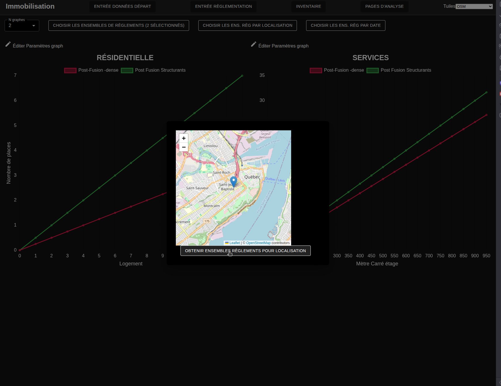
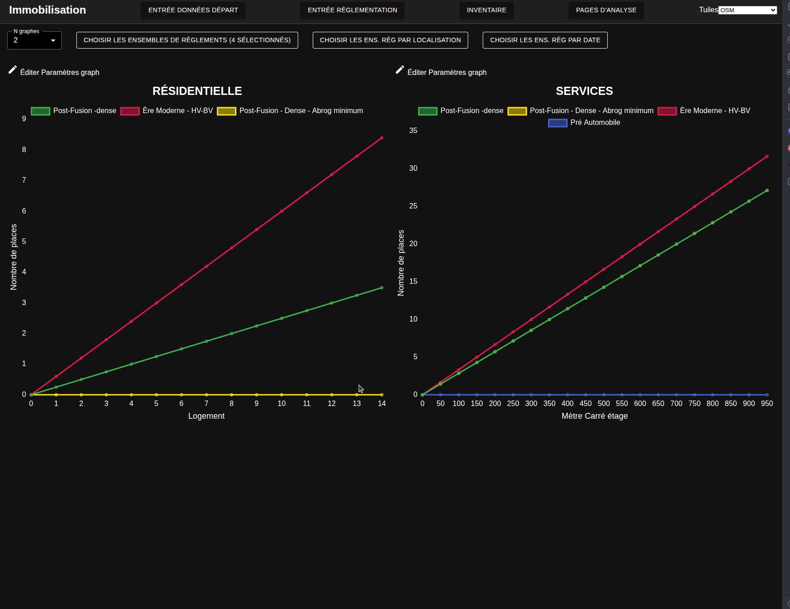
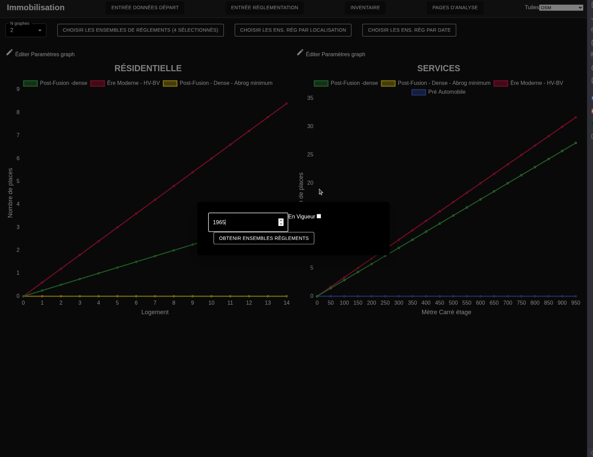

# Visualisation des règlements

---
[^Tables des matières](../../README.md)|
[<Création des associations Ens Reg Terr](033-EnsRegTerrCreation.md)| 
[Imputation du stationnement>](040-Prediction.md)
---

On peut ensuite faire un validation rapide des règlements de manière visuelle

## Procédure

1. Navigez à la [page de visualisation des ensembles de règleents](http://localhost:3000/ana-reg)
2. Cliquez sur choisir les ensembles de règlements:

3. Sélectionnez les ensembles de règlements à comparer:

4. Sélectionnez le nombre de graphiques:

5. Cliquez sur le crayon en haut à gauche de chaque graphe

6. Choisissez un des codes d'uttilisation du bien fonds. Notez que l'interface ne peut pour l'instant que grapher des règlements avec les mêmes unités de formulation. Vous pouvez aussi éditer les limites du graphique

7. Répétez les étapes 5 et 6 avec un autre CUBF. Les graphiques devraient être visibles:

## Options de sélection 

On peut sélectionner les ensembles de règlements de manière transversale (à une date donnée) ou longitudinale (à un lieu donné). On peut altérer cette sélection avec les deux boutons à gauche de celui utilisé à l'étape 2

Cette image montre la sélection longitudinale. L'utilisateur clique sur un lieu sur la carte pour voir sélectionner les ensembles de règlements applicables:

Les graphiques devraient se mettre à jour automatiquement:

Une procédure similaire peut être utilisée pour sélectionner la date: 

Encore une fois les graphiques se mettent à jour automatiquement: 
