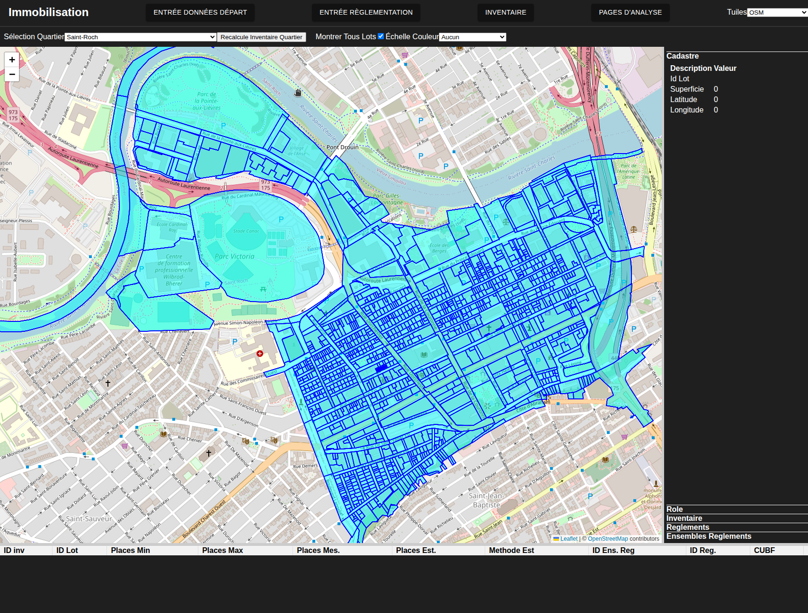
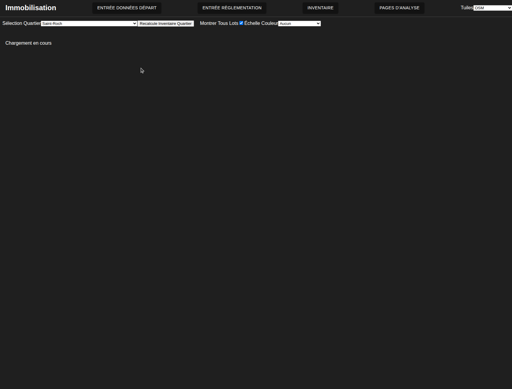
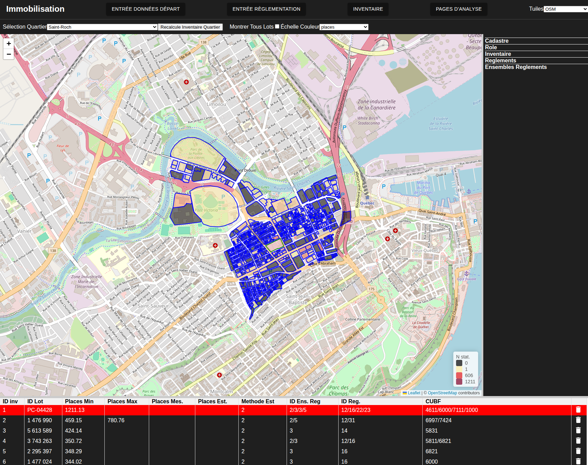
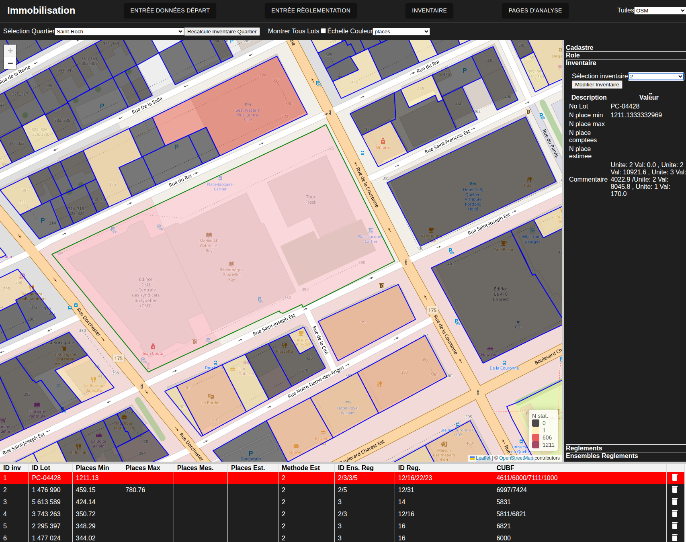
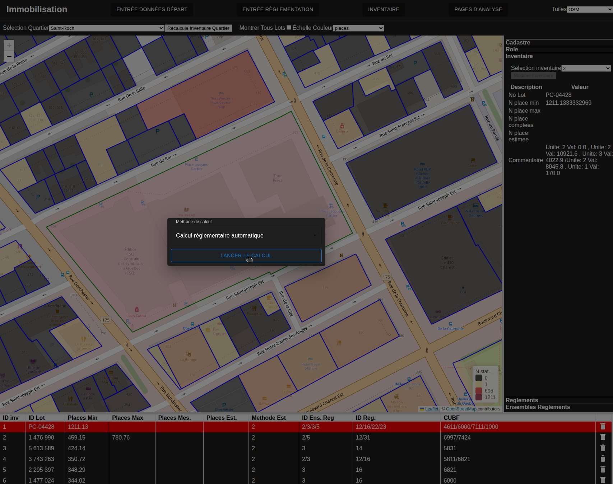
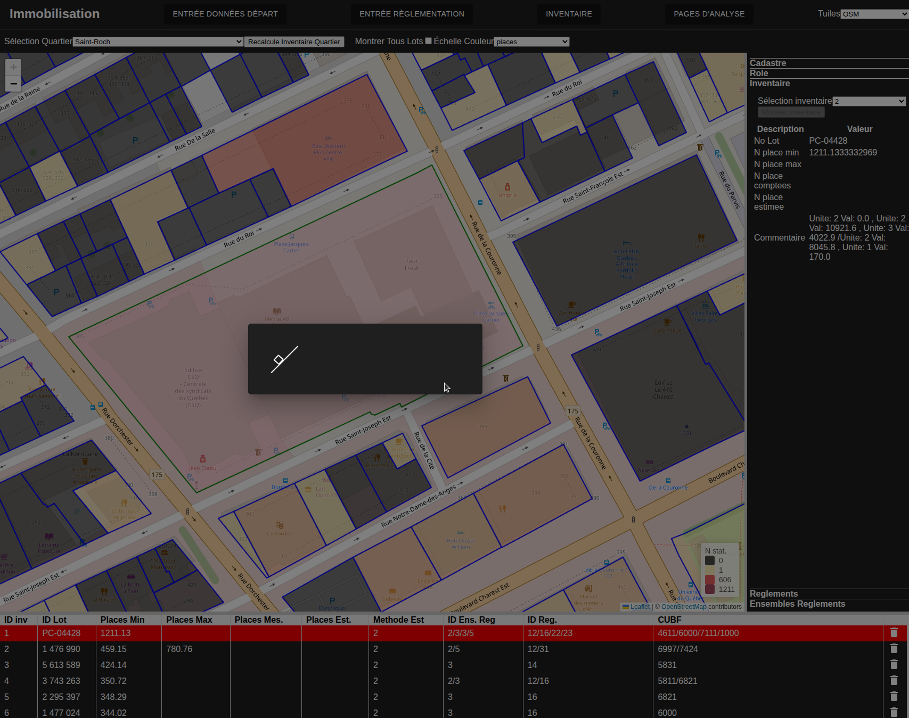
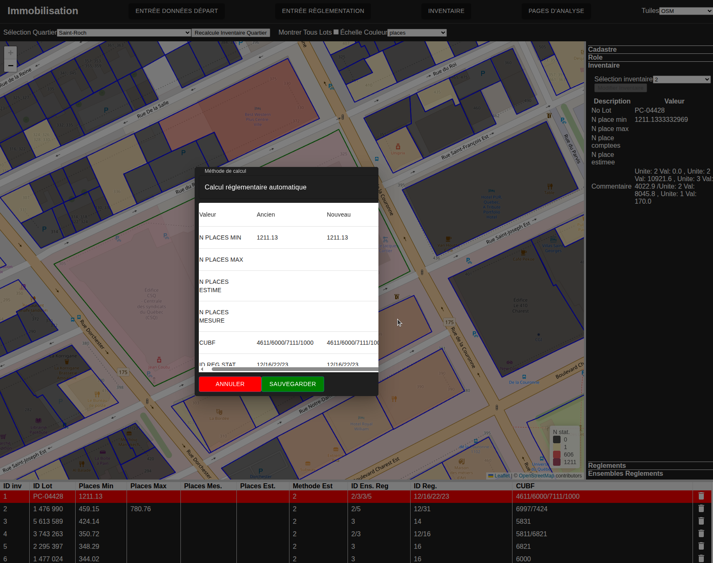

# Imputation de la capacité de stationnement par les minimums

---
[^Tables des matières](../../README.md)|[<Association des ensembles de règlements à l'historique](033-VisualisationReg.md)| 
[Méthodes alternatives>](041-MethodesAlternatives.md)
---

Deux options sont possibles pour la prédiction de l'offre de stationnement. Le calcul en lots ou le calcul individuel. Cette section donnera un aperçu des deux méthodes.

## Imputation par lots

En commençant un nouveau projet, le moyen le plus facile de démarrer est de faire une prédiction par lots avec la procédure suivante:
1. Naviguez à la [page de manipuation d'inventaire](http://localhost:3000/inventaire)

2. Sélectionner un quartier à imputer dans la list déroulante en haut à gauche et cliquer sur la boite a cocher nomméé montrer tous lots. Vous devriez voir les lots cadastraux:

3. Cliquez sur Recalcule Inventaire quartier. L,opération prend du temps donc soyez patient! Un page d'attente apparaitra:

4. Une fois le calcul complété une page de comparaison devrait apparaitre. Dans un premier temps, cliquez sur approuver tous. Une fois la page rechargée, cliquez sur la liste déroulante d'échelle de couleur et fixez la à places. Une carte choroplèthe devrait apparaitre:

Cela complète l'imputation par lot. Ce proccessus peut être relancé après la modification des ensemble de règlement pour mettre à jour les prédictions

## Imputation individuelle

Une fois qu'une impulation par lot a été complétée on peut aller visualiser ou modifier des prédictions individuelles.

1. Zoommez jusqu'à un lot et cliquez dessus pour le sélectioner. la colonne de droite devrait avoir des informations qui s,affichent

2. Cliquez sur l'item "inventaire" dans la barre de droite. Sélectionner l'item 2 (calcul automatique) dans la liste déroulante. La prédiction automatique devrait s'afficher

3. Cliquez sur le bouton "Modifier l'inventaire pour ouvrir le modal de prédiction

4. Cliquez sur le bouton lancer le calcul. Une petite icone de calcul devrait s,afficher pendant le calcul

5. Une fois le calcul complété la nouvelle prédiction de vrai apparaitre avec un comparaison à l'ancienne. Vous pouvez sauvegarder la nouvelle prédiction ou annuler:

Ceci conclut la section sur l'imputation automatique. La prochaine section discutera des méthodes alternatives.